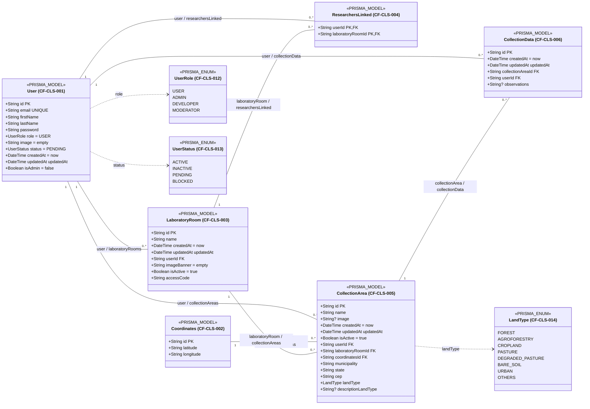
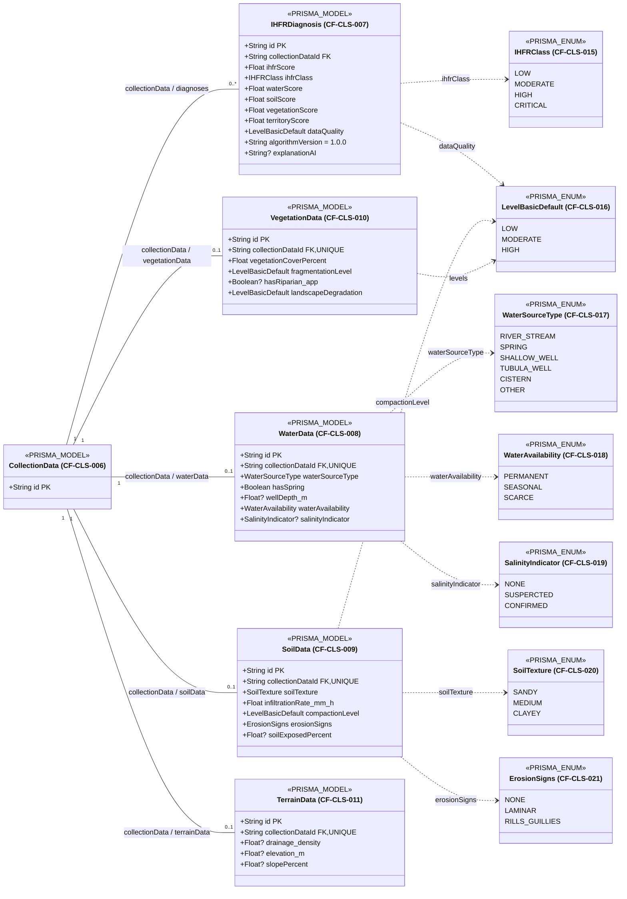
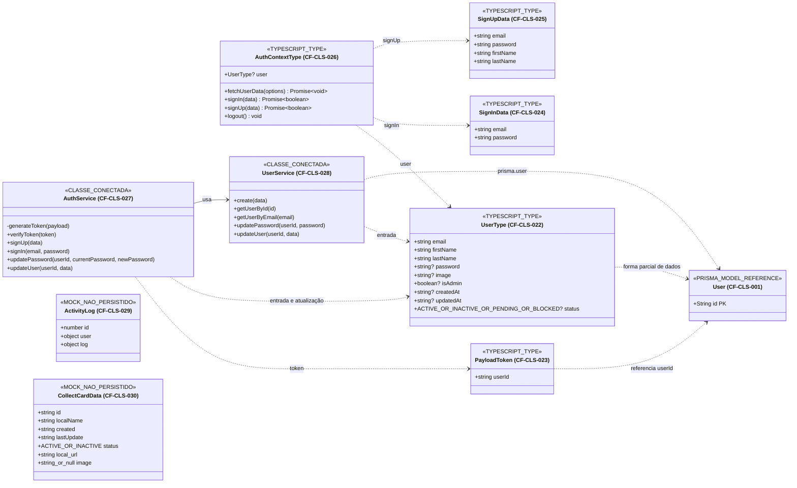

# Diagrama de classes Code-First

## Identificação e limites

| Campo | Registro | Classificação |
|---|---|---|
| Iniciativa | `PRD Code-First` — Fase 1 | `DECISAO_DE_TRABALHO_PARA_RASCUNHO` |
| Estado | `EM_REVISAO` | estado documental; não concede aprovação normativa |
| Baseline | branch `docs/code-first-prd`; HEAD e upstream `213918ec6a5f91ed4e35e54d9d0bef07ed156f36`; worktree inicialmente limpo | `EVIDENCIA_IMPLEMENTACAO` |
| Escopo | modelo observável no schema e tipos, mocks e classes de aplicação diretamente conectados a conceitos do produto | `EVIDENCIA_IMPLEMENTACAO` |
| Validação | inspeção estática; aplicação, build, lint, testes, banco, migrations e deploy não executados | `LIMITACAO_DA_EVIDENCIA` |
| Aprovação do domínio | inexistente | `NAO_ESPECIFICADO` |
| Validação cruzada | `CONCLUIDA`; relatório em [`../analysis/code-first-package-validation.md`](../analysis/code-first-package-validation.md) | `EVIDENCIA_IMPLEMENTACAO` |

Fontes usadas: código e configurações rastreados; [`../../../prisma/schema.prisma`](../../../prisma/schema.prisma); tipos, classes e mocks TypeScript diretamente inspecionáveis; documentos existentes da iniciativa em [`../`](../); [`../../../TECH_DECISIONS.md`](../../../TECH_DECISIONS.md), com os estados já registrados preservados; e decisões humanas registradas na iniciativa. `docs/raw/**`, matriz global, documentação histórica, internet, fontes externas e Figma não foram lidos, enumerados nem pesquisados.

O schema é `EVIDENCIA_IMPLEMENTACAO` da estrutura de persistência declarada no baseline. Ele não é decisão normativa de dados, contrato científico aprovado nem domínio final. A nulabilidade, unicidade, chaves, relações e cardinalidades abaixo reproduzem somente o que é verificável estaticamente. Nenhuma validação em runtime foi realizada.

## Visão do modelo

O encadeamento persistido observável sustenta parcialmente `User` → `LaboratoryRoom`/`ResearchersLinked` → `CollectionArea` → `CollectionData` → dados ambientais → `IHFRDiagnosis`. `User` também aparece como autoria técnica de `CollectionArea` e `CollectionData`; o código não responde se esses vínculos definem propriedade de negócio. `Coordinates` dá a `CollectionArea` uma referência por latitude e longitude textuais e obrigatórias.

`INFERENCIA` — esse encadeamento é compatível com a jornada candidata usuário → laboratório/vínculo → área → coleta → dados ambientais → diagnóstico IHFR, mas a existência das relações não aprova a jornada, as permissões, a propriedade, o contrato científico ou a forma de obtenção do IHFR.

O mapa pertence ao núcleo do MVP por `CF-PD-007`, porém o único modelo espacial persistido localizado é `Coordinates`, ligado à área. Não há geometria de área, localização própria de coleta, camada, marcador, projeção, precisão ou arquitetura cartográfica persistida suficiente para criar outras classes espaciais. O acompanhamento possui `ActivityLog` mockado e resumo/interface parcial, sem entidade persistida de evento ou histórico localizada.

## Inventário de elementos

| ID | Nome no código | Categoria | Finalidade observável | Origem | Estado | Requisitos relacionados | Casos de uso relacionados |
|---|---|---|---|---|---|---|---|
| `CF-CLS-001` | `User` | `PRISMA_MODEL` | conta, estado, papel técnico e autoria de registros | `prisma/schema.prisma:10-27` | declarado no schema; consumidor de autenticação localizado | `CF-PRD-FR-001`, `CF-PRD-FR-002`, `CF-PRD-FR-003`, `CF-PRD-FR-011`, `CF-PRD-FR-012`; `CF-PRD-NFR-002`, `CF-PRD-NFR-003` | `CF-UC-001`, `CF-UC-002`, `CF-UC-003`, `CF-UC-004`, `CF-UC-005`, `CF-UC-006`, `CF-UC-008`, `CF-UC-009`, `CF-UC-014` |
| `CF-CLS-002` | `Coordinates` | `PRISMA_MODEL` | latitude e longitude textuais reutilizáveis por áreas | `prisma/schema.prisma:43-49` | declarado no schema; consumidor persistente não localizado | `CF-PRD-FR-013`, `CF-PRD-FR-014`, `CF-PRD-FR-015` | `CF-UC-007`, `CF-UC-010`, `CF-UC-015` |
| `CF-CLS-003` | `LaboratoryRoom` | `PRISMA_MODEL` | contexto técnico de laboratório ligado a um usuário | `prisma/schema.prisma:51-64` | declarado no schema; interface correspondente é mockada | `CF-PRD-FR-003`, `CF-PRD-FR-004`, `CF-PRD-FR-005`, `CF-PRD-FR-011`; `CF-PRD-NFR-001` | `CF-UC-004`, `CF-UC-005`, `CF-UC-006`, `CF-UC-007`, `CF-UC-008` |
| `CF-CLS-004` | `ResearchersLinked` | `PRISMA_MODEL` | associação entre usuário e laboratório | `prisma/schema.prisma:66-74` | declarado no schema; fluxo consumidor não localizado | `CF-PRD-FR-003`, `CF-PRD-FR-004`, `CF-PRD-FR-011`; `CF-PRD-NFR-001` | `CF-UC-005`, `CF-UC-006` |
| `CF-CLS-005` | `CollectionArea` | `PRISMA_MODEL` | área vinculada a autor, laboratório e coordenadas | `prisma/schema.prisma:76-97` | declarado no schema; lista visual mockada | `CF-PRD-FR-005`, `CF-PRD-FR-006`, `CF-PRD-FR-008`, `CF-PRD-FR-011`, `CF-PRD-FR-012`, `CF-PRD-FR-013`, `CF-PRD-FR-014`, `CF-PRD-FR-015`; `CF-PRD-NFR-001`, `CF-PRD-NFR-002`, `CF-PRD-NFR-006` | `CF-UC-007`, `CF-UC-008`, `CF-UC-009`, `CF-UC-010`, `CF-UC-012`, `CF-UC-013`, `CF-UC-014`, `CF-UC-015` |
| `CF-CLS-006` | `CollectionData` | `PRISMA_MODEL` | registro de coleta ligado a área e autor | `prisma/schema.prisma:110-126` | declarado no schema; fluxo consumidor não localizado | `CF-PRD-FR-006`, `CF-PRD-FR-007`, `CF-PRD-FR-008`, `CF-PRD-FR-009`, `CF-PRD-FR-010`, `CF-PRD-FR-011`, `CF-PRD-FR-012`, `CF-PRD-FR-014`, `CF-PRD-FR-015`; `CF-PRD-NFR-002`, `CF-PRD-NFR-006` | `CF-UC-009`, `CF-UC-010`, `CF-UC-011`, `CF-UC-012`, `CF-UC-013`, `CF-UC-014`, `CF-UC-015` |
| `CF-CLS-007` | `IHFRDiagnosis` | `PRISMA_MODEL` | resultado IHFR e pontuações declaradas para uma coleta | `prisma/schema.prisma:128-142` | declarado no schema; consumidor e produção não localizados | `CF-PRD-FR-008`, `CF-PRD-FR-009`, `CF-PRD-FR-015`; `CF-PRD-NFR-006` | `CF-UC-012`, `CF-UC-013`, `CF-UC-015` |
| `CF-CLS-008` | `WaterData` | `PRISMA_MODEL` | grupo técnico de dados de água | `prisma/schema.prisma:151-162` | declarado no schema; sem consumidor | `CF-PRD-FR-007`, `CF-PRD-FR-014` | `CF-UC-011` |
| `CF-CLS-009` | `SoilData` | `PRISMA_MODEL` | grupo técnico de dados de solo | `prisma/schema.prisma:164-175` | declarado no schema; sem consumidor | `CF-PRD-FR-007`, `CF-PRD-FR-014` | `CF-UC-011` |
| `CF-CLS-010` | `VegetationData` | `PRISMA_MODEL` | grupo técnico de dados de vegetação | `prisma/schema.prisma:177-187` | declarado no schema; sem consumidor | `CF-PRD-FR-007`, `CF-PRD-FR-014` | `CF-UC-011` |
| `CF-CLS-011` | `TerrainData` | `PRISMA_MODEL` | grupo técnico de dados de terreno | `prisma/schema.prisma:189-198` | declarado no schema; sem consumidor | `CF-PRD-FR-007`, `CF-PRD-FR-014` | `CF-UC-011` |
| `CF-CLS-012` | `UserRole` | `PRISMA_ENUM` | valores técnicos do campo `User.role` | `prisma/schema.prisma:29-34` | usado no schema; não aprova papéis de produto | `CF-PRD-FR-011` | `CF-UC-002`, `CF-UC-003` |
| `CF-CLS-013` | `UserStatus` | `PRISMA_ENUM` | valores do campo `User.status` | `prisma/schema.prisma:36-41` | usado no schema e parcialmente na autenticação | `CF-PRD-FR-001`, `CF-PRD-FR-002` | `CF-UC-001`, `CF-UC-002`, `CF-UC-003` |
| `CF-CLS-014` | `LandType` | `PRISMA_ENUM` | valores técnicos do campo `CollectionArea.landType` | `prisma/schema.prisma:99-108` | usado no schema; taxonomia não aprovada | `CF-PRD-FR-005` | `CF-UC-007`, `CF-UC-008` |
| `CF-CLS-015` | `IHFRClass` | `PRISMA_ENUM` | valores técnicos de `IHFRDiagnosis.ihfrClass` | `prisma/schema.prisma:144-149` | usado no schema; classes científicas não aprovadas | `CF-PRD-FR-008`, `CF-PRD-FR-009`, `CF-PRD-FR-015` | `CF-UC-012`, `CF-UC-013`, `CF-UC-015` |
| `CF-CLS-016` | `LevelBasicDefault` | `PRISMA_ENUM` | escala reutilizada por diagnóstico, solo e vegetação | `prisma/schema.prisma:203-207` | usado no schema; significado científico não aprovado | `CF-PRD-FR-007`, `CF-PRD-FR-008`, `CF-PRD-FR-009` | `CF-UC-011`, `CF-UC-012`, `CF-UC-013` |
| `CF-CLS-017` | `WaterSourceType` | `PRISMA_ENUM` | valores técnicos de fonte de água | `prisma/schema.prisma:209-216` | usado no schema; taxonomia não aprovada | `CF-PRD-FR-007` | `CF-UC-011` |
| `CF-CLS-018` | `WaterAvailability` | `PRISMA_ENUM` | valores técnicos de disponibilidade hídrica | `prisma/schema.prisma:218-222` | usado no schema; taxonomia não aprovada | `CF-PRD-FR-007` | `CF-UC-011` |
| `CF-CLS-019` | `SalinityIndicator` | `PRISMA_ENUM` | valores técnicos do indicador de salinidade | `prisma/schema.prisma:224-228` | usado no schema; taxonomia não aprovada | `CF-PRD-FR-007` | `CF-UC-011` |
| `CF-CLS-020` | `SoilTexture` | `PRISMA_ENUM` | valores técnicos de textura do solo | `prisma/schema.prisma:230-234` | usado no schema; taxonomia não aprovada | `CF-PRD-FR-007` | `CF-UC-011` |
| `CF-CLS-021` | `ErosionSigns` | `PRISMA_ENUM` | valores técnicos de sinais de erosão | `prisma/schema.prisma:236-240` | usado no schema; taxonomia não aprovada | `CF-PRD-FR-007` | `CF-UC-011` |
| `CF-CLS-022` | `UserType` | `TYPESCRIPT_TYPE` | forma de dados de usuário usada por autenticação e persistência | `src/app/api/server/types/database-tables.type.ts:1-11` | usado por contexto e serviços | `CF-PRD-FR-001`, `CF-PRD-FR-002`, `CF-PRD-FR-012` | `CF-UC-001`, `CF-UC-002`, `CF-UC-003` |
| `CF-CLS-023` | `PayloadToken` | `TYPESCRIPT_TYPE` | payload de token com `userId` | `src/app/api/server/services/auth.service.ts:9-11` | usado por `AuthService` | `CF-PRD-FR-002` | `CF-UC-002`, `CF-UC-003` |
| `CF-CLS-024` | `SignInData` | `TYPESCRIPT_TYPE` | entrada do login no contexto de autenticação | `src/contexts/auth.context.tsx:13-16` | usado no cliente | `CF-PRD-FR-001`, `CF-PRD-FR-002` | `CF-UC-002` |
| `CF-CLS-025` | `SignUpData` | `TYPESCRIPT_TYPE` | entrada do cadastro no contexto de autenticação | `src/contexts/auth.context.tsx:18-23` | usado no cliente | `CF-PRD-FR-001` | `CF-UC-001` |
| `CF-CLS-026` | `AuthContextType` | `TYPESCRIPT_TYPE` | contrato local do contexto React de autenticação | `src/contexts/auth.context.tsx:25-31` | usado pelo contexto; sem classe persistida própria | `CF-PRD-FR-001`, `CF-PRD-FR-002` | `CF-UC-001`, `CF-UC-002`, `CF-UC-003` |
| `CF-CLS-027` | `AuthService` | `CLASSE_CONECTADA` | autenticação e atualização de usuário por `UserService` | `src/app/api/server/services/auth.service.ts:13-159` | instanciada e consumida por rotas de autenticação | `CF-PRD-FR-001`, `CF-PRD-FR-002` | `CF-UC-001`, `CF-UC-002`, `CF-UC-003` |
| `CF-CLS-028` | `UserService` | `CLASSE_CONECTADA` | operações Prisma sobre `User` | `src/app/api/server/services/users.service.ts:4-65` | instanciada e conectada a `prisma.user` | `CF-PRD-FR-001`, `CF-PRD-FR-002`, `CF-PRD-FR-012` | `CF-UC-001`, `CF-UC-002`, `CF-UC-003` |
| `CF-CLS-029` | `ActivityLog` | `MOCK_NAO_PERSISTIDO` | forma local de itens do histórico mockado | `src/app/(private)/dashboard/activity-history.tsx:9-25` | usado apenas em `MOCK_LOGS` local | `CF-PRD-FR-010`, `CF-PRD-FR-012` | `CF-UC-014` |
| `CF-CLS-030` | `CollectCardData` | `MOCK_NAO_PERSISTIDO` | forma local dos cards mockados de áreas | `src/app/(private)/dashboard/collects/collect-card.tsx:6-14`; `src/app/(private)/dashboard/collects/collects-grid.tsx:3-32` | usado em dados locais; não mapeado ao Prisma | `CF-PRD-FR-005`, `CF-PRD-FR-010` | `CF-UC-008` |

Não foi localizada `TYPESCRIPT_INTERFACE` que represente conceito de produto. `ContentBoxProps` e os vários tipos `Props` descrevem componentes React e foram excluídos. `FetchOptions` é opção técnica de busca do contexto, não modelo do produto. Estruturas inline do workspace e do mapa não recebem IDs porque não declaram classe, tipo, interface ou entidade persistida.

## Diagramas Mermaid

### Modelo persistido principal

### Dados ambientais e diagnóstico

`CollectionData` reaparece abaixo somente como elemento-ponte com o mesmo ID; não é um segundo model.

### Tipos e classes de aplicação conectados e mocks

`ActivityLog` e `CollectCardData` ficam deliberadamente sem associação aos models Prisma: semelhança de campos ou uso de IDs em links não comprova mapeamento persistente.

O arquivo [`../diagrams/plantuml/class-diagram.puml`](../diagrams/plantuml/class-diagram.puml) contém os mesmos 30 elementos, atributos, valores de enum, relações, dependências, IDs e cardinalidades. Os packages PlantUML correspondem às três subdivisões Mermaid; `CollectionData` e a referência a `User` aparecem uma única vez no PlantUML e servem de ponte entre packages.

## Detalhamento dos elementos

### Models persistidos

Em todos os models, `String?`, `Float?` e `Boolean?` indicam nulabilidade declarada; campos sem `?` são obrigatórios no schema. `PK`, `FK` e `UNIQUE` refletem somente anotações explícitas. Não há `@@index` explícito no schema. As ações referenciais não foram configuradas explicitamente.

| Elemento | Propósito e campos escalares | Identificadores e restrições | Relações; autoria/propriedade | Evidência e estado de uso | Limitações e dúvidas não respondidas |
|---|---|---|---|---|---|
| `CF-CLS-001` `User` | conta: `id`, `email`, `firstName`, `lastName`, `password`, `role`, `image`, `status`, `createdAt`, `updatedAt`, `isAdmin` | PK `id` UUID; `email` único; defaults `USER`, `""`, `PENDING`, `now()`, `false`; `updatedAt` automático | um para muitos com laboratórios criados, vínculos, áreas e coletas | `prisma/schema.prisma:10-27`; serviços e autenticação em `src/app/api/server/services/auth.service.ts:13-159` e `src/app/api/server/services/users.service.ts:4-65`; uso estático conectado | `role` e `isAdmin` coexistem; código não define matriz de acesso, propriedade ou exposição segura dos campos |
| `CF-CLS-002` `Coordinates` | `id`, `latitude`, `longitude`, todos obrigatórios | PK `id` UUID; nenhum índice/unique adicional | uma coordenada pode referenciar várias áreas; não há autoria | `prisma/schema.prisma:43-49`; sem consumidor persistente localizado | valores são `String`; formato, precisão, CRS, validação e significado espacial não especificados |
| `CF-CLS-003` `LaboratoryRoom` | `id`, `name`, timestamps, `userId`, `imageBanner`, `isActive`, `accessCode` | PK `id` UUID; defaults de timestamps, imagem e atividade; `accessCode` não é único no schema | requer um `User`; reúne vínculos e áreas | `prisma/schema.prisma:51-64`; interface de workspace mockada em `src/app/(private)/workspace/page.tsx:19-170` | `userId` evidencia vínculo técnico, não aprova papel de responsável/proprietário; ingresso e ciclo permanecem abertos |
| `CF-CLS-004` `ResearchersLinked` | `userId`, `laboratoryRoomId` | PK composta e FKs nos dois campos; nenhum atributo adicional | cada linha exige um usuário e um laboratório | `prisma/schema.prisma:66-74`; sem consumidor localizado | não registra papel, status, convite, datas, autor ou saída; não prova mecanismo por código de acesso |
| `CF-CLS-005` `CollectionArea` | `id`, `name`, `image?`, timestamps, `isActive`, três FKs, `municipality`, `state`, `cep`, `landType`, `descriptionLandType?` | PK `id` UUID; defaults de timestamps e atividade; FKs obrigatórias | requer um usuário, um laboratório e uma coordenada; reúne coletas | `prisma/schema.prisma:76-97`; cards mockados em `src/app/(private)/dashboard/collects/collect-card.tsx:6-83` | `userId` pode indicar autoria técnica, mas propriedade não está aprovada; endereço e coordenadas não definem geometria nem privacidade |
| `CF-CLS-006` `CollectionData` | `id`, timestamps, `collectionAreaId`, `userId`, `observations?` | PK `id` UUID; timestamps; FKs obrigatórias | requer área e usuário; reúne diagnósticos e até um registro de cada grupo ambiental pela unicidade dos FKs no lado dependente | `prisma/schema.prisma:110-126`; sem fluxo consumidor | nome sugere coleta, mas data de campo, estado, revisão e regras de edição não existem no model |
| `CF-CLS-007` `IHFRDiagnosis` | `id`, FK, `ihfrScore`, `ihfrClass`, quatro scores dimensionais, `dataQuality`, `algorithmVersion`, `explanationAI?` | PK `id` UUID; FK obrigatória não única; versão default `1.0.0`; sem timestamp | cada diagnóstico requer uma coleta; uma coleta pode ter vários diagnósticos | `prisma/schema.prisma:128-142`; sem consumidor ou produtor localizado | fórmula, variáveis, classes, limiares, qualidade, versão científica e forma de obtenção não aprovadas; `explanationAI` não cria requisito de IA |
| `CF-CLS-008` `WaterData` | FK; `waterSourceType`, `hasSpring`, `wellDepth_m?`, `waterAvailability`, `salinityIndicator?` | PK `id` UUID; `collectionDataId` obrigatório e único | cada registro requer uma coleta; no máximo um por coleta | `prisma/schema.prisma:151-162`; sem consumidor | grupo e campos não são contrato científico; unidades/validações não especificadas |
| `CF-CLS-009` `SoilData` | FK; `soilTexture`, `infiltrationRate_mm_h`, `compactionLevel`, `erosionSigns`, `soilExposedPercent?` | PK `id` UUID; `collectionDataId` obrigatório e único | cada registro requer uma coleta; no máximo um por coleta | `prisma/schema.prisma:164-175`; sem consumidor | grupo, enumerações e variáveis não são contrato científico aprovado |
| `CF-CLS-010` `VegetationData` | FK; `vegetationCoverPercent`, `fragmentationLevel`, `hasRiparian_app?`, `landscapeDegradation` | PK `id` UUID; `collectionDataId` obrigatório e único | cada registro requer uma coleta; no máximo um por coleta | `prisma/schema.prisma:177-187`; sem consumidor | sem contrato científico; o código não esclarece o significado do sufixo `_app` |
| `CF-CLS-011` `TerrainData` | FK; `drainage_density?`, `elevation_m?`, `slopePercent?` | PK `id` UUID; `collectionDataId` obrigatório e único | cada registro requer uma coleta; no máximo um por coleta | `prisma/schema.prisma:189-198`; sem consumidor | grupo, unidades e nulabilidade científica não estão aprovados |

### Enums persistidos

| Elemento | Valores exatos | Uso | Evidência | Limitação |
|---|---|---|---|---|
| `CF-CLS-012` `UserRole` | `USER`, `ADMIN`, `DEVELOPER`, `MODERATOR` | `User.role` | `prisma/schema.prisma:16`, `prisma/schema.prisma:29-34` | papel técnico não equivale aos atores ou permissões candidatos do PRD |
| `CF-CLS-013` `UserStatus` | `ACTIVE`, `INACTIVE`, `PENDING`, `BLOCKED` | `User.status`; bloqueio parcial no login | `prisma/schema.prisma:18`, `prisma/schema.prisma:36-41`; `src/app/api/server/services/auth.service.ts:85-87` | transições e efeitos completos não especificados |
| `CF-CLS-014` `LandType` | `FOREST`, `AGROFORESTRY`, `CROPLAND`, `PASTURE`, `DEGRADED_PASTURE`, `BARE_SOIL`, `URBAN`, `OTHERS` | `CollectionArea.landType` | `prisma/schema.prisma:89`, `prisma/schema.prisma:99-108` | taxonomia de produto/dados não aprovada |
| `CF-CLS-015` `IHFRClass` | `LOW`, `MODERATE`, `HIGH`, `CRITICAL` | `IHFRDiagnosis.ihfrClass` | `prisma/schema.prisma:132`, `prisma/schema.prisma:144-149` | classe e limiares científicos não aprovados |
| `CF-CLS-016` `LevelBasicDefault` | `LOW`, `MODERATE`, `HIGH` | qualidade, compactação, fragmentação e degradação | `prisma/schema.prisma:137`, `prisma/schema.prisma:170`, `prisma/schema.prisma:182`, `prisma/schema.prisma:184`, `prisma/schema.prisma:203-207` | reuso técnico não prova escala científica comum |
| `CF-CLS-017` `WaterSourceType` | `RIVER_STREAM`, `SPRING`, `SHALLOW_WELL`, `TUBULA_WELL`, `CISTERN`, `OTHER` | `WaterData.waterSourceType` | `prisma/schema.prisma:155`, `prisma/schema.prisma:209-216` | valores preservados exatamente; intenção de `TUBULA_WELL` não esclarecida |
| `CF-CLS-018` `WaterAvailability` | `PERMANENT`, `SEASONAL`, `SCARCE` | `WaterData.waterAvailability` | `prisma/schema.prisma:158`, `prisma/schema.prisma:218-222` | critérios de classificação não especificados |
| `CF-CLS-019` `SalinityIndicator` | `NONE`, `SUSPERCTED`, `CONFIRMED` | `WaterData.salinityIndicator?` | `prisma/schema.prisma:159`, `prisma/schema.prisma:224-228` | valor preservado exatamente; intenção de `SUSPERCTED` não esclarecida |
| `CF-CLS-020` `SoilTexture` | `SANDY`, `MEDIUM`, `CLAYEY` | `SoilData.soilTexture` | `prisma/schema.prisma:168`, `prisma/schema.prisma:230-234` | taxonomia e intenção de `CLAYEY` não esclarecidas |
| `CF-CLS-021` `ErosionSigns` | `NONE`, `LAMINAR`, `RILLS_GUILLIES` | `SoilData.erosionSigns` | `prisma/schema.prisma:171`, `prisma/schema.prisma:236-240` | taxonomia e intenção de `RILLS_GUILLIES` não esclarecidas |

### Tipos e classes usados pela aplicação

| Elemento | Campos ou métodos observáveis | Conexões e restrições | Evidência e estado | Limitações |
|---|---|---|---|---|
| `CF-CLS-022` `UserType` | obrigatórios `email`, `firstName`, `lastName`; opcionais `password`, `image`, `isAdmin`, timestamps textuais e união literal `status` | entrada de `AuthService`/`UserService` e estado de `AuthContextType`; não contém `id` nem `role` | `src/app/api/server/types/database-tables.type.ts:1-11`; usado estaticamente | diverge da forma completa de `User`; não é DTO validado nem model persistido |
| `CF-CLS-023` `PayloadToken` | `userId: string` | usado para emissão/verificação por `AuthService` | `src/app/api/server/services/auth.service.ts:9-23`; usado estaticamente | contrato de sessão técnico; não define política de autenticação |
| `CF-CLS-024` `SignInData` | `email`, `password` obrigatórios | parâmetro de `AuthContextType.signIn` | `src/contexts/auth.context.tsx:13-16`, `src/contexts/auth.context.tsx:25-31`, `src/contexts/auth.context.tsx:77-117` | validação detalhada não expressa pelo tipo |
| `CF-CLS-025` `SignUpData` | `email`, `password`, `firstName`, `lastName` obrigatórios | parâmetro de `AuthContextType.signUp` | `src/contexts/auth.context.tsx:18-31`, `src/contexts/auth.context.tsx:119-157` | não aprova dados normativos de cadastro ou consentimento |
| `CF-CLS-026` `AuthContextType` | `user`; funções `fetchUserData`, `signIn`, `signUp`, `logout` | conecta os três tipos anteriores; contrato local de contexto React | `src/contexts/auth.context.tsx:25-33`; usado pelo provider | não é classe de domínio nem persistência |
| `CF-CLS-027` `AuthService` | `generateToken`, `verifyToken`, `signUp`, `signIn`, `updatePassword`, `updateUser` | usa `UserService`, `PayloadToken` e `UserType`; instância consumida por rotas | `src/app/api/server/services/auth.service.ts:13-159`; conectado estaticamente | serviço técnico de autenticação; não representa ator, conta adicional ou regra aprovada |
| `CF-CLS-028` `UserService` | `create`, `getUserById`, `getUserByEmail`, `updatePassword`, `updateUser` | acessa `prisma.user` e aceita `UserType` | `src/app/api/server/services/users.service.ts:4-65`; conectado estaticamente | não há interface de repositório nem contrato de domínio separado |

### Tipos e mocks não persistidos

| Elemento | Estrutura observável | Evidência e uso | Separação do persistido | Limitações |
|---|---|---|---|---|
| `CF-CLS-029` `ActivityLog` | `id: number`; objeto `user`; objeto `log` com `title`, `date`, `referenceId` | `src/app/(private)/dashboard/activity-history.tsx:9-110`; array `MOCK_LOGS` | não há model de atividade/histórico no Prisma | dados locais incluem pessoas e eventos fictícios; não demonstram autoria persistida, evento ou retenção |
| `CF-CLS-030` `CollectCardData` | `id`, `localName`, `created`, `lastUpdate`, união de status, `local_url`, `image` | `src/app/(private)/dashboard/collects/collect-card.tsx:6-14`; array local em `src/app/(private)/dashboard/collects/collects-grid.tsx:3-32` | nomes e tipos não correspondem integralmente a `CollectionArea`; nenhum acesso Prisma | card é projeção mockada; URL externa não cria classe de mapa ou relação persistida |

O workspace também contém laboratório, responsável, integrantes e datas fixos controlados por estado local em `src/app/(private)/workspace/page.tsx:19-170`, mas não declara tipo nomeado. O mapa em `src/app/(private)/dashboard/maps.tsx:18-46` é placeholder visual sem classe de domínio. Ambos permanecem evidência de UI parcial, não elementos persistidos.

## Relações e cardinalidades

| Origem | Relação | Destino | Cardinalidade | Campo/chave | Ação referencial | Evidência | Interpretação permitida | Limitação |
|---|---|---|---|---|---|---|---|---|
| `User` | `laboratoryRooms` / `user` | `LaboratoryRoom` | `User 1` — `LaboratoryRoom 0..*`; cada laboratório exige `1 User` | `LaboratoryRoom.userId` → `User.id` | não configurada explicitamente | `prisma/schema.prisma:23`, `prisma/schema.prisma:56-57` | vínculo técnico obrigatório do laboratório a usuário | não aprova propriedade nem cascata |
| `User` | `researchersLinked` / `user` | `ResearchersLinked` | `User 1` — vínculo `0..*`; cada vínculo exige `1 User` | `ResearchersLinked.userId` → `User.id`; parte da PK | não configurada explicitamente | `prisma/schema.prisma:24`, `prisma/schema.prisma:67`, `prisma/schema.prisma:70`, `prisma/schema.prisma:73` | associação de participação | não define estado/papel do membro |
| `LaboratoryRoom` | `researchersLinked` / `laboratoryRoom` | `ResearchersLinked` | laboratório `1` — vínculo `0..*`; cada vínculo exige `1` laboratório | `laboratoryRoomId` → `LaboratoryRoom.id`; parte da PK | não configurada explicitamente | `prisma/schema.prisma:62`, `prisma/schema.prisma:68`, `prisma/schema.prisma:71`, `prisma/schema.prisma:73` | associação de participação | mecanismo de ingresso aberto |
| `User` | `collectionAreas` / `user` | `CollectionArea` | `User 1` — área `0..*`; cada área exige `1 User` | `CollectionArea.userId` → `User.id` | não configurada explicitamente | `prisma/schema.prisma:25`, `prisma/schema.prisma:83`, `prisma/schema.prisma:92` | autoria/vínculo técnico da área | propriedade de negócio aberta |
| `Coordinates` | `collectionAreas` / `coordinates` | `CollectionArea` | coordenada `1` — área `0..*`; cada área exige `1 Coordinates` | `CollectionArea.coordinatesId` → `Coordinates.id` | não configurada explicitamente | `prisma/schema.prisma:48`, `prisma/schema.prisma:85`, `prisma/schema.prisma:93` | referência espacial obrigatória da área | FK não única permite reutilização; geometria ausente |
| `LaboratoryRoom` | `collectionAreas` / `laboratoryRoom` | `CollectionArea` | laboratório `1` — área `0..*`; cada área exige `1` laboratório | `CollectionArea.laboratoryRoomId` → `LaboratoryRoom.id` | não configurada explicitamente | `prisma/schema.prisma:63`, `prisma/schema.prisma:84`, `prisma/schema.prisma:94` | contexto técnico da área | segregação e acesso não validados |
| `User` | `collectionData` / `user` | `CollectionData` | `User 1` — coleta `0..*`; cada coleta exige `1 User` | `CollectionData.userId` → `User.id` | não configurada explicitamente | `prisma/schema.prisma:26`, `prisma/schema.prisma:115`, `prisma/schema.prisma:118` | autoria/vínculo técnico da coleta | regras de autoria e edição abertas |
| `CollectionArea` | `collectionData` / `collectionArea` | `CollectionData` | área `1` — coleta `0..*`; cada coleta exige `1` área | `collectionAreaId` → `CollectionArea.id` | não configurada explicitamente | `prisma/schema.prisma:96`, `prisma/schema.prisma:114`, `prisma/schema.prisma:119` | coleta pertence tecnicamente a uma área | ciclo e exclusão não definidos |
| `CollectionData` | `diagnoses` / `collectionData` | `IHFRDiagnosis` | coleta `1` — diagnóstico `0..*`; cada diagnóstico exige `1` coleta | `IHFRDiagnosis.collectionDataId` → `CollectionData.id` | não configurada explicitamente | `prisma/schema.prisma:125`, `prisma/schema.prisma:130`, `prisma/schema.prisma:141` | permite vários resultados por coleta | razão, ordem e versão entre diagnósticos não definidas |
| `CollectionData` | `waterData` / `collectionData` | `WaterData` | coleta `1` — água `0..1`; cada água exige `1` coleta | FK obrigatória e `@unique` | não configurada explicitamente | `prisma/schema.prisma:121`, `prisma/schema.prisma:153`, `prisma/schema.prisma:161` | unicidade limita a um registro de água por coleta | campo reverso é lista; contrato científico não aprovado |
| `CollectionData` | `soilData` / `collectionData` | `SoilData` | coleta `1` — solo `0..1`; cada solo exige `1` coleta | FK obrigatória e `@unique` | não configurada explicitamente | `prisma/schema.prisma:122`, `prisma/schema.prisma:166`, `prisma/schema.prisma:174` | unicidade limita a um registro de solo por coleta | contrato científico não aprovado |
| `CollectionData` | `vegetationData` / `collectionData` | `VegetationData` | coleta `1` — vegetação `0..1`; cada vegetação exige `1` coleta | FK obrigatória e `@unique` | não configurada explicitamente | `prisma/schema.prisma:123`, `prisma/schema.prisma:179`, `prisma/schema.prisma:186` | unicidade limita a um registro de vegetação por coleta | contrato científico não aprovado |
| `CollectionData` | `terrainData` / `collectionData` | `TerrainData` | coleta `1` — terreno `0..1`; cada terreno exige `1` coleta | FK obrigatória e `@unique` | não configurada explicitamente | `prisma/schema.prisma:124`, `prisma/schema.prisma:191`, `prisma/schema.prisma:197` | unicidade limita a um registro de terreno por coleta | contrato científico não aprovado |

Nenhum `onDelete`, `onUpdate` ou outra ação referencial aparece nessas relações. Este documento não completa o comportamento com defaults do ORM ou do banco.

## Separação de modelos

### 1. Modelo persistido

Os 11 `PRISMA_MODEL` e 10 `PRISMA_ENUM` representam somente a estrutura declarada em `prisma/schema.prisma`. O schema contém contas, laboratórios e vínculos, áreas com coordenadas textuais, coletas, quatro grupos ambientais e diagnóstico IHFR. Não há índice `@@index` explícito; há PKs, `User.email @unique` e quatro FKs ambientais `@unique`.

### 2. Modelo utilizado pela aplicação

`UserType`, `PayloadToken`, `SignInData`, `SignUpData`, `AuthContextType`, `AuthService` e `UserService` estão conectados ao fluxo estático de autenticação e ao model `User`. A conexão não transforma tipos de transporte, contexto React ou serviços técnicos em entidades de domínio.

### 3. Tipos ou mocks não persistidos

`ActivityLog` e `CollectCardData` tipam arrays locais. O workspace usa estado e conteúdo fixos sem tipo de produto nomeado; o mapa é placeholder. Nenhuma dessas estruturas é apresentada como persistida.

### 4. Conceitos do PRD sem classe ou persistência localizada

- acompanhamento persistido, eventos de histórico e resumo consolidado;
- contexto de laboratório ativo e regras de convite, participação, saída, papéis, permissões e propriedade;
- geometria de área, localização própria de coleta, camadas, filtros e demais arquitetura do mapa;
- processo que calcula, importa, registra ou consulta o IHFR;
- contrato científico aprovado para grupos ambientais, variáveis, unidades, classes e limiares;
- gráficos ou projeções territoriais persistidos;
- alertas, mencionados somente por comentário no schema, sem model implementado.

Essas ausências não criam classes propostas. Permanecem `NAO_ESPECIFICADO` ou `PENDENCIA_DE_DECISAO` conforme os registros da iniciativa.

## Rastreabilidade

Somente relações semânticas diretas são registradas. Todos os identificadores relacionados são escritos explicitamente.

| Elemento | Requisitos | Casos de uso | Evidência | Estado |
|---|---|---|---|---|
| `CF-CLS-001` `User`; `CF-CLS-012` `UserRole`; `CF-CLS-013` `UserStatus` | `CF-PRD-FR-001`, `CF-PRD-FR-002`, `CF-PRD-FR-003`, `CF-PRD-FR-004`, `CF-PRD-FR-011`, `CF-PRD-FR-012`; `CF-PRD-NFR-002`, `CF-PRD-NFR-003` | `CF-UC-001`, `CF-UC-002`, `CF-UC-003`, `CF-UC-004`, `CF-UC-005`, `CF-UC-006`, `CF-UC-008`, `CF-UC-009`, `CF-UC-014` | `prisma/schema.prisma:10-41`; `src/app/api/server/services/auth.service.ts:13-159`; `src/app/api/server/services/users.service.ts:4-65` | persistido no schema; consumo parcial |
| `CF-CLS-003` `LaboratoryRoom`; `CF-CLS-004` `ResearchersLinked` | `CF-PRD-FR-003`, `CF-PRD-FR-004`, `CF-PRD-FR-005`, `CF-PRD-FR-011`; `CF-PRD-NFR-001` | `CF-UC-004`, `CF-UC-005`, `CF-UC-006`, `CF-UC-007`, `CF-UC-008` | `prisma/schema.prisma:51-74`; `src/app/(private)/workspace/page.tsx:19-170` | persistido no schema; fluxo parcial/mock |
| `CF-CLS-002` `Coordinates`; `CF-CLS-005` `CollectionArea`; `CF-CLS-014` `LandType` | `CF-PRD-FR-005`, `CF-PRD-FR-006`, `CF-PRD-FR-008`, `CF-PRD-FR-011`, `CF-PRD-FR-012`, `CF-PRD-FR-013`, `CF-PRD-FR-014`, `CF-PRD-FR-015`; `CF-PRD-NFR-001`, `CF-PRD-NFR-002`, `CF-PRD-NFR-006` | `CF-UC-007`, `CF-UC-008`, `CF-UC-009`, `CF-UC-010`, `CF-UC-012`, `CF-UC-013`, `CF-UC-014`, `CF-UC-015` | `prisma/schema.prisma:43-49`, `prisma/schema.prisma:76-109`; `src/app/(private)/dashboard/maps.tsx:18-46`; `src/app/(private)/dashboard/collects/collects-grid.tsx:3-32` | persistido no schema; UI parcial |
| `CF-CLS-006` `CollectionData` | `CF-PRD-FR-006`, `CF-PRD-FR-007`, `CF-PRD-FR-008`, `CF-PRD-FR-009`, `CF-PRD-FR-010`, `CF-PRD-FR-011`, `CF-PRD-FR-012`, `CF-PRD-FR-014`, `CF-PRD-FR-015`; `CF-PRD-NFR-002`, `CF-PRD-NFR-006` | `CF-UC-009`, `CF-UC-010`, `CF-UC-011`, `CF-UC-012`, `CF-UC-013`, `CF-UC-014`, `CF-UC-015` | `prisma/schema.prisma:110-126` | persistido no schema; sem consumidor |
| `CF-CLS-007` `IHFRDiagnosis`; `CF-CLS-015` `IHFRClass`; `CF-CLS-016` `LevelBasicDefault` | `CF-PRD-FR-008`, `CF-PRD-FR-009`, `CF-PRD-FR-015`; `CF-PRD-NFR-006` | `CF-UC-012`, `CF-UC-013`, `CF-UC-015` | `prisma/schema.prisma:128-149`, `prisma/schema.prisma:203-207` | persistido no schema; produção/consulta ausentes |
| `CF-CLS-008`, `CF-CLS-009`, `CF-CLS-010`, `CF-CLS-011`; `CF-CLS-017`, `CF-CLS-018`, `CF-CLS-019`, `CF-CLS-020`, `CF-CLS-021` | `CF-PRD-FR-007`, `CF-PRD-FR-014` | `CF-UC-011` | `prisma/schema.prisma:151-240` | persistido no schema; sem consumidor; ciência não aprovada |
| `CF-CLS-022`, `CF-CLS-023`, `CF-CLS-024`, `CF-CLS-025`, `CF-CLS-026`, `CF-CLS-027`, `CF-CLS-028` | `CF-PRD-FR-001`, `CF-PRD-FR-002`, `CF-PRD-FR-012` | `CF-UC-001`, `CF-UC-002`, `CF-UC-003` | `src/app/api/server/types/database-tables.type.ts:1-11`; `src/contexts/auth.context.tsx:13-31`; `src/app/api/server/services/auth.service.ts:9-159`; `src/app/api/server/services/users.service.ts:4-65` | usados estaticamente; runtime não validado |
| `CF-CLS-029` `ActivityLog` | `CF-PRD-FR-010`, `CF-PRD-FR-012` | `CF-UC-014` | `src/app/(private)/dashboard/activity-history.tsx:9-110` | mock não persistido |
| `CF-CLS-030` `CollectCardData` | `CF-PRD-FR-005`, `CF-PRD-FR-010` | `CF-UC-008` | `src/app/(private)/dashboard/collects/collect-card.tsx:6-14`; `src/app/(private)/dashboard/collects/collects-grid.tsx:3-32` | mock não persistido |

As associações espaciais cobrem somente `Coordinates` e `CollectionArea`, além do encadeamento indireto da área para a coleta. Nenhuma classe foi associada ao mapa apenas por ele pertencer ao MVP.

## Decisões e limitações abertas

- `PENDENCIA_DE_DECISAO` — laboratório é contexto colaborativo candidato; convite, participação, cardinalidade, saída, papéis, propriedade, transferência e permissões permanecem abertas (`CF-PD-002`, `CF-PD-006`).
- `PENDENCIA_DE_DECISAO` — área, coleta, dados e diagnóstico têm estrutura observável, mas ciclo, edição, revisão, exclusão e proveniência normativa permanecem abertos (`CF-PD-003`).
- `PENDENCIA_DE_DECISAO` — a forma de obtenção do IHFR e seu contrato científico continuam abertas (`CF-PD-005`). Nenhuma fórmula, variável normativa, classe aprovada, limiar ou regra científica foi criada.
- `PENDENCIA_DE_DECISAO` — o mapa integra o MVP por `CF-PD-007`, mas sua geometria, precisão, privacidade, camadas, interações e arquitetura não são respondidas pelo modelo atual.
- `LIMITACAO_DA_EVIDENCIA` — a inspeção foi exclusivamente estática; existência no schema não comprova migration aplicada, tabela existente, integridade em banco ou comportamento em runtime.

## Ponto de parada

Este documento e seu PlantUML permanecem `EM_REVISAO`. A validação cruzada está `CONCLUIDA` em [`../analysis/code-first-package-validation.md`](../analysis/code-first-package-validation.md), a Fase 1 está `CONCLUIDA` e a Fase 2 está `NAO_INICIADA`, aguardando revisão humana e autorização explícita. O schema continua sendo evidência de implementação, não domínio aprovado; as decisões abertas e a ausência de aprovação normativa permanecem preservadas.
