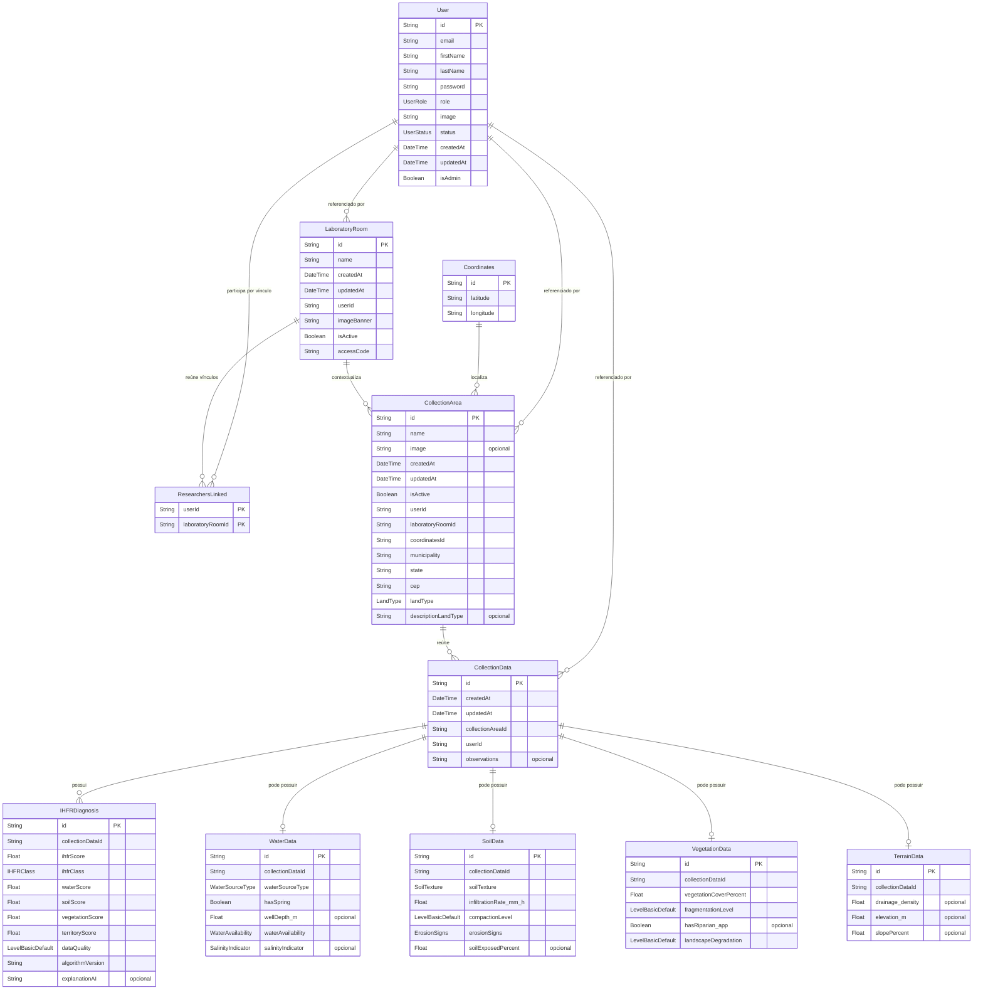

# Modelo lógico de dados Code-First

## Identificação, baseline e limites

| Campo | Registro | Classificação |
|---|---|---|
| Iniciativa | `PRD Code-First` — ampliação da Fase 1 | `DECISAO_DE_TRABALHO_PARA_RASCUNHO` |
| Estado | `EM_REVISAO` | estado documental; não concede aprovação normativa |
| Baseline desta execução | branch `docs/code-first-prd`; HEAD `b3c73fb7e3151c7badb23f8dfeac5c689e17983b`; upstream `origin/docs/code-first-prd`; worktree inicialmente limpo | `EVIDENCIA_IMPLEMENTACAO` |
| Fonte estrutural principal | [`../../../prisma/schema.prisma`](../../../prisma/schema.prisma) | `EVIDENCIA_IMPLEMENTACAO` da estrutura declarada |
| Método | inspeção estática do schema, do código rastreado pertinente, das configurações rastreadas e do pacote Code-First | `LIMITACAO_DA_EVIDENCIA` quanto a runtime e banco |
| Aprovação do domínio | inexistente | `NAO_ESPECIFICADO` |
| Encerramento ampliado | `FASE_1_AMPLIADA_CONCLUIDA_EM_REVISAO` | gates materiais estáticos aprovados; não concede aprovação normativa |
| Fase 2 | `NAO_INICIADA` | não foi autorizada nesta execução |

Fontes complementares: código rastreado que confirma uso e significado observável; configurações rastreadas pertinentes; documentos de [`../`](../); e [`../../../TECH_DECISIONS.md`](../../../TECH_DECISIONS.md), com seus estados preservados. Não foram usados conteúdo histórico excluído, matriz global, auditorias anteriores, internet, Figma ou o conteúdo da migration local ignorada.

Esta é uma visão descritiva do baseline, não um modelo de domínio aprovado. A existência de uma entidade, atributo ou relacionamento no schema não transforma a estrutura atual em intenção normativa, regra de produto ou contrato científico validado. Aplicação, banco, migrations, Prisma generate, build e testes não foram executados.

## Convenção desta iniciativa

A terminologia de modelagem varia entre métodos e ferramentas. Nesta iniciativa:

- o **modelo lógico** descreve entidades, atributos, identificadores, domínios de valores e relacionamentos;
- o **modelo relacional** descreve a organização dessa mesma estrutura em relações representadas pelos models Prisma, campos e restrições declaradas no schema;
- os dois modelos são visões complementares do mesmo baseline, não propostas independentes de banco;
- nenhum deles redesenha, normaliza, desnormaliza ou corrige a estrutura atual.

Os nomes das entidades e atributos são os nomes reais do schema. Enums são domínios de valores usados por atributos; não são tratados como entidades persistidas independentes. Tipos TypeScript, serviços, componentes, estruturas inline e mocks não são entidades deste modelo lógico.

## Inventário de entidades

O baseline contém 11 models Prisma, todos cobertos abaixo.

| Entidade lógica | Descrição observável | Identificador | Classe Code-First | Uso conectado observado |
|---|---|---|---|---|
| `User` | conta, estado, papel técnico e vínculo de autoria | `id` | `CF-CLS-001` | autenticação e operações Prisma sobre `User` |
| `Coordinates` | latitude e longitude textuais referenciáveis por áreas | `id` | `CF-CLS-002` | consumidor persistente não localizado |
| `LaboratoryRoom` | contexto técnico de laboratório vinculado a usuário | `id` | `CF-CLS-003` | interface correspondente mockada |
| `ResearchersLinked` | associação entre usuário e laboratório | (`userId`, `laboratoryRoomId`) | `CF-CLS-004` | consumidor não localizado |
| `CollectionArea` | área vinculada a usuário, laboratório e coordenadas | `id` | `CF-CLS-005` | cards de interface mockados |
| `CollectionData` | registro de coleta vinculado a área e usuário | `id` | `CF-CLS-006` | consumidor não localizado |
| `IHFRDiagnosis` | resultado IHFR declarado para uma coleta | `id` | `CF-CLS-007` | produtor e consumidor não localizados |
| `WaterData` | grupo declarado de dados de água | `id` | `CF-CLS-008` | consumidor não localizado |
| `SoilData` | grupo declarado de dados de solo | `id` | `CF-CLS-009` | consumidor não localizado |
| `VegetationData` | grupo declarado de dados de vegetação | `id` | `CF-CLS-010` | consumidor não localizado |
| `TerrainData` | grupo declarado de dados de terreno | `id` | `CF-CLS-011` | consumidor não localizado |

## Atributos e domínios

`Obrigatório` e `opcional` reproduzem a nulabilidade declarada no Prisma. Defaults e comportamentos técnicos detalhados pertencem ao [modelo relacional](relational-data-model.md); sua menção aqui apenas caracteriza o atributo no baseline.

### Identidade, laboratório e área

| Entidade | Atributo | Domínio declarado | Participação do atributo | Descrição observável |
|---|---|---|---|---|
| `User` | `id` | `String` | obrigatório; identificador | identificador com declaração `uuid()` |
| `User` | `email` | `String` | obrigatório | endereço usado pela autenticação; unicidade declarada |
| `User` | `firstName` | `String` | obrigatório | primeiro nome |
| `User` | `lastName` | `String` | obrigatório | sobrenome |
| `User` | `password` | `String` | obrigatório | valor de credencial persistido; política não definida por este modelo |
| `User` | `role` | `UserRole` | obrigatório | papel técnico; default `USER` |
| `User` | `image` | `String` | obrigatório | referência textual; default vazio |
| `User` | `status` | `UserStatus` | obrigatório | estado técnico; default `PENDING` |
| `User` | `createdAt` | `DateTime` | obrigatório | registro de criação; default `now()` |
| `User` | `updatedAt` | `DateTime` | obrigatório | atualização declarada por `@updatedAt` |
| `User` | `isAdmin` | `Boolean` | obrigatório | sinalizador técnico; default `false` |
| `Coordinates` | `id` | `String` | obrigatório; identificador | identificador com declaração `uuid()` |
| `Coordinates` | `latitude` | `String` | obrigatório | latitude textual; formato, precisão e CRS não especificados |
| `Coordinates` | `longitude` | `String` | obrigatório | longitude textual; formato, precisão e CRS não especificados |
| `LaboratoryRoom` | `id` | `String` | obrigatório; identificador | identificador com declaração `uuid()` |
| `LaboratoryRoom` | `name` | `String` | obrigatório | nome do laboratório |
| `LaboratoryRoom` | `createdAt` | `DateTime` | obrigatório | registro de criação; default `now()` |
| `LaboratoryRoom` | `updatedAt` | `DateTime` | obrigatório | atualização declarada por `@updatedAt` |
| `LaboratoryRoom` | `userId` | `String` | obrigatório | referência a `User.id` |
| `LaboratoryRoom` | `imageBanner` | `String` | obrigatório | referência textual; default vazio |
| `LaboratoryRoom` | `isActive` | `Boolean` | obrigatório | sinalizador técnico; default `true` |
| `LaboratoryRoom` | `accessCode` | `String` | obrigatório | código textual sem unicidade declarada |
| `ResearchersLinked` | `userId` | `String` | obrigatório; identificador composto | referência a `User.id` |
| `ResearchersLinked` | `laboratoryRoomId` | `String` | obrigatório; identificador composto | referência a `LaboratoryRoom.id` |
| `CollectionArea` | `id` | `String` | obrigatório; identificador | identificador com declaração `uuid()` |
| `CollectionArea` | `name` | `String` | obrigatório | nome da área |
| `CollectionArea` | `image` | `String` | opcional | referência textual de imagem |
| `CollectionArea` | `createdAt` | `DateTime` | obrigatório | registro de criação; default `now()` |
| `CollectionArea` | `updatedAt` | `DateTime` | obrigatório | atualização declarada por `@updatedAt` |
| `CollectionArea` | `isActive` | `Boolean` | obrigatório | sinalizador técnico; default `true` |
| `CollectionArea` | `userId` | `String` | obrigatório | referência a `User.id` |
| `CollectionArea` | `laboratoryRoomId` | `String` | obrigatório | referência a `LaboratoryRoom.id` |
| `CollectionArea` | `coordinatesId` | `String` | obrigatório | referência a `Coordinates.id` |
| `CollectionArea` | `municipality` | `String` | obrigatório | município textual |
| `CollectionArea` | `state` | `String` | obrigatório | estado textual |
| `CollectionArea` | `cep` | `String` | obrigatório | CEP textual |
| `CollectionArea` | `landType` | `LandType` | obrigatório | domínio técnico de tipo de terra |
| `CollectionArea` | `descriptionLandType` | `String` | opcional | descrição adicional do tipo de terra |

### Coleta, dados ambientais e diagnóstico

| Entidade | Atributo | Domínio declarado | Participação do atributo | Descrição observável |
|---|---|---|---|---|
| `CollectionData` | `id` | `String` | obrigatório; identificador | identificador com declaração `uuid()` |
| `CollectionData` | `createdAt` | `DateTime` | obrigatório | registro de criação; default `now()` |
| `CollectionData` | `updatedAt` | `DateTime` | obrigatório | atualização declarada por `@updatedAt` |
| `CollectionData` | `collectionAreaId` | `String` | obrigatório | referência a `CollectionArea.id` |
| `CollectionData` | `userId` | `String` | obrigatório | referência a `User.id` |
| `CollectionData` | `observations` | `String` | opcional | observações textuais |
| `IHFRDiagnosis` | `id` | `String` | obrigatório; identificador | identificador com declaração `uuid()` |
| `IHFRDiagnosis` | `collectionDataId` | `String` | obrigatório | referência a `CollectionData.id` |
| `IHFRDiagnosis` | `ihfrScore` | `Float` | obrigatório | pontuação IHFR declarada |
| `IHFRDiagnosis` | `ihfrClass` | `IHFRClass` | obrigatório | classe IHFR técnica |
| `IHFRDiagnosis` | `waterScore` | `Float` | obrigatório | pontuação de água declarada |
| `IHFRDiagnosis` | `soilScore` | `Float` | obrigatório | pontuação de solo declarada |
| `IHFRDiagnosis` | `vegetationScore` | `Float` | obrigatório | pontuação de vegetação declarada |
| `IHFRDiagnosis` | `territoryScore` | `Float` | obrigatório | pontuação territorial declarada |
| `IHFRDiagnosis` | `dataQuality` | `LevelBasicDefault` | obrigatório | domínio técnico de qualidade |
| `IHFRDiagnosis` | `algorithmVersion` | `String` | obrigatório | versão textual; default `1.0.0` |
| `IHFRDiagnosis` | `explanationAI` | `String` | opcional | texto opcional; não prova capacidade de IA |
| `WaterData` | `id` | `String` | obrigatório; identificador | identificador com declaração `uuid()` |
| `WaterData` | `collectionDataId` | `String` | obrigatório | referência única a `CollectionData.id` |
| `WaterData` | `waterSourceType` | `WaterSourceType` | obrigatório | tipo técnico de fonte de água |
| `WaterData` | `hasSpring` | `Boolean` | obrigatório | indicador declarado de nascente |
| `WaterData` | `wellDepth_m` | `Float` | opcional | profundidade declarada; o nome sugere metros, sem validação científica |
| `WaterData` | `waterAvailability` | `WaterAvailability` | obrigatório | disponibilidade hídrica técnica |
| `WaterData` | `salinityIndicator` | `SalinityIndicator` | opcional | indicador técnico de salinidade |
| `SoilData` | `id` | `String` | obrigatório; identificador | identificador com declaração `uuid()` |
| `SoilData` | `collectionDataId` | `String` | obrigatório | referência única a `CollectionData.id` |
| `SoilData` | `soilTexture` | `SoilTexture` | obrigatório | textura técnica do solo |
| `SoilData` | `infiltrationRate_mm_h` | `Float` | obrigatório | taxa declarada; o nome sugere mm/h, sem validação científica |
| `SoilData` | `compactionLevel` | `LevelBasicDefault` | obrigatório | nível técnico de compactação |
| `SoilData` | `erosionSigns` | `ErosionSigns` | obrigatório | sinais técnicos de erosão |
| `SoilData` | `soilExposedPercent` | `Float` | opcional | percentual declarado de solo exposto |
| `VegetationData` | `id` | `String` | obrigatório; identificador | identificador com declaração `uuid()` |
| `VegetationData` | `collectionDataId` | `String` | obrigatório | referência única a `CollectionData.id` |
| `VegetationData` | `vegetationCoverPercent` | `Float` | obrigatório | percentual declarado de cobertura vegetal |
| `VegetationData` | `fragmentationLevel` | `LevelBasicDefault` | obrigatório | nível técnico de fragmentação |
| `VegetationData` | `hasRiparian_app` | `Boolean` | opcional | indicador cujo sufixo `_app` não é esclarecido pelo código |
| `VegetationData` | `landscapeDegradation` | `LevelBasicDefault` | obrigatório | nível técnico de degradação da paisagem |
| `TerrainData` | `id` | `String` | obrigatório; identificador | identificador com declaração `uuid()` |
| `TerrainData` | `collectionDataId` | `String` | obrigatório | referência única a `CollectionData.id` |
| `TerrainData` | `drainage_density` | `Float` | opcional | densidade de drenagem declarada; unidade não especificada |
| `TerrainData` | `elevation_m` | `Float` | opcional | elevação declarada; o nome sugere metros, sem validação científica |
| `TerrainData` | `slopePercent` | `Float` | opcional | declividade percentual declarada |

### Domínios enumerados

Os 10 enums são domínios de valores, não entidades persistidas independentes. Grafias são preservadas exatamente como no schema; nenhuma correção semântica é inferida.

| Domínio | Valores declarados | Atributos que o usam | Classe Code-First | Limitação |
|---|---|---|---|---|
| `UserRole` | `USER`, `ADMIN`, `DEVELOPER`, `MODERATOR` | `User.role` | `CF-CLS-012` | não aprova papéis nem permissões do produto |
| `UserStatus` | `ACTIVE`, `INACTIVE`, `PENDING`, `BLOCKED` | `User.status` | `CF-CLS-013` | transições e efeitos não especificados |
| `LandType` | `FOREST`, `AGROFORESTRY`, `CROPLAND`, `PASTURE`, `DEGRADED_PASTURE`, `BARE_SOIL`, `URBAN`, `OTHERS` | `CollectionArea.landType` | `CF-CLS-014` | taxonomia de dados/produto não aprovada |
| `IHFRClass` | `LOW`, `MODERATE`, `HIGH`, `CRITICAL` | `IHFRDiagnosis.ihfrClass` | `CF-CLS-015` | classes e limiares científicos não aprovados |
| `LevelBasicDefault` | `LOW`, `MODERATE`, `HIGH` | `IHFRDiagnosis.dataQuality`, `SoilData.compactionLevel`, `VegetationData.fragmentationLevel`, `VegetationData.landscapeDegradation` | `CF-CLS-016` | reuso técnico não prova significado científico comum |
| `WaterSourceType` | `RIVER_STREAM`, `SPRING`, `SHALLOW_WELL`, `TUBULA_WELL`, `CISTERN`, `OTHER` | `WaterData.waterSourceType` | `CF-CLS-017` | `TUBULA_WELL` preservado; intenção não esclarecida |
| `WaterAvailability` | `PERMANENT`, `SEASONAL`, `SCARCE` | `WaterData.waterAvailability` | `CF-CLS-018` | critérios não especificados |
| `SalinityIndicator` | `NONE`, `SUSPERCTED`, `CONFIRMED` | `WaterData.salinityIndicator` | `CF-CLS-019` | `SUSPERCTED` preservado; intenção não esclarecida |
| `SoilTexture` | `SANDY`, `MEDIUM`, `CLAYEY` | `SoilData.soilTexture` | `CF-CLS-020` | `CLAYEY` preservado; intenção não esclarecida |
| `ErosionSigns` | `NONE`, `LAMINAR`, `RILLS_GUILLIES` | `SoilData.erosionSigns` | `CF-CLS-021` | `RILLS_GUILLIES` preservado; intenção não esclarecida |

## Identificadores

| Entidade | Identificador lógico observado | Natureza |
|---|---|---|
| `User` | `id` | simples |
| `Coordinates` | `id` | simples |
| `LaboratoryRoom` | `id` | simples |
| `ResearchersLinked` | (`userId`, `laboratoryRoomId`) | composto; também identifica unicamente o par usuário–laboratório |
| `CollectionArea` | `id` | simples |
| `CollectionData` | `id` | simples |
| `IHFRDiagnosis` | `id` | simples |
| `WaterData` | `id` | simples; `collectionDataId` também é único |
| `SoilData` | `id` | simples; `collectionDataId` também é único |
| `VegetationData` | `id` | simples; `collectionDataId` também é único |
| `TerrainData` | `id` | simples; `collectionDataId` também é único |

`User.email` também possui unicidade declarada, mas não substitui o identificador primário `User.id` nesta representação.

## Relacionamentos, cardinalidades e participação

| Entidade A | Entidade B | Cardinalidade observada | Participação em A | Participação em B | Evidência estrutural e limite |
|---|---|---|---|---|---|
| `User` | `LaboratoryRoom` | `1 : 0..*` | opcional: um usuário pode não ter laboratórios | obrigatória: cada laboratório referencia um usuário | `LaboratoryRoom.userId`; não aprova propriedade |
| `User` | `ResearchersLinked` | `1 : 0..*` | opcional: um usuário pode não ter vínculos | obrigatória: cada vínculo referencia um usuário | `ResearchersLinked.userId`; papel e estado do membro ausentes |
| `LaboratoryRoom` | `ResearchersLinked` | `1 : 0..*` | opcional: um laboratório pode não ter vínculos | obrigatória: cada vínculo referencia um laboratório | `ResearchersLinked.laboratoryRoomId`; ingresso e saída abertos |
| `User` | `CollectionArea` | `1 : 0..*` | opcional: um usuário pode não estar ligado a áreas | obrigatória: cada área referencia um usuário | `CollectionArea.userId`; não aprova propriedade de negócio |
| `Coordinates` | `CollectionArea` | `1 : 0..*` | opcional: coordenadas podem não ser referenciadas | obrigatória: cada área referencia coordenadas | FK não única permite reutilização; não há geometria de área |
| `LaboratoryRoom` | `CollectionArea` | `1 : 0..*` | opcional: um laboratório pode não ter áreas | obrigatória: cada área referencia um laboratório | segregação e acesso não validados |
| `User` | `CollectionData` | `1 : 0..*` | opcional: um usuário pode não estar ligado a coletas | obrigatória: cada coleta referencia um usuário | `CollectionData.userId`; autoria normativa aberta |
| `CollectionArea` | `CollectionData` | `1 : 0..*` | opcional: uma área pode não ter coletas | obrigatória: cada coleta referencia uma área | ciclo da coleta não especificado |
| `CollectionData` | `IHFRDiagnosis` | `1 : 0..*` | opcional: uma coleta pode não ter diagnóstico | obrigatória: cada diagnóstico referencia uma coleta | FK não única permite múltiplos diagnósticos |
| `CollectionData` | `WaterData` | `1 : 0..1` | opcional: uma coleta pode não ter dados de água | obrigatória: cada registro de água referencia uma coleta | FK única limita a um registro por coleta |
| `CollectionData` | `SoilData` | `1 : 0..1` | opcional: uma coleta pode não ter dados de solo | obrigatória: cada registro de solo referencia uma coleta | FK única limita a um registro por coleta |
| `CollectionData` | `VegetationData` | `1 : 0..1` | opcional: uma coleta pode não ter dados de vegetação | obrigatória: cada registro de vegetação referencia uma coleta | FK única limita a um registro por coleta |
| `CollectionData` | `TerrainData` | `1 : 0..1` | opcional: uma coleta pode não ter dados de terreno | obrigatória: cada registro de terreno referencia uma coleta | FK única limita a um registro por coleta |

As cardinalidades derivam das FKs, da nulabilidade e da unicidade declaradas. O nome de um campo não foi usado isoladamente para concluir uma relação `1:1`. Os campos reversos `waterData`, `soilData`, `vegetationData` e `terrainData` são listas no Prisma, mas as respectivas FKs únicas limitam o lado dependente a no máximo um registro por coleta.

## Explicação textual do modelo

`User` participa de dois vínculos diferentes com `LaboratoryRoom`: a referência direta obrigatória de cada laboratório por `userId` e a associação muitos-para-muitos materializada por `ResearchersLinked`. A estrutura não define se o primeiro vínculo significa autoria, responsabilidade ou propriedade, nem se todos os responsáveis também precisam estar na associação.

Cada `CollectionArea` exige referências a `User`, `LaboratoryRoom` e `Coordinates`. `Coordinates` contém somente latitude e longitude textuais, e sua FK não única permite que várias áreas reutilizem o mesmo registro. `CollectionData` exige uma área e um usuário; por isso sua associação espacial observável é indireta, via `CollectionArea` → `Coordinates`, sem localização própria de coleta.

Uma `CollectionData` pode reunir opcionalmente até um registro de cada grupo `WaterData`, `SoilData`, `VegetationData` e `TerrainData`. Pode também possuir zero ou vários `IHFRDiagnosis`. Essa estrutura não informa o método de obtenção do diagnóstico, a relação temporal entre diagnósticos nem a validade científica de campos, unidades, enums, pontuações ou classes.

## Diagrama Mermaid

O diagrama `LDM-01` representa as 11 entidades, seus atributos escalares, identificadores e 13 relacionamentos. O arquivo [`../diagrams/plantuml/logical-data-model.puml`](../diagrams/plantuml/logical-data-model.puml) contém a representação PlantUML equivalente identificada pelo mesmo código.

## Evidências e rastreabilidade

| Entidades lógicas | Relações no modelo relacional | Classes | Requisitos diretamente relacionados | Casos de uso diretamente relacionados | Fluxos diretamente relacionados |
|---|---|---|---|---|---|
| `User` | `User` | `CF-CLS-001`; domínios `CF-CLS-012`, `CF-CLS-013` | `CF-PRD-FR-001`, `CF-PRD-FR-002`, `CF-PRD-FR-003`, `CF-PRD-FR-011`, `CF-PRD-FR-012`; `CF-PRD-NFR-002`, `CF-PRD-NFR-003` | `CF-UC-001`, `CF-UC-002`, `CF-UC-003`, `CF-UC-004`, `CF-UC-005`, `CF-UC-006`, `CF-UC-008`, `CF-UC-009`, `CF-UC-014` | `CF-PFLOW-001`, `CF-PFLOW-002`, `CF-PFLOW-003`, `CF-PFLOW-004`, `CF-PFLOW-005`, `CF-PFLOW-007` |
| `LaboratoryRoom`, `ResearchersLinked` | `LaboratoryRoom`, `ResearchersLinked` | `CF-CLS-003`, `CF-CLS-004` | `CF-PRD-FR-003`, `CF-PRD-FR-004`, `CF-PRD-FR-005`, `CF-PRD-FR-011`; `CF-PRD-NFR-001` | `CF-UC-004`, `CF-UC-005`, `CF-UC-006`, `CF-UC-007`, `CF-UC-008` | `CF-PFLOW-001`, `CF-PFLOW-003`, `CF-PFLOW-004` |
| `Coordinates`, `CollectionArea` | `Coordinates`, `CollectionArea` | `CF-CLS-002`, `CF-CLS-005`; domínio `CF-CLS-014` | `CF-PRD-FR-005`, `CF-PRD-FR-006`, `CF-PRD-FR-013`, `CF-PRD-FR-014`, `CF-PRD-FR-015`; `CF-PRD-NFR-001`, `CF-PRD-NFR-002`, `CF-PRD-NFR-006` | `CF-UC-007`, `CF-UC-008`, `CF-UC-009`, `CF-UC-010`, `CF-UC-015` | `CF-PFLOW-001`, `CF-PFLOW-004`, `CF-PFLOW-005`, `CF-PFLOW-007` |
| `CollectionData` | `CollectionData` | `CF-CLS-006` | `CF-PRD-FR-006`, `CF-PRD-FR-007`, `CF-PRD-FR-008`, `CF-PRD-FR-009`, `CF-PRD-FR-010`, `CF-PRD-FR-012`, `CF-PRD-FR-014`, `CF-PRD-FR-015`; `CF-PRD-NFR-002`, `CF-PRD-NFR-006` | `CF-UC-009`, `CF-UC-010`, `CF-UC-011`, `CF-UC-012`, `CF-UC-013`, `CF-UC-014`, `CF-UC-015` | `CF-PFLOW-001`, `CF-PFLOW-005`, `CF-PFLOW-006`, `CF-PFLOW-007` |
| `WaterData`, `SoilData`, `VegetationData`, `TerrainData` | relações homônimas | `CF-CLS-008`, `CF-CLS-009`, `CF-CLS-010`, `CF-CLS-011`; domínios `CF-CLS-016`, `CF-CLS-017`, `CF-CLS-018`, `CF-CLS-019`, `CF-CLS-020`, `CF-CLS-021` | `CF-PRD-FR-007`, `CF-PRD-FR-014` | `CF-UC-011` | `CF-PFLOW-001`, `CF-PFLOW-005` |
| `IHFRDiagnosis` | `IHFRDiagnosis` | `CF-CLS-007`; domínios `CF-CLS-015`, `CF-CLS-016` | `CF-PRD-FR-008`, `CF-PRD-FR-009`, `CF-PRD-FR-015`; `CF-PRD-NFR-006` | `CF-UC-012`, `CF-UC-013`, `CF-UC-015` | `CF-PFLOW-001`, `CF-PFLOW-006`, `CF-PFLOW-007` |

Relações acima são incluídas somente quando há compatibilidade estrutural direta; requisitos de responsividade e acessibilidade não recebem cobertura forçada por entidades.

## Conceitos do produto sem representação no schema

- contexto de laboratório ativo e regras de convite, ingresso, aprovação, saída, papéis, participação, propriedade, transferência e permissões;
- geometria de área, localização própria da coleta, camadas, filtros, marcadores, projeção, precisão e demais entidades cartográficas;
- acompanhamento persistido, eventos de histórico e resumo consolidado;
- processo que calcula, importa, obtém, registra ou consulta o IHFR;
- contrato científico aprovado para variáveis, unidades, validações, pontuações, classes e limiares;
- gráficos e projeções territoriais persistidos;
- alertas, mencionados somente em comentário do schema, sem model declarado.

Essas ausências não criam entidades propostas. O mapa continua no MVP por `CF-PD-007`, mas só `Coordinates` e o encadeamento indireto até `CollectionData` possuem estrutura persistível declarada. O contrato científico e a forma de obtenção do IHFR permanecem abertos por `CF-PD-005`; regras de laboratório, participação, papéis e propriedade permanecem abertas por `CF-PD-002`, `CF-PD-003` e `CF-PD-006`.

## Limitações e ponto de parada

- `EVIDENCIA_IMPLEMENTACAO` — o schema declara estrutura; não comprova migration aplicada, relações/tabelas existentes ou dados persistidos.
- `LIMITACAO_DA_EVIDENCIA` — somente `User` possui uso Prisma conectado localizado; os demais models não foram validados em runtime.
- `PENDENCIA_DE_DECISAO` — o modelo pretendido, a governança de dados e o domínio final não estão aprovados.
- `PENDENCIA_DE_DECISAO` — campos e enums ambientais e de IHFR não constituem contrato científico validado.
- `NAO_ESPECIFICADO` — ações referenciais, ciclos de vida, retenção, privacidade e regras de propriedade não são definidos por esta visão.
- `LIMITACAO_DA_EVIDENCIA` — renderizadores PlantUML e Mermaid não estão disponíveis localmente; a equivalência foi validada estruturalmente, mas a renderização visual não foi verificada.

O documento permanece `EM_REVISAO`. Os gates materiais dos quatro novos artefatos, de sua integração e da equivalência Mermaid–PlantUML foram aprovados estaticamente. O encerramento é `FASE_1_AMPLIADA_CONCLUIDA_EM_REVISAO`; a Fase 2 não começou e permanece `FASE_2_NAO_INICIADA`.
