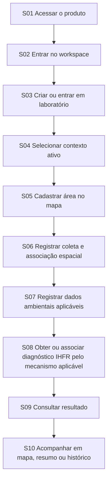
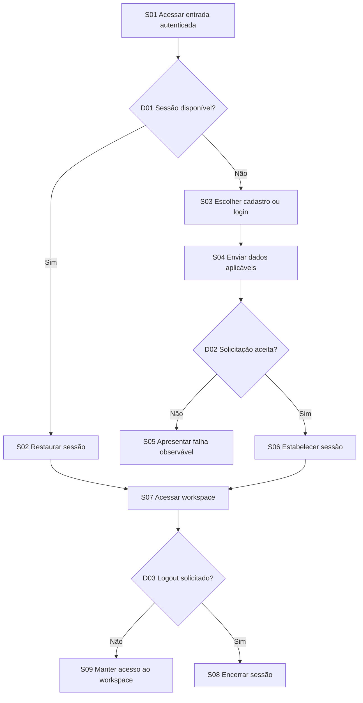
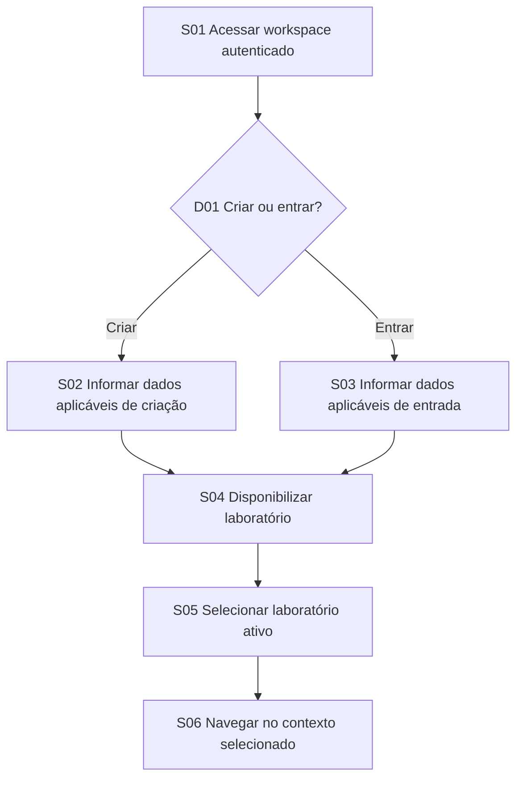
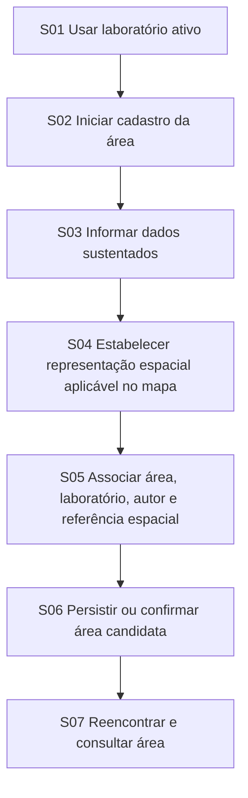
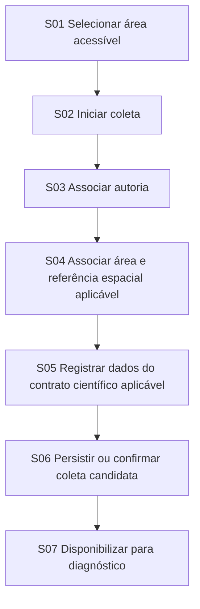
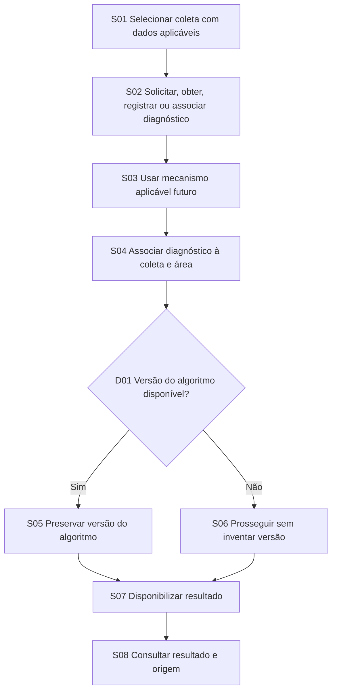
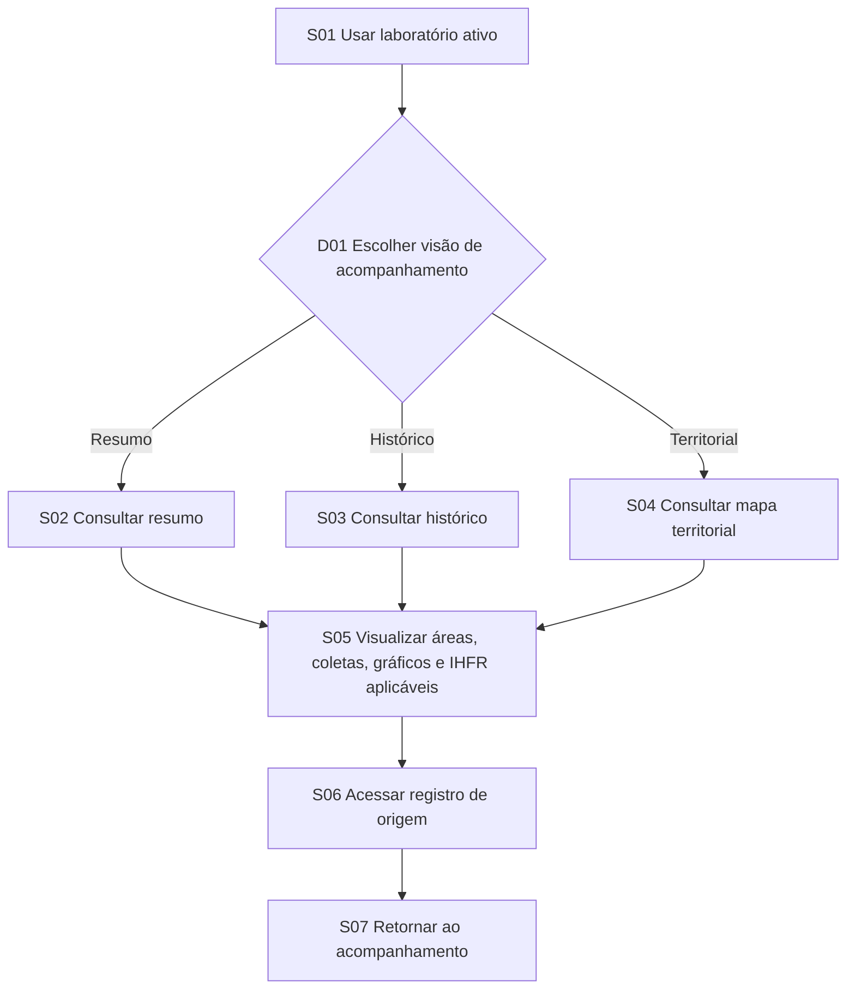

# Fluxos do produto Code-First

## Identificação e limites

| Campo | Registro | Classificação |
|---|---|---|
| Iniciativa | `PRD Code-First` — Fase 1 | `DECISAO_DE_TRABALHO_PARA_RASCUNHO` |
| Estado | `EM_REVISAO` | estado documental; não concede aprovação normativa |
| Baseline | branch `docs/code-first-prd`; HEAD e upstream `213918ec6a5f91ed4e35e54d9d0bef07ed156f36`; worktree inicialmente limpo | `EVIDENCIA_IMPLEMENTACAO` |
| Escopo | exatamente sete fluxos `CF-PFLOW-001`, `CF-PFLOW-002`, `CF-PFLOW-003`, `CF-PFLOW-004`, `CF-PFLOW-005`, `CF-PFLOW-006`, `CF-PFLOW-007` | `DECISAO_DE_TRABALHO_PARA_RASCUNHO` |
| Natureza | fluxos candidatos derivados do código, schema, requisitos, casos de uso e decisões registradas | `REQUISITO_CANDIDATO_DERIVADO_DO_CODIGO` |
| Validação | inspeção estática; runtime não executado | `LIMITACAO_DA_EVIDENCIA` |
| Aprovação normativa | inexistente | `NAO_ESPECIFICADO` |
| Validação cruzada | `CONCLUIDA`; relatório em [`../analysis/code-first-package-validation.md`](../analysis/code-first-package-validation.md) | `EVIDENCIA_IMPLEMENTACAO` |

Fontes usadas: código e configurações rastreados; [`../../../prisma/schema.prisma`](../../../prisma/schema.prisma); [`requirements.md`](requirements.md); [`use-cases.md`](use-cases.md); [`class-diagram.md`](class-diagram.md); os demais documentos da iniciativa em [`../`](../); [`../../../TECH_DECISIONS.md`](../../../TECH_DECISIONS.md), com seus estados preservados; e as decisões humanas registradas na iniciativa. `docs/raw/**`, matriz global, relatórios históricos, internet, fontes externas e Figma foram excluídos.

Este documento especifica comportamento candidato e registra separadamente a implementação observável. Código, schema, mocks e placeholders comprovam somente seu próprio estado; não aprovam intenção, regras de negócio, domínio, permissões ou ciência. A aplicação, build, lint, testes, banco, migrations e deploy não foram executados.

O mapa integra o núcleo do MVP por `CF-PD-007`; Leaflet/React-Leaflet são a escolha local planejada para seu mínimo, enquanto geometria adicional, formato de coordenadas, camadas, simbologia, precisão, interação, provedor e arquitetura definitiva continuam abertos em `CF-Q-012`, `CF-Q-013`, `TD-008`, `TD-011` e `TD-014`. `TD-010` confirma Plotly apenas para gráficos analíticos futuros posteriores à IMP-009, sem integração definida. O IHFR integra o ciclo por `CF-PD-004`, enquanto sua forma de produção permanece aberta em `CF-PD-005`; este documento não define fórmula, pesos, variáveis normativas, classes, limiares, interpretação, Python, serviço externo ou cálculo interno.

## Convenções

| Marca visual | Classificação | Uso |
|---|---|---|
| ◆ | `DIRECAO_CONFIRMADA_PARA_RASCUNHO` | direção humana registrada para estruturar o rascunho, sem aprovação normativa final |
| ◇ | `REQUISITO_CANDIDATO_DERIVADO_DO_CODIGO` | comportamento pretendido candidato, ainda sujeito a decisão e aprovação |
| ■ | `IMPLEMENTADO_VERIFICADO_ESTATICAMENTE` | comportamento localizado no código por inspeção estática, sem validação runtime |
| ◐ | `PARCIALMENTE_IMPLEMENTADO` | apenas parte do comportamento ou da estrutura foi localizada |
| ▧ | `MOCK_OU_PLACEHOLDER` | interface ou dado aparente sem integração de domínio comprovada |
| ⚠ | `DEPENDENCIA_ABERTA` | decisão, política, contrato ou autoridade ainda necessária |
| △ | `LIMITACAO_DA_EVIDENCIA` | limite da inspeção; não constitui comportamento desejado |

Nos diagramas, `SNN` identifica uma etapa e `DNN` uma decisão. Os rótulos permanecem curtos; classificação, evidência e diferença entre comportamento candidato e implementação atual ficam nas tabelas. A representação PlantUML equivalente está em [`../diagrams/plantuml/product-flows.puml`](../diagrams/plantuml/product-flows.puml).

## `CF-PFLOW-001` — Ciclo principal do MVP

### Especificação

| Campo | Registro |
|---|---|
| Objetivo | demonstrar o ciclo principal completo, do acesso ao acompanhamento territorial e histórico |
| Atores | participante da equipe; participante de campo; participante do laboratório; processo de diagnóstico `NAO_ESPECIFICADO` |
| Gatilho | pessoa inicia acesso ao produto para realizar ou acompanhar o ciclo do MVP |
| Precondições | elegibilidade e dados de acesso aplicáveis; contratos e permissões exigidos em cada etapa permanecem abertos |
| Pós-condições | diagnóstico, quando aplicável, permanece ligado à coleta e à área; registros podem ser reencontrados em mapa, resumo ou histórico |
| Requisitos relacionados | `CF-PRD-FR-001`, `CF-PRD-FR-002`, `CF-PRD-FR-003`, `CF-PRD-FR-004`, `CF-PRD-FR-005`, `CF-PRD-FR-006`, `CF-PRD-FR-007`, `CF-PRD-FR-008`, `CF-PRD-FR-009`, `CF-PRD-FR-010`, `CF-PRD-FR-011`, `CF-PRD-FR-012`, `CF-PRD-FR-013`, `CF-PRD-FR-014`, `CF-PRD-FR-015`; `CF-PRD-NFR-001`, `CF-PRD-NFR-002`, `CF-PRD-NFR-003`, `CF-PRD-NFR-004`, `CF-PRD-NFR-005`, `CF-PRD-NFR-006` transversalmente |
| Casos de uso relacionados | `CF-UC-001`, `CF-UC-002`, `CF-UC-003`, `CF-UC-004`, `CF-UC-005`, `CF-UC-006`, `CF-UC-007`, `CF-UC-008`, `CF-UC-009`, `CF-UC-010`, `CF-UC-011`, `CF-UC-012`, `CF-UC-013`, `CF-UC-014`, `CF-UC-015` |
| Classes/models relacionados | `CF-CLS-001`, `CF-CLS-002`, `CF-CLS-003`, `CF-CLS-004`, `CF-CLS-005`, `CF-CLS-006`, `CF-CLS-007`, `CF-CLS-008`, `CF-CLS-009`, `CF-CLS-010`, `CF-CLS-011`; classes e tipos de autenticação `CF-CLS-022`, `CF-CLS-023`, `CF-CLS-024`, `CF-CLS-025`, `CF-CLS-026`, `CF-CLS-027`, `CF-CLS-028`; `CF-CLS-029` e `CF-CLS-030` apenas como mocks de histórico e cards |
| Evidências | `src/contexts/auth.context.tsx:40-171`; `src/app/(private)/workspace/page.tsx:19-168`; `src/app/(private)/dashboard/page.tsx:7-22`; `src/app/(private)/dashboard/maps.tsx:18-46`; `prisma/schema.prisma:10-198` |
| Estado geral da implementação | `PARCIALMENTE_IMPLEMENTADO`: identidade possui caminhos estáticos; núcleo de domínio é schema, mock ou placeholder sem ciclo conectado |
| Decisões abertas | `CF-PD-002`, `CF-PD-003`, `CF-PD-005`, `CF-PD-006`; `CF-Q-005`, `CF-Q-006`, `CF-Q-011`, `CF-Q-012`, `CF-Q-013` |
| Limitações | não comprova jornada executável de ponta a ponta nem aprova regras científicas, permissões ou tecnologia cartográfica |

### Mermaid

### Etapas e implementação atual

| Etapa | Comportamento candidato | Natureza | Implementação observável |
|---|---|---|---|
| `S01` | iniciar cadastro, login ou restauração de sessão aplicável | ◇ requisito candidato | ■ cadastro/login localizados; ◐ sessão não validada em runtime |
| `S02` | alcançar o workspace autenticado | ◇ requisito candidato | ■ navegação estática localizada; △ proteção integral não validada |
| `S03` | criar ou entrar em laboratório | ◇ requisito candidato | ▧ botões e card; ◐ models `LaboratoryRoom` e `ResearchersLinked` sem fluxo consumidor |
| `S04` | selecionar o laboratório como contexto ativo | ◇ requisito candidato | ▧ estado local e card fixo; contexto persistido não localizado |
| `S05` | cadastrar a área e manter representação espacial aplicável no mapa | ◆ mapa no núcleo; ◇ fluxo candidato | ◐ `Coordinates` e `CollectionArea`; ▧ mapa e ação de nova área |
| `S06` | registrar coleta, autoria, área e associação espacial aplicável | ◇ requisito candidato | ◐ `CollectionData` e relações no schema; ▧ ação de nova coleta |
| `S07` | registrar dados exigidos pelo contrato científico aplicável | ◇ requisito candidato | ◐ quatro grupos sugeridos pelo schema, sem consumidor; ⚠ contrato científico |
| `S08` | obter ou associar diagnóstico IHFR pelo mecanismo aplicável | ◆ IHFR no ciclo; ⚠ mecanismo aberto | ◐ `IHFRDiagnosis` sem serviço, API ou interface consumidora localizada |
| `S09` | consultar o resultado com origem e versão do algoritmo disponível | ◇ requisito candidato | △ consulta não localizada; apenas estrutura parcial no schema |
| `S10` | visualizar mapa/resumo/histórico e retornar aos registros de origem | ◆ mapa no núcleo; ◇ acompanhamento candidato | ▧ mapa e histórico; ◐ dashboard; destinos parcialmente ausentes |

### Alternativas, exceções e separação de estados

- Cadastro, login e restauração da sessão são entradas sustentadas; política de conta, rejeição e expiração permanecem abertas.
- O fluxo não escolhe entre criação e ingresso no laboratório nem define seus mecanismos.
- `S08` usa formulação neutra: a produção do IHFR pode ser interna ou externa, importada, registrada ou consultada conforme decisão futura.
- Comportamento candidato: o ciclo completo acima. Implementação atual: apenas partes isoladas, sem evidência runtime de integração ponta a ponta.

## `CF-PFLOW-002` — Identidade e acesso

### Especificação

| Campo | Registro |
|---|---|
| Objetivo | permitir cadastro, login, restauração da sessão, acesso ao workspace e logout sem normalizar fragilidades técnicas atuais |
| Atores | pessoa elegível; usuário cadastrado |
| Gatilho | pessoa acessa uma rota de entrada ou uma página que utiliza o contexto autenticado |
| Precondições | política de elegibilidade, dados mínimos e estados de conta ainda aberta; para restauração, sessão previamente disponível |
| Pós-condições | sessão disponível para o workspace ou encerrada no logout; falha permanece sem promover detalhes técnicos a regra de produto |
| Requisitos relacionados | `CF-PRD-FR-001`, `CF-PRD-FR-002`; `CF-PRD-NFR-003`, `CF-PRD-NFR-004`, `CF-PRD-NFR-005` |
| Casos de uso relacionados | `CF-UC-001`, `CF-UC-002`, `CF-UC-003` |
| Classes/models relacionados | `CF-CLS-001` `User`; `CF-CLS-013` `UserStatus`; `CF-CLS-022`, `CF-CLS-023`, `CF-CLS-024`, `CF-CLS-025`, `CF-CLS-026`, `CF-CLS-027`, `CF-CLS-028` — tipos e serviços de autenticação |
| Evidências | `src/app/register/page.tsx:14-49`; `src/app/login/page.tsx:12-37`; `src/contexts/auth.context.tsx:40-171`; rotas em `src/app/api/auth/` |
| Estado geral da implementação | `PARCIALMENTE_IMPLEMENTADO`: cadastro e login localizados estaticamente; restauração e logout localizados sem validação runtime integral |
| Decisões abertas | `CF-Q-005`, `CF-Q-006`; política de acesso e privacidade em `CF-PD-006` |
| Limitações | não valida expiração, proteção de todas as rotas, mensagens, consentimento, duplicidade ou estados de conta |

### Mermaid

### Etapas e implementação atual

| Etapa | Comportamento candidato | Natureza | Implementação observável |
|---|---|---|---|
| `S01` | iniciar acesso autenticado | ◇ requisito candidato | ■ páginas de cadastro e login localizadas |
| `D01` | usar sessão disponível ou seguir para entrada | ◇ requisito candidato | ◐ chamada a `/api/auth/me`; expiração e abrangência não validadas |
| `S02` | restaurar usuário e contexto de autenticação | ◇ requisito candidato | ◐ contexto React restaura usuário estaticamente |
| `S03` | escolher cadastro ou login | ◇ requisito candidato | ■ dois caminhos de interface e API localizados |
| `S04` | enviar dados aceitos pela política futura | ◇ requisito candidato; ⚠ política aberta | ■ chamadas de cadastro/login; △ validações de produto não aprovadas |
| `D02` | distinguir sucesso de falha | ◇ requisito candidato | ■ respostas e exceções tratadas no cliente; mensagens finais permanecem abertas |
| `S05` | apresentar falha compreensível e permitir nova tentativa | ◇ requisito candidato | ◐ falha observável; critérios de UX não validados |
| `S06` | estabelecer sessão válida | ◇ requisito candidato | ■ rota e contexto localizados estaticamente; △ controles runtime não auditados |
| `S07` | acessar e permanecer no workspace | ◇ requisito candidato | ■ navegação localizada; △ proteção completa não validada |
| `D03`/`S08` | solicitar logout e encerrar sessão | ◇ requisito candidato | ◐ rota de logout, limpeza do contexto e redirecionamento localizados |
| `S09` | manter o acesso enquanto não houver logout | ◇ requisito candidato | ◐ contexto local localizado; duração e expiração não validadas |

### Alternativas, exceções e separação de estados

- Cadastro e login são alternativas sustentadas. Sessão disponível pode ser restaurada antes de solicitar novas credenciais.
- A solicitação pode falhar segundo respostas observáveis, mas causas, mensagens e política de nova tentativa permanecem abertas.
- Comportamento candidato: acesso coerente ao workspace e logout. Implementação atual: caminhos estáticos existentes, sem auditoria de segurança ou runtime.

## `CF-PFLOW-003` — Entrada e seleção do laboratório

### Especificação

| Campo | Registro |
|---|---|
| Objetivo | disponibilizar um laboratório ao usuário autenticado, selecionar o contexto ativo e iniciar navegação contextualizada |
| Atores | usuário autenticado; participante ou responsável como hipóteses, sem papéis aprovados |
| Gatilho | usuário acessa o workspace e precisa estabelecer um contexto de laboratório |
| Precondições | sessão autenticada; vínculo, elegibilidade e permissões futuras aplicáveis |
| Pós-condições | laboratório disponível e selecionado como contexto das áreas, coletas, diagnósticos e acompanhamento |
| Requisitos relacionados | `CF-PRD-FR-003`, `CF-PRD-FR-004`, `CF-PRD-FR-011`; `CF-PRD-NFR-001`, `CF-PRD-NFR-003`, `CF-PRD-NFR-004`, `CF-PRD-NFR-005` |
| Casos de uso relacionados | `CF-UC-004`, `CF-UC-005`, `CF-UC-006` |
| Classes/models relacionados | `CF-CLS-001` `User`; `CF-CLS-003` `LaboratoryRoom`; `CF-CLS-004` `ResearchersLinked` |
| Evidências | `prisma/schema.prisma:51-74`; `src/app/(private)/workspace/page.tsx:19-168` |
| Estado geral da implementação | `PARCIALMENTE_IMPLEMENTADO`: relações declaradas; interface, laboratório e seleção atuais são mocks/estado local |
| Decisões abertas | `CF-PD-002`, `CF-PD-006` |
| Limitações | convite, código, aprovação, múltiplos laboratórios, saída, transferência, propriedade e papéis não são definidos |

### Mermaid

### Etapas e implementação atual

| Etapa | Comportamento candidato | Natureza | Implementação observável |
|---|---|---|---|
| `S01` | acessar o workspace com sessão | ◇ requisito candidato | ■ rota e página localizadas; △ proteção runtime não validada |
| `D01` | escolher criação ou entrada | ◇ requisito candidato | ▧ botões alternam estado local da página |
| `S02` | fornecer dados aplicáveis para criar laboratório | ◇ requisito candidato; ⚠ regras abertas | ◐ model `LaboratoryRoom`; ▧ ação sem persistência localizada |
| `S03` | fornecer dados aplicáveis para entrar em laboratório | ◇ requisito candidato; ⚠ mecanismo aberto | ◐ `ResearchersLinked` e `accessCode`; ▧ ação sem consumidor localizado |
| `S04` | tornar o laboratório acessível ao usuário | ◇ requisito candidato | ▧ card fixo; relações no schema sem fluxo persistido |
| `S05` | selecionar o laboratório ativo | ◇ requisito candidato | ▧ seleção representada por estado local e card único |
| `S06` | navegar com o contexto selecionado | ◇ requisito candidato | ■ link ao dashboard; △ propagação real do contexto não localizada |

### Alternativas, exceções e separação de estados

- Criação e entrada são alternativas sustentadas, sem fixar convite, código ou aprovação como regra pretendida.
- A indisponibilidade ou rejeição de um laboratório não possui tratamento de produto suficientemente especificado.
- Comportamento candidato: laboratório disponível e contexto ativo. Implementação atual: schema parcial e workspace mockado.

## `CF-PFLOW-004` — Cadastro e consulta espacial da área

### Especificação

| Campo | Registro |
|---|---|
| Objetivo | cadastrar uma área no laboratório ativo, manter representação espacial aplicável no mapa e permitir consulta posterior |
| Atores | participante do laboratório autorizado; permissão concreta ainda aberta |
| Gatilho | participante inicia nova área ou consulta áreas existentes no laboratório ativo |
| Precondições | laboratório ativo; acesso aplicável |
| Pós-condições | área ligada ao laboratório, ao autor aplicável e à representação espacial; registro reencontrável para consulta |
| Requisitos relacionados | `CF-PRD-FR-005`, `CF-PRD-FR-011`, `CF-PRD-FR-012`, `CF-PRD-FR-013`; `CF-PRD-NFR-001`, `CF-PRD-NFR-002`, `CF-PRD-NFR-003`, `CF-PRD-NFR-004`, `CF-PRD-NFR-005` |
| Casos de uso relacionados | `CF-UC-007`, `CF-UC-008` |
| Classes/models relacionados | `CF-CLS-001` `User`; `CF-CLS-002` `Coordinates`; `CF-CLS-003` `LaboratoryRoom`; `CF-CLS-005` `CollectionArea`; `CF-CLS-014` `LandType` apenas como enum técnico não aprovado; `CF-CLS-030` `CollectCardData` como mock |
| Evidências | `prisma/schema.prisma:43-109`; `src/app/(private)/dashboard/collects/page.tsx:6-24`; `src/app/(private)/dashboard/collects/collect-card.tsx:24-80`; `src/app/(private)/dashboard/collects/collects-grid.tsx:3-49`; `src/app/(private)/dashboard/maps.tsx:18-46` |
| Estado geral da implementação | `PARCIALMENTE_IMPLEMENTADO`: schema espacial parcial; lista e mapa mockados; ação de cadastro placeholder |
| Decisões abertas | `CF-PD-003`, `CF-PD-006`; `CF-Q-012`, `CF-Q-013`; `TD-008`, `TD-011`, `TD-014`; em `TD-010`, apenas integração e gráficos concretos permanecem abertos |
| Limitações | não escolhe ponto, polígono, coordenadas, formato, precisão, interação, biblioteca ou provedor |

### Mermaid

### Etapas e implementação atual

| Etapa | Comportamento candidato | Natureza | Implementação observável |
|---|---|---|---|
| `S01` | manter o laboratório ativo durante o fluxo | ◇ requisito candidato | ▧ contexto ativo não persistido localizado |
| `S02` | iniciar nova área | ◇ requisito candidato | ▧ botão “Nova Área” apenas dispara alerta |
| `S03` | informar dados sustentados pelo código e decisões futuras | ◇ requisito candidato | ◐ `CollectionArea` declara nome, imagem, município, estado, CEP, tipo e descrição; taxonomia não aprovada |
| `S04` | estabelecer representação espacial aplicável pelo mapa | ◆ direção do mapa; ◇ requisito candidato | ◐ latitude/longitude textuais em `Coordinates`; ▧ mapa sem domínio conectado |
| `S05` | preservar vínculos com laboratório, autor e referência espacial | ◇ requisito candidato | ◐ chaves obrigatórias declaradas no schema; regras de propriedade abertas |
| `S06` | persistir ou confirmar a área pelo mecanismo futuro | ◇ requisito candidato | △ nenhum fluxo consumidor localizado |
| `S07` | consultar área, autoria e referência espacial aplicáveis | ◇ requisito candidato | ▧ cards locais, link externo e rota de detalhe sem destino localizado |

### Alternativas, exceções e separação de estados

- Uma área já existente pode ser consultada a partir de `S07`; o cadastro completo não precisa ser repetido.
- O link atual para Google Maps é mock e não seleciona tecnologia do produto.
- Comportamento candidato: cadastro e consulta espacial integrados. Implementação atual: estrutura parcial no schema e apresentações estáticas.

## `CF-PFLOW-005` — Coleta e dados ambientais

### Especificação

| Campo | Registro |
|---|---|
| Objetivo | registrar coleta, autoria, associação espacial aplicável e dados definidos pelo contrato científico futuro |
| Atores | participante de campo autorizado |
| Gatilho | participante seleciona uma área acessível e solicita nova coleta |
| Precondições | laboratório ativo; área acessível com referência espacial aplicável; contrato científico definido para o uso |
| Pós-condições | coleta recuperável, ligada à área, autor e dados aplicáveis, disponível para o ciclo diagnóstico |
| Requisitos relacionados | `CF-PRD-FR-006`, `CF-PRD-FR-007`, `CF-PRD-FR-011`, `CF-PRD-FR-012`, `CF-PRD-FR-014`; `CF-PRD-NFR-001`, `CF-PRD-NFR-002`, `CF-PRD-NFR-003`, `CF-PRD-NFR-004`, `CF-PRD-NFR-005` |
| Casos de uso relacionados | `CF-UC-009`, `CF-UC-010`, `CF-UC-011` |
| Classes/models relacionados | `CF-CLS-001` `User`; `CF-CLS-002` `Coordinates`; `CF-CLS-005` `CollectionArea`; `CF-CLS-006` `CollectionData`; `CF-CLS-008`, `CF-CLS-009`, `CF-CLS-010`, `CF-CLS-011` — grupos técnicos ambientais |
| Evidências | `prisma/schema.prisma:43-49`, `prisma/schema.prisma:76-126`, `prisma/schema.prisma:151-198`; `src/app/(private)/dashboard/page.tsx:7-22` |
| Estado geral da implementação | `PARCIALMENTE_IMPLEMENTADO`: models e relações declarados; ação placeholder e nenhum formulário/consumidor localizado |
| Decisões abertas | `CF-PD-003`, `CF-PD-005`, `CF-PD-006`; `CF-Q-011`, `CF-Q-012` |
| Limitações | água, solo, vegetação e terreno são somente grupos sugeridos pelo schema; campos, unidades, obrigatoriedade e validações não são aprovados |

### Mermaid

### Etapas e implementação atual

| Etapa | Comportamento candidato | Natureza | Implementação observável |
|---|---|---|---|
| `S01` | selecionar área disponível no contexto | ◇ requisito candidato | ▧ cards de área usam dados locais; contexto real não conectado |
| `S02` | iniciar registro da coleta | ◇ requisito candidato | ▧ botão “Nova Coleta” apenas dispara alerta |
| `S03` | preservar autoria aplicável | ◇ requisito candidato; ⚠ regras de autoria abertas | ◐ `CollectionData.userId` obrigatório no schema |
| `S04` | vincular coleta à área e alcançar sua referência espacial | ◆ associação espacial no núcleo; ◇ requisito candidato | ◐ cadeia `Coordinates → CollectionArea → CollectionData`; não há coordenada própria da coleta |
| `S05` | registrar dados exigidos pelo contrato científico | ◇ requisito candidato; ⚠ ciência aberta | ◐ `WaterData`, `SoilData`, `VegetationData`, `TerrainData` sem consumidor |
| `S06` | persistir ou confirmar a coleta candidata | ◇ requisito candidato | △ nenhum fluxo consumidor localizado |
| `S07` | tornar dados aplicáveis disponíveis ao diagnóstico | ◇ requisito candidato | ◐ relações com `IHFRDiagnosis` existem; integração não localizada |

### Alternativas, exceções e separação de estados

- O schema sustenta associação espacial pela área, não localização própria da coleta; outra granularidade depende de `CF-Q-012`.
- Incompletude, correção, rejeição e confirmação dos dados dependem do contrato científico e não são inventadas como exceções.
- Comportamento candidato: coleta ambiental rastreável e disponível ao diagnóstico. Implementação atual: somente schema parcial e ações placeholder.

## `CF-PFLOW-006` — Obtenção e consulta do diagnóstico IHFR

### Especificação

| Campo | Registro |
|---|---|
| Objetivo | obter, registrar ou associar um diagnóstico pelo mecanismo aplicável, preservar sua origem e consultar o resultado |
| Atores | participante autorizado; processo de diagnóstico `NAO_ESPECIFICADO` |
| Gatilho | coleta possui dados aplicáveis ou existe diagnóstico aceito para associação |
| Precondições | coleta e área existentes; dados e contrato científicos aplicáveis; acesso cabível |
| Pós-condições | diagnóstico associado à coleta e, por ela, à área; versão do algoritmo preservada quando disponível; resultado consultável |
| Requisitos relacionados | `CF-PRD-FR-008`, `CF-PRD-FR-009`, `CF-PRD-FR-011`, `CF-PRD-FR-012`; `CF-PRD-NFR-001`, `CF-PRD-NFR-002`, `CF-PRD-NFR-003`, `CF-PRD-NFR-004`, `CF-PRD-NFR-005`, `CF-PRD-NFR-006` |
| Casos de uso relacionados | `CF-UC-012`, `CF-UC-013` |
| Classes/models relacionados | `CF-CLS-005` `CollectionArea`; `CF-CLS-006` `CollectionData`; `CF-CLS-007` `IHFRDiagnosis`; `CF-CLS-015` e `CF-CLS-016` apenas como enums técnicos não validados cientificamente |
| Evidências | `prisma/schema.prisma:76-142`; ausência de API, serviço ou tela consumidora registrada em `CF-GAP-012` |
| Estado geral da implementação | `PARCIALMENTE_IMPLEMENTADO` na estrutura; comportamento de consulta `NAO_LOCALIZADO` |
| Decisões abertas | `CF-PD-005`, `CF-Q-011`; alternativas ainda não aprovadas `TD-009`, `TD-012` |
| Limitações | não define fórmula, pesos, variáveis, classes, limiares, interpretação, cálculo interno, Python, importação, registro manual ou serviço externo |

### Mermaid

### Etapas e implementação atual

| Etapa | Comportamento candidato | Natureza | Implementação observável |
|---|---|---|---|
| `S01` | localizar coleta com dados aplicáveis | ◇ requisito candidato | ◐ estrutura existe; nenhum consumidor localizado |
| `S02` | solicitar, obter, registrar ou associar diagnóstico | ◇ requisito candidato; ⚠ forma de produção aberta | △ nenhum fluxo localizado |
| `S03` | usar o mecanismo que vier a ser decidido | ⚠ `CF-PD-005` | △ mecanismo `NAO_ESPECIFICADO` |
| `S04` | associar diagnóstico à coleta e, por ela, à área | ◇ requisito candidato | ◐ `IHFRDiagnosis.collectionDataId` obrigatório |
| `D01`/`S05` | preservar a versão do algoritmo disponível | ◇ requisito candidato | ◐ `algorithmVersion` existe no schema, mas não aprova semântica nem valor; versão do contrato científico não existe |
| `S06` | prosseguir sem inventar versão quando ela não estiver disponível | △ limite da evidência | △ tratamento específico não localizado |
| `S07` | disponibilizar resultado associado | ◇ requisito candidato | ◐ campos técnicos no schema; contrato científico não aprovado |
| `S08` | consultar resultado, coleta, área e versão do algoritmo disponível | ◇ requisito candidato | △ comportamento de consulta não localizado |

### Alternativas, exceções e separação de estados

- `S02` mantém todas as formas plausíveis abertas; nenhuma é escolhida ou privilegiada.
- A ausência de versão não autoriza preenchimento inventado; o tratamento futuro permanece `NAO_ESPECIFICADO`.
- A cadeia ampliada `coleta → versão do contrato científico → versão do algoritmo → diagnóstico`, proposta em H08, não está integralmente implementada nem aprovada. O fluxo atual documenta apenas coleta → diagnóstico e a versão de algoritmo armazenada no diagnóstico; a versão do contrato permanece em `CF-PD-005` e `CF-Q-011`.
- Comportamento candidato: diagnóstico rastreável e consultável. Implementação atual: model parcial sem produção ou consulta conectada.

## `CF-PFLOW-007` — Acompanhamento territorial, resumo e histórico

### Especificação

| Campo | Registro |
|---|---|
| Objetivo | acompanhar áreas, coletas e resultados pelo resumo, histórico ou mapa e retornar ao registro de origem |
| Atores | participante do laboratório autorizado |
| Gatilho | participante solicita acompanhamento no laboratório ativo |
| Precondições | laboratório ativo; registros acessíveis; gráficos e resultados somente quando aplicáveis |
| Pós-condições | conteúdo consultado sem alteração e com vínculo ao registro de origem preservado |
| Requisitos relacionados | `CF-PRD-FR-009`, `CF-PRD-FR-010`, `CF-PRD-FR-011`, `CF-PRD-FR-012`, `CF-PRD-FR-015`; `CF-PRD-NFR-001`, `CF-PRD-NFR-002`, `CF-PRD-NFR-003`, `CF-PRD-NFR-004`, `CF-PRD-NFR-005`, `CF-PRD-NFR-006` |
| Casos de uso relacionados | `CF-UC-014`, `CF-UC-015`; `CF-UC-008` e `CF-UC-013` como consultas de origem relacionadas |
| Classes/models relacionados | `CF-CLS-002` `Coordinates`; `CF-CLS-003` `LaboratoryRoom`; `CF-CLS-005` `CollectionArea`; `CF-CLS-006` `CollectionData`; `CF-CLS-007` `IHFRDiagnosis`; `CF-CLS-029` `ActivityLog` como mock não persistido |
| Evidências | `src/app/(private)/dashboard/page.tsx:7-22`; `src/app/(private)/dashboard/maps.tsx:18-46`; `src/app/(private)/dashboard/activity-history.tsx:9-270`; `prisma/schema.prisma:43-142` |
| Estado geral da implementação | `PARCIALMENTE_IMPLEMENTADO`: resumo parcial, histórico e mapa mockados; registros de domínio e destinos não conectados |
| Decisões abertas | `CF-PD-003`, `CF-PD-005`, `CF-PD-006`; `CF-Q-012`, `CF-Q-013`; contratos científicos e de entrada, integração e gráficos concretos de `TD-010`; `TD-014` |
| Limitações | não seleciona tecnologia, camada, simbologia, filtro ou interação; gráficos e resultados só aparecem quando aplicáveis e existentes |

### Mermaid

### Etapas e implementação atual

| Etapa | Comportamento candidato | Natureza | Implementação observável |
|---|---|---|---|
| `S01` | manter laboratório ativo como contexto | ◇ requisito candidato | ▧ contexto real não conectado |
| `D01` | escolher resumo, histórico ou visão territorial | ◇ requisito candidato | ◐ dashboard contém mapa e histórico; resumo é parcial |
| `S02` | consultar resumo do ciclo | ◇ requisito candidato | ◐ página do dashboard e cabeçalho; conteúdo detalhado aberto |
| `S03` | consultar histórico e localizar registros | ◇ requisito candidato | ▧ `MOCK_LOGS`; ■ busca, filtros, vazio e paginação locais |
| `S04` | consultar visualização territorial | ◆ mapa no núcleo; ◇ requisito candidato | ▧ contêiner, texto e legenda sem domínio conectado |
| `S05` | visualizar áreas, coletas, autoria, dados, gráficos e IHFR quando aplicáveis à visão escolhida | ◆ direção do mapa; ◇ requisito candidato | ▧ registros e pessoas do histórico são mocks; △ projeções e gráficos não localizados |
| `S06` | acessar o registro que originou o elemento | ◇ requisito candidato | ▧ links para rota de detalhe sem destino localizado |
| `S07` | retornar ao acompanhamento contextualizado | ◇ requisito candidato | △ comportamento específico não localizado |

### Alternativas, exceções e separação de estados

- Resumo, histórico e mapa são alternativas de consulta do mesmo contexto, sem prescrever ordem entre elas.
- Busca sem correspondência no histórico atual apresenta estado vazio; isso é evidência da interface mockada, não contrato geral do mapa ou resumo.
- Comportamento candidato: acompanhamento rastreável e retorno à origem. Implementação atual: componentes parciais e mocks não persistidos.

## Matriz fluxo → requisitos e casos de uso

| Fluxo | Requisitos | Casos de uso | Cobertura |
|---|---|---|---|
| `CF-PFLOW-001` | `CF-PRD-FR-001`, `CF-PRD-FR-002`, `CF-PRD-FR-003`, `CF-PRD-FR-004`, `CF-PRD-FR-005`, `CF-PRD-FR-006`, `CF-PRD-FR-007`, `CF-PRD-FR-008`, `CF-PRD-FR-009`, `CF-PRD-FR-010`, `CF-PRD-FR-011`, `CF-PRD-FR-012`, `CF-PRD-FR-013`, `CF-PRD-FR-014`, `CF-PRD-FR-015`; `CF-PRD-NFR-001`, `CF-PRD-NFR-002`, `CF-PRD-NFR-003`, `CF-PRD-NFR-004`, `CF-PRD-NFR-005`, `CF-PRD-NFR-006` | `CF-UC-001`, `CF-UC-002`, `CF-UC-003`, `CF-UC-004`, `CF-UC-005`, `CF-UC-006`, `CF-UC-007`, `CF-UC-008`, `CF-UC-009`, `CF-UC-010`, `CF-UC-011`, `CF-UC-012`, `CF-UC-013`, `CF-UC-014`, `CF-UC-015` | macrofluxo completo; NFRs transversais não viram etapas artificiais |
| `CF-PFLOW-002` | `CF-PRD-FR-001`, `CF-PRD-FR-002`; `CF-PRD-NFR-003`, `CF-PRD-NFR-004`, `CF-PRD-NFR-005` | `CF-UC-001`, `CF-UC-002`, `CF-UC-003` | identidade, sessão e logout |
| `CF-PFLOW-003` | `CF-PRD-FR-003`, `CF-PRD-FR-004`, `CF-PRD-FR-011`; `CF-PRD-NFR-001`, `CF-PRD-NFR-003`, `CF-PRD-NFR-004`, `CF-PRD-NFR-005` | `CF-UC-004`, `CF-UC-005`, `CF-UC-006` | laboratório disponível, ativo e contextual |
| `CF-PFLOW-004` | `CF-PRD-FR-005`, `CF-PRD-FR-011`, `CF-PRD-FR-012`, `CF-PRD-FR-013`; `CF-PRD-NFR-001`, `CF-PRD-NFR-002`, `CF-PRD-NFR-003`, `CF-PRD-NFR-004`, `CF-PRD-NFR-005` | `CF-UC-007`, `CF-UC-008` | cadastro, representação espacial e consulta |
| `CF-PFLOW-005` | `CF-PRD-FR-006`, `CF-PRD-FR-007`, `CF-PRD-FR-011`, `CF-PRD-FR-012`, `CF-PRD-FR-014`; `CF-PRD-NFR-001`, `CF-PRD-NFR-002`, `CF-PRD-NFR-003`, `CF-PRD-NFR-004`, `CF-PRD-NFR-005` | `CF-UC-009`, `CF-UC-010`, `CF-UC-011` | coleta, autoria, espaço e dados aplicáveis |
| `CF-PFLOW-006` | `CF-PRD-FR-008`, `CF-PRD-FR-009`, `CF-PRD-FR-011`, `CF-PRD-FR-012`; `CF-PRD-NFR-001`, `CF-PRD-NFR-002`, `CF-PRD-NFR-003`, `CF-PRD-NFR-004`, `CF-PRD-NFR-005`, `CF-PRD-NFR-006` | `CF-UC-012`, `CF-UC-013` | obtenção/associação neutra e consulta do IHFR |
| `CF-PFLOW-007` | `CF-PRD-FR-009`, `CF-PRD-FR-010`, `CF-PRD-FR-011`, `CF-PRD-FR-012`, `CF-PRD-FR-015`; `CF-PRD-NFR-001`, `CF-PRD-NFR-002`, `CF-PRD-NFR-003`, `CF-PRD-NFR-004`, `CF-PRD-NFR-005`, `CF-PRD-NFR-006` | `CF-UC-014`, `CF-UC-015`; consultas relacionadas `CF-UC-008`, `CF-UC-013` | resumo, histórico, território e retorno à origem |

Cobertura validável: os 15 requisitos funcionais, os 6 não funcionais e os 15 casos de uso aparecem no macrofluxo e possuem ao menos um fluxo detalhado diretamente relacionado.

## Matriz fluxo → classes

| Fluxo | Classes/models relacionados | Relação | Limitação |
|---|---|---|---|
| `CF-PFLOW-001` | `User`, `LaboratoryRoom`, `ResearchersLinked`, `Coordinates`, `CollectionArea`, `CollectionData`, dados ambientais, `IHFRDiagnosis` | encadeamento técnico do ciclo completo | relações não aprovam jornada, domínio, ciência ou permissões |
| `CF-PFLOW-002` | `User`, `UserStatus`, tipos de entrada/contexto, `AuthService`, `UserService` | identidade persistida e serviços conectados | runtime e política de conta não validados |
| `CF-PFLOW-003` | `User`, `LaboratoryRoom`, `ResearchersLinked` | criação técnica e vínculo usuário–laboratório | ingresso, propriedade e contexto ativo não persistidos como fluxo |
| `CF-PFLOW-004` | `User`, `Coordinates`, `LaboratoryRoom`, `CollectionArea`, `LandType` | área ligada a autor, laboratório e coordenadas | geometria ausente; enum não é taxonomia aprovada |
| `CF-PFLOW-005` | `User`, `Coordinates`, `CollectionArea`, `CollectionData`, `WaterData`, `SoilData`, `VegetationData`, `TerrainData` | autoria, área, cadeia espacial e grupos de dados | grupos do schema não são contrato científico |
| `CF-PFLOW-006` | `CollectionArea`, `CollectionData`, `IHFRDiagnosis`, `IHFRClass`, `LevelBasicDefault` | diagnóstico ligado à coleta e área | enums e campos não aprovam ciência nem mecanismo de produção |
| `CF-PFLOW-007` | `LaboratoryRoom`, `Coordinates`, `CollectionArea`, `CollectionData`, `IHFRDiagnosis`, `ActivityLog` | origem territorial e histórico aparente | `ActivityLog` é mock; não há entidade persistida de histórico |

## Matriz fluxo → implementação

| Fluxo | Entrada no código | Estado | Evidência |
|---|---|---|---|
| `CF-PFLOW-001` | login/registro → workspace → dashboard | `PARCIALMENTE_IMPLEMENTADO` | páginas e schema isolados; ciclo conectado não localizado |
| `CF-PFLOW-002` | `/register`, `/login`, contexto e rotas `/api/auth/*` | cadastro/login `IMPLEMENTADO_VERIFICADO_ESTATICAMENTE`; sessão parcial | `src/app/register/page.tsx`; `src/app/login/page.tsx`; `src/contexts/auth.context.tsx` |
| `CF-PFLOW-003` | `/workspace` | `PARCIALMENTE_IMPLEMENTADO`, com `MOCK_OU_PLACEHOLDER` | `src/app/(private)/workspace/page.tsx`; `prisma/schema.prisma:51-74` |
| `CF-PFLOW-004` | `/dashboard/collects` e mapa do dashboard | `PARCIALMENTE_IMPLEMENTADO`, com `MOCK_OU_PLACEHOLDER` | `collects/page.tsx`, `collect-card.tsx`, `collects-grid.tsx`, `maps.tsx`; schema `43-109` |
| `CF-PFLOW-005` | ação “Nova Coleta” | `PARCIALMENTE_IMPLEMENTADO`; consumidor não localizado | `dashboard/page.tsx:14-16`; schema `110-126`, `151-198` |
| `CF-PFLOW-006` | nenhuma entrada consumidora localizada | estrutura `PARCIALMENTE_IMPLEMENTADO`; consulta `NAO_LOCALIZADO` | `prisma/schema.prisma:128-142` |
| `CF-PFLOW-007` | `/dashboard`, mapa e histórico | `PARCIALMENTE_IMPLEMENTADO`, com `MOCK_OU_PLACEHOLDER` | `dashboard/page.tsx`, `maps.tsx`, `activity-history.tsx` |

## Decisões abertas e ponto de parada

| Decisão | Fluxos afetados | Conteúdo que permanece aberto |
|---|---|---|
| `CF-PD-002` | `CF-PFLOW-003` e ciclo principal | criação, entrada, convite/código, aprovação, múltiplos laboratórios, saída e transferência |
| `CF-PD-003` | `CF-PFLOW-004`, `CF-PFLOW-005`, `CF-PFLOW-007` e ciclo principal | dados mínimos, estados, edição, exclusão, eventos, resumo e detalhes cartográficos |
| `CF-PD-005` | `CF-PFLOW-005`, `CF-PFLOW-006`, `CF-PFLOW-007` e ciclo principal | contrato científico, forma de produção, conteúdo, qualidade, validação, versão do contrato, versão do algoritmo e relação entre ambas |
| `CF-PD-006` | todos os fluxos autenticados | papéis, permissões, propriedade, autoria detalhada, isolamento e privacidade |
| `TD-008`, `TD-010`, `TD-011`, `TD-014` | `CF-PFLOW-004`, `CF-PFLOW-005`, `CF-PFLOW-007` | Leaflet/React-Leaflet como escolha planejada do mapa mínimo e Plotly confirmado para gráficos futuros; provedor, arquitetura definitiva e integração analítica permanecem abertos |
| `TD-009`, `TD-012` | `CF-PFLOW-006` | eventual Python e integração; não determinam a forma de produção do IHFR |

Os sete fluxos e seu PlantUML permanecem `EM_REVISAO`. A validação cruzada está `CONCLUIDA` em [`../analysis/code-first-package-validation.md`](../analysis/code-first-package-validation.md), a Fase 1 está `CONCLUIDA` e a Fase 2 está `NAO_INICIADA`, aguardando revisão humana e autorização explícita. As decisões abertas e a ausência de aprovação normativa permanecem preservadas.
