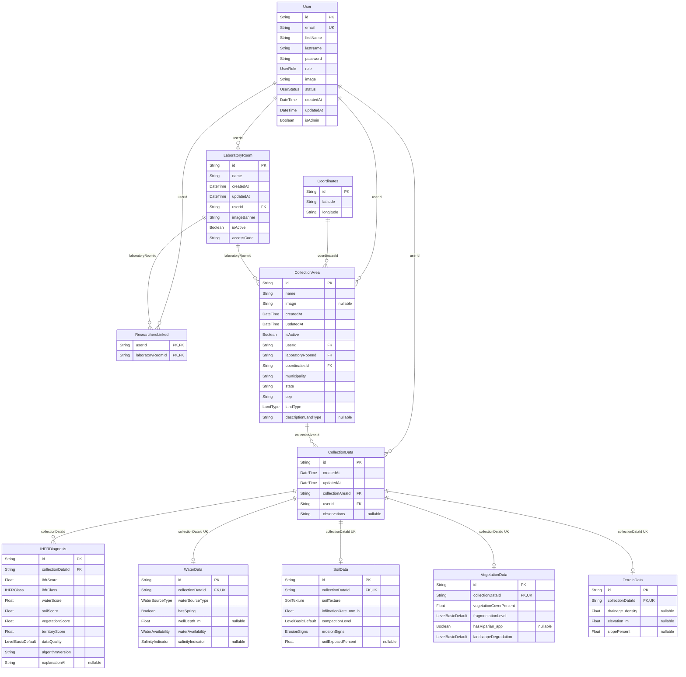

# Modelo relacional de dados Code-First

## Identificação, baseline e limites

| Campo | Registro | Classificação |
|---|---|---|
| Iniciativa | `PRD Code-First` — ampliação da Fase 1 | `DECISAO_DE_TRABALHO_PARA_RASCUNHO` |
| Estado | `EM_REVISAO` | estado documental; não concede aprovação normativa |
| Baseline desta execução | branch `docs/code-first-prd`; HEAD `b3c73fb7e3151c7badb23f8dfeac5c689e17983b`; upstream `origin/docs/code-first-prd`; worktree inicialmente limpo | `EVIDENCIA_IMPLEMENTACAO` |
| Fonte estrutural principal | [`../../../prisma/schema.prisma`](../../../prisma/schema.prisma) | `EVIDENCIA_IMPLEMENTACAO` da estrutura declarada |
| Provider declarado | `postgresql` | declaração do datasource; banco implantado não verificado |
| Método | inspeção estática; aplicação, banco, migrations, Prisma generate, build e testes não executados | `LIMITACAO_DA_EVIDENCIA` |
| Aprovação do domínio | inexistente | `NAO_ESPECIFICADO` |
| Encerramento ampliado | `FASE_1_AMPLIADA_CONCLUIDA_EM_REVISAO` | gates materiais estáticos aprovados; não concede aprovação normativa |
| Fase 2 | `NAO_INICIADA` | não foi autorizada nesta execução |

Também foram usados código rastreado pertinente, configurações rastreadas, documentos de [`../`](../) e [`../../../TECH_DECISIONS.md`](../../../TECH_DECISIONS.md), preservando os estados registrados. Não foram usados conteúdo histórico excluído, matriz global, auditorias anteriores, internet, Figma nem o conteúdo da migration local ignorada.

## Convenção e correspondência de nomes

Nesta iniciativa, o modelo lógico descreve entidades, atributos, identificadores e relacionamentos; este modelo relacional descreve a organização da mesma estrutura em relações representadas pelos models Prisma, campos e restrições explicitamente declaradas. São visões complementares do baseline, não propostas independentes nem um redesenho.

O schema não contém `@map` ou `@@map`. Assim:

- **nome no código** é o identificador literal do model ou campo Prisma;
- **relação representada** usa o nome do model somente como nome lógico desta documentação;
- **nome físico observado no banco** é `NAO_VERIFICADO`, porque o banco não foi inspecionado;
- nenhum nome convencional de tabela, coluna, constraint ou índice é apresentado como nome físico existente.

| Entidade lógica | Prisma model | Relação representada nesta visão | `@@map` | Classe |
|---|---|---|---|---|
| `User` | `User` | `User` | não declarado | `CF-CLS-001` |
| `Coordinates` | `Coordinates` | `Coordinates` | não declarado | `CF-CLS-002` |
| `LaboratoryRoom` | `LaboratoryRoom` | `LaboratoryRoom` | não declarado | `CF-CLS-003` |
| `ResearchersLinked` | `ResearchersLinked` | `ResearchersLinked` | não declarado | `CF-CLS-004` |
| `CollectionArea` | `CollectionArea` | `CollectionArea` | não declarado | `CF-CLS-005` |
| `CollectionData` | `CollectionData` | `CollectionData` | não declarado | `CF-CLS-006` |
| `IHFRDiagnosis` | `IHFRDiagnosis` | `IHFRDiagnosis` | não declarado | `CF-CLS-007` |
| `WaterData` | `WaterData` | `WaterData` | não declarado | `CF-CLS-008` |
| `SoilData` | `SoilData` | `SoilData` | não declarado | `CF-CLS-009` |
| `VegetationData` | `VegetationData` | `VegetationData` | não declarado | `CF-CLS-010` |
| `TerrainData` | `TerrainData` | `TerrainData` | não declarado | `CF-CLS-011` |

## Convenções do inventário de campos

- `PK`, `FK` e `UK` refletem somente `@id`, `@@id`, `@relation(fields: ..., references: ...)` e `@unique` explícitos.
- `—` significa que o item não foi declarado ou não se aplica ao campo.
- Campos escalares são potencialmente persistíveis; campos de relação Prisma representam navegação/associação e não correspondem automaticamente a colunas.
- `obrigatório` e `nullable` reproduzem a presença ou ausência de `?` no campo escalar. Em campos de relação, a participação deriva do tipo da relação e da FK correspondente.
- Defaults são transcritos conforme o schema. `now()`, `uuid()` e `@updatedAt` não são atribuídos ao PostgreSQL nem tratados como comportamento validado em runtime.
- Nenhum campo possui `@map` declarado; portanto o nome mapeado é sempre “não declarado”.

## Inventário de campos por relação

### `User`

| Campo | Tipo declarado no Prisma | Obrigatoriedade | PK/FK/UK | Referência | Default declarado | Observação |
|---|---|---|---|---|---|---|
| `id` | `String` | obrigatório | PK | — | `uuid()` | escalar persistível; `@map` não declarado |
| `email` | `String` | obrigatório | UK | — | — | escalar persistível; unicidade simples |
| `firstName` | `String` | obrigatório | — | — | — | escalar persistível |
| `lastName` | `String` | obrigatório | — | — | — | escalar persistível |
| `password` | `String` | obrigatório | — | — | — | escalar persistível; tratamento seguro não é validado aqui |
| `role` | `UserRole` | obrigatório | — | — | `USER` | escalar persistível com domínio enum |
| `image` | `String` | obrigatório | — | — | `""` | escalar persistível |
| `status` | `UserStatus` | obrigatório | — | — | `PENDING` | escalar persistível com domínio enum |
| `createdAt` | `DateTime` | obrigatório | — | — | `now()` | escalar persistível; executor do default não presumido |
| `updatedAt` | `DateTime` | obrigatório | — | — | `@updatedAt` | escalar persistível; comportamento declarado pelo Prisma, runtime não validado |
| `isAdmin` | `Boolean` | obrigatório | — | — | `false` | escalar persistível |
| `laboratoryRooms` | `LaboratoryRoom[]` | relação `0..*` | — | FK está em `LaboratoryRoom.userId` | — | campo de relação Prisma; não é coluna automática |
| `researchersLinked` | `ResearchersLinked[]` | relação `0..*` | — | FK está em `ResearchersLinked.userId` | — | campo de relação Prisma; não é coluna automática |
| `collectionAreas` | `CollectionArea[]` | relação `0..*` | — | FK está em `CollectionArea.userId` | — | campo de relação Prisma; não é coluna automática |
| `collectionData` | `CollectionData[]` | relação `0..*` | — | FK está em `CollectionData.userId` | — | campo de relação Prisma; não é coluna automática |

### `Coordinates`

| Campo | Tipo declarado no Prisma | Obrigatoriedade | PK/FK/UK | Referência | Default declarado | Observação |
|---|---|---|---|---|---|---|
| `id` | `String` | obrigatório | PK | — | `uuid()` | escalar persistível |
| `latitude` | `String` | obrigatório | — | — | — | escalar persistível; formato e tipo SQL não presumidos |
| `longitude` | `String` | obrigatório | — | — | — | escalar persistível; formato e tipo SQL não presumidos |
| `collectionAreas` | `CollectionArea[]` | relação `0..*` | — | FK está em `CollectionArea.coordinatesId` | — | campo de relação Prisma; não é coluna automática |

### `LaboratoryRoom`

| Campo | Tipo declarado no Prisma | Obrigatoriedade | PK/FK/UK | Referência | Default declarado | Observação |
|---|---|---|---|---|---|---|
| `id` | `String` | obrigatório | PK | — | `uuid()` | escalar persistível |
| `name` | `String` | obrigatório | — | — | — | escalar persistível |
| `createdAt` | `DateTime` | obrigatório | — | — | `now()` | escalar persistível; executor do default não presumido |
| `updatedAt` | `DateTime` | obrigatório | — | — | `@updatedAt` | escalar persistível; runtime não validado |
| `userId` | `String` | obrigatório | FK | `User.id` | — | escalar persistível; vínculo técnico, não propriedade aprovada |
| `user` | `User` | relação obrigatória | — | usa `userId` → `User.id` | — | campo de relação Prisma; não é coluna automática |
| `imageBanner` | `String` | obrigatório | — | — | `""` | escalar persistível |
| `isActive` | `Boolean` | obrigatório | — | — | `true` | escalar persistível |
| `accessCode` | `String` | obrigatório | — | — | — | escalar persistível; não há unicidade explícita |
| `researchersLinked` | `ResearchersLinked[]` | relação `0..*` | — | FK está em `ResearchersLinked.laboratoryRoomId` | — | campo de relação Prisma; não é coluna automática |
| `collectionAreas` | `CollectionArea[]` | relação `0..*` | — | FK está em `CollectionArea.laboratoryRoomId` | — | campo de relação Prisma; não é coluna automática |

### `ResearchersLinked`

| Campo | Tipo declarado no Prisma | Obrigatoriedade | PK/FK/UK | Referência | Default declarado | Observação |
|---|---|---|---|---|---|---|
| `userId` | `String` | obrigatório | PK composta, FK | `User.id` | — | escalar persistível; primeira parte de `@@id` |
| `laboratoryRoomId` | `String` | obrigatório | PK composta, FK | `LaboratoryRoom.id` | — | escalar persistível; segunda parte de `@@id` |
| `user` | `User` | relação obrigatória | — | usa `userId` → `User.id` | — | campo de relação Prisma; não é coluna automática |
| `laboratoryRoom` | `LaboratoryRoom` | relação obrigatória | — | usa `laboratoryRoomId` → `LaboratoryRoom.id` | — | campo de relação Prisma; não é coluna automática |

### `CollectionArea`

| Campo | Tipo declarado no Prisma | Obrigatoriedade | PK/FK/UK | Referência | Default declarado | Observação |
|---|---|---|---|---|---|---|
| `id` | `String` | obrigatório | PK | — | `uuid()` | escalar persistível |
| `name` | `String` | obrigatório | — | — | — | escalar persistível |
| `image` | `String?` | nullable | — | — | — | escalar persistível |
| `createdAt` | `DateTime` | obrigatório | — | — | `now()` | escalar persistível; executor do default não presumido |
| `updatedAt` | `DateTime` | obrigatório | — | — | `@updatedAt` | escalar persistível; runtime não validado |
| `isActive` | `Boolean` | obrigatório | — | — | `true` | escalar persistível |
| `userId` | `String` | obrigatório | FK | `User.id` | — | escalar persistível; autoria/propriedade normativa não definida |
| `laboratoryRoomId` | `String` | obrigatório | FK | `LaboratoryRoom.id` | — | escalar persistível |
| `coordinatesId` | `String` | obrigatório | FK | `Coordinates.id` | — | escalar persistível; não é único |
| `municipality` | `String` | obrigatório | — | — | — | escalar persistível |
| `state` | `String` | obrigatório | — | — | — | escalar persistível |
| `cep` | `String` | obrigatório | — | — | — | escalar persistível |
| `landType` | `LandType` | obrigatório | — | — | — | escalar persistível com domínio enum |
| `descriptionLandType` | `String?` | nullable | — | — | — | escalar persistível |
| `user` | `User` | relação obrigatória | — | usa `userId` → `User.id` | — | campo de relação Prisma; não é coluna automática |
| `coordinates` | `Coordinates` | relação obrigatória | — | usa `coordinatesId` → `Coordinates.id` | — | campo de relação Prisma; não é coluna automática |
| `laboratoryRoom` | `LaboratoryRoom` | relação obrigatória | — | usa `laboratoryRoomId` → `LaboratoryRoom.id` | — | campo de relação Prisma; não é coluna automática |
| `collectionData` | `CollectionData[]` | relação `0..*` | — | FK está em `CollectionData.collectionAreaId` | — | campo de relação Prisma; não é coluna automática |

### `CollectionData`

| Campo | Tipo declarado no Prisma | Obrigatoriedade | PK/FK/UK | Referência | Default declarado | Observação |
|---|---|---|---|---|---|---|
| `id` | `String` | obrigatório | PK | — | `uuid()` | escalar persistível |
| `createdAt` | `DateTime` | obrigatório | — | — | `now()` | escalar persistível; executor do default não presumido |
| `updatedAt` | `DateTime` | obrigatório | — | — | `@updatedAt` | escalar persistível; runtime não validado |
| `collectionAreaId` | `String` | obrigatório | FK | `CollectionArea.id` | — | escalar persistível |
| `userId` | `String` | obrigatório | FK | `User.id` | — | escalar persistível; autoria normativa não definida |
| `observations` | `String?` | nullable | — | — | — | escalar persistível |
| `user` | `User` | relação obrigatória | — | usa `userId` → `User.id` | — | campo de relação Prisma; não é coluna automática |
| `collectionArea` | `CollectionArea` | relação obrigatória | — | usa `collectionAreaId` → `CollectionArea.id` | — | campo de relação Prisma; não é coluna automática |
| `waterData` | `WaterData[]` | relação `0..1` pela FK única no destino | — | FK está em `WaterData.collectionDataId` | — | campo de relação Prisma; lista não é coluna; unicidade limita a cardinalidade |
| `soilData` | `SoilData[]` | relação `0..1` pela FK única no destino | — | FK está em `SoilData.collectionDataId` | — | campo de relação Prisma; lista não é coluna; unicidade limita a cardinalidade |
| `vegetationData` | `VegetationData[]` | relação `0..1` pela FK única no destino | — | FK está em `VegetationData.collectionDataId` | — | campo de relação Prisma; lista não é coluna; unicidade limita a cardinalidade |
| `terrainData` | `TerrainData[]` | relação `0..1` pela FK única no destino | — | FK está em `TerrainData.collectionDataId` | — | campo de relação Prisma; lista não é coluna; unicidade limita a cardinalidade |
| `diagnoses` | `IHFRDiagnosis[]` | relação `0..*` | — | FK está em `IHFRDiagnosis.collectionDataId` | — | campo de relação Prisma; não é coluna automática |

### `IHFRDiagnosis`

| Campo | Tipo declarado no Prisma | Obrigatoriedade | PK/FK/UK | Referência | Default declarado | Observação |
|---|---|---|---|---|---|---|
| `id` | `String` | obrigatório | PK | — | `uuid()` | escalar persistível |
| `collectionDataId` | `String` | obrigatório | FK | `CollectionData.id` | — | escalar persistível; não é único |
| `ihfrScore` | `Float` | obrigatório | — | — | — | escalar persistível; tipo SQL e regra científica não presumidos |
| `ihfrClass` | `IHFRClass` | obrigatório | — | — | — | escalar persistível com domínio enum |
| `waterScore` | `Float` | obrigatório | — | — | — | escalar persistível |
| `soilScore` | `Float` | obrigatório | — | — | — | escalar persistível |
| `vegetationScore` | `Float` | obrigatório | — | — | — | escalar persistível |
| `territoryScore` | `Float` | obrigatório | — | — | — | escalar persistível |
| `dataQuality` | `LevelBasicDefault` | obrigatório | — | — | — | escalar persistível com domínio enum |
| `algorithmVersion` | `String` | obrigatório | — | — | `"1.0.0"` | escalar persistível; não valida versão científica |
| `explanationAI` | `String?` | nullable | — | — | — | escalar persistível; não prova capacidade de IA |
| `collectionData` | `CollectionData` | relação obrigatória | — | usa `collectionDataId` → `CollectionData.id` | — | campo de relação Prisma; não é coluna automática |

### `WaterData`

| Campo | Tipo declarado no Prisma | Obrigatoriedade | PK/FK/UK | Referência | Default declarado | Observação |
|---|---|---|---|---|---|---|
| `id` | `String` | obrigatório | PK | — | `uuid()` | escalar persistível |
| `collectionDataId` | `String` | obrigatório | FK, UK | `CollectionData.id` | — | escalar persistível; unicidade simples |
| `waterSourceType` | `WaterSourceType` | obrigatório | — | — | — | escalar persistível com domínio enum |
| `hasSpring` | `Boolean` | obrigatório | — | — | — | escalar persistível |
| `wellDepth_m` | `Float?` | nullable | — | — | — | escalar persistível; unidade não validada |
| `waterAvailability` | `WaterAvailability` | obrigatório | — | — | — | escalar persistível com domínio enum |
| `salinityIndicator` | `SalinityIndicator?` | nullable | — | — | — | escalar persistível com domínio enum |
| `collectionData` | `CollectionData` | relação obrigatória | — | usa `collectionDataId` → `CollectionData.id` | — | campo de relação Prisma; não é coluna automática |

### `SoilData`

| Campo | Tipo declarado no Prisma | Obrigatoriedade | PK/FK/UK | Referência | Default declarado | Observação |
|---|---|---|---|---|---|---|
| `id` | `String` | obrigatório | PK | — | `uuid()` | escalar persistível |
| `collectionDataId` | `String` | obrigatório | FK, UK | `CollectionData.id` | — | escalar persistível; unicidade simples |
| `soilTexture` | `SoilTexture` | obrigatório | — | — | — | escalar persistível com domínio enum |
| `infiltrationRate_mm_h` | `Float` | obrigatório | — | — | — | escalar persistível; unidade não validada |
| `compactionLevel` | `LevelBasicDefault` | obrigatório | — | — | — | escalar persistível com domínio enum |
| `erosionSigns` | `ErosionSigns` | obrigatório | — | — | — | escalar persistível com domínio enum |
| `soilExposedPercent` | `Float?` | nullable | — | — | — | escalar persistível |
| `collectionData` | `CollectionData` | relação obrigatória | — | usa `collectionDataId` → `CollectionData.id` | — | campo de relação Prisma; não é coluna automática |

### `VegetationData`

| Campo | Tipo declarado no Prisma | Obrigatoriedade | PK/FK/UK | Referência | Default declarado | Observação |
|---|---|---|---|---|---|---|
| `id` | `String` | obrigatório | PK | — | `uuid()` | escalar persistível |
| `collectionDataId` | `String` | obrigatório | FK, UK | `CollectionData.id` | — | escalar persistível; unicidade simples |
| `vegetationCoverPercent` | `Float` | obrigatório | — | — | — | escalar persistível |
| `fragmentationLevel` | `LevelBasicDefault` | obrigatório | — | — | — | escalar persistível com domínio enum |
| `hasRiparian_app` | `Boolean?` | nullable | — | — | — | escalar persistível; significado do sufixo não especificado |
| `landscapeDegradation` | `LevelBasicDefault` | obrigatório | — | — | — | escalar persistível com domínio enum |
| `collectionData` | `CollectionData` | relação obrigatória | — | usa `collectionDataId` → `CollectionData.id` | — | campo de relação Prisma; não é coluna automática |

### `TerrainData`

| Campo | Tipo declarado no Prisma | Obrigatoriedade | PK/FK/UK | Referência | Default declarado | Observação |
|---|---|---|---|---|---|---|
| `id` | `String` | obrigatório | PK | — | `uuid()` | escalar persistível |
| `collectionDataId` | `String` | obrigatório | FK, UK | `CollectionData.id` | — | escalar persistível; unicidade simples |
| `drainage_density` | `Float?` | nullable | — | — | — | escalar persistível; unidade não especificada |
| `elevation_m` | `Float?` | nullable | — | — | — | escalar persistível; unidade não validada |
| `slopePercent` | `Float?` | nullable | — | — | — | escalar persistível |
| `collectionData` | `CollectionData` | relação obrigatória | — | usa `collectionDataId` → `CollectionData.id` | — | campo de relação Prisma; não é coluna automática |

## Chaves, unicidade, índices, defaults e ações referenciais

| Categoria | Declarações explícitas no schema |
|---|---|
| PKs simples | `id` em `User`, `Coordinates`, `LaboratoryRoom`, `CollectionArea`, `CollectionData`, `IHFRDiagnosis`, `WaterData`, `SoilData`, `VegetationData`, `TerrainData` |
| PK composta | `ResearchersLinked.@@id([userId, laboratoryRoomId])` |
| FKs | 13 FKs escalares: `LaboratoryRoom.userId`; duas em `ResearchersLinked`; três em `CollectionArea`; duas em `CollectionData`; `IHFRDiagnosis.collectionDataId`; e uma `collectionDataId` em cada um dos quatro grupos ambientais |
| Unicidade simples | `User.email`; `WaterData.collectionDataId`; `SoilData.collectionDataId`; `VegetationData.collectionDataId`; `TerrainData.collectionDataId` |
| Unicidade composta adicional | nenhuma `@@unique` declarada; a PK composta de `ResearchersLinked` assegura a unicidade do par como chave primária |
| Índices explícitos | nenhum `@@index` declarado |
| Defaults explícitos | `uuid()`, `USER`, `""`, `PENDING`, `now()`, `false`, `true`, `"1.0.0"`, conforme os campos inventariados |
| Atualização automática declarada | `@updatedAt` em `User.updatedAt`, `LaboratoryRoom.updatedAt`, `CollectionArea.updatedAt`, `CollectionData.updatedAt` |
| Ações referenciais | nenhum `onDelete` ou `onUpdate` configurado explicitamente; comportamento é “não explicitado no schema” |
| Nomes de constraints | não declarados e não observados |
| Tipos SQL | não declarados com tipos nativos e não observados no banco |

## Relacionamentos e cardinalidades

| Origem principal | Campo FK no dependente | Destino | Cardinalidade | Participação do dependente | Ação referencial |
|---|---|---|---|---|---|
| `User` | `LaboratoryRoom.userId` | `LaboratoryRoom` | `1 : 0..*` | obrigatória | não explicitada no schema |
| `User` | `ResearchersLinked.userId` | `ResearchersLinked` | `1 : 0..*` | obrigatória | não explicitada no schema |
| `LaboratoryRoom` | `ResearchersLinked.laboratoryRoomId` | `ResearchersLinked` | `1 : 0..*` | obrigatória | não explicitada no schema |
| `User` | `CollectionArea.userId` | `CollectionArea` | `1 : 0..*` | obrigatória | não explicitada no schema |
| `Coordinates` | `CollectionArea.coordinatesId` | `CollectionArea` | `1 : 0..*` | obrigatória | não explicitada no schema |
| `LaboratoryRoom` | `CollectionArea.laboratoryRoomId` | `CollectionArea` | `1 : 0..*` | obrigatória | não explicitada no schema |
| `User` | `CollectionData.userId` | `CollectionData` | `1 : 0..*` | obrigatória | não explicitada no schema |
| `CollectionArea` | `CollectionData.collectionAreaId` | `CollectionData` | `1 : 0..*` | obrigatória | não explicitada no schema |
| `CollectionData` | `IHFRDiagnosis.collectionDataId` | `IHFRDiagnosis` | `1 : 0..*` | obrigatória | não explicitada no schema |
| `CollectionData` | `WaterData.collectionDataId` | `WaterData` | `1 : 0..1` | obrigatória quando `WaterData` existe | não explicitada no schema |
| `CollectionData` | `SoilData.collectionDataId` | `SoilData` | `1 : 0..1` | obrigatória quando `SoilData` existe | não explicitada no schema |
| `CollectionData` | `VegetationData.collectionDataId` | `VegetationData` | `1 : 0..1` | obrigatória quando `VegetationData` existe | não explicitada no schema |
| `CollectionData` | `TerrainData.collectionDataId` | `TerrainData` | `1 : 0..1` | obrigatória quando `TerrainData` existe | não explicitada no schema |

As quatro cardinalidades `1 : 0..1` decorrem da combinação entre FK obrigatória e `@unique` no dependente, não do nome do campo reverso. `IHFRDiagnosis.collectionDataId` não é único e, portanto, a relação é `1 : 0..*`.

## Enums e valores

Enums são domínios declarados, não relações/tabelas independentes nesta visão.

| Enum | Valores exatos | Campos |
|---|---|---|
| `UserRole` | `USER`, `ADMIN`, `DEVELOPER`, `MODERATOR` | `User.role` |
| `UserStatus` | `ACTIVE`, `INACTIVE`, `PENDING`, `BLOCKED` | `User.status` |
| `LandType` | `FOREST`, `AGROFORESTRY`, `CROPLAND`, `PASTURE`, `DEGRADED_PASTURE`, `BARE_SOIL`, `URBAN`, `OTHERS` | `CollectionArea.landType` |
| `IHFRClass` | `LOW`, `MODERATE`, `HIGH`, `CRITICAL` | `IHFRDiagnosis.ihfrClass` |
| `LevelBasicDefault` | `LOW`, `MODERATE`, `HIGH` | `IHFRDiagnosis.dataQuality`, `SoilData.compactionLevel`, `VegetationData.fragmentationLevel`, `VegetationData.landscapeDegradation` |
| `WaterSourceType` | `RIVER_STREAM`, `SPRING`, `SHALLOW_WELL`, `TUBULA_WELL`, `CISTERN`, `OTHER` | `WaterData.waterSourceType` |
| `WaterAvailability` | `PERMANENT`, `SEASONAL`, `SCARCE` | `WaterData.waterAvailability` |
| `SalinityIndicator` | `NONE`, `SUSPERCTED`, `CONFIRMED` | `WaterData.salinityIndicator` |
| `SoilTexture` | `SANDY`, `MEDIUM`, `CLAYEY` | `SoilData.soilTexture` |
| `ErosionSigns` | `NONE`, `LAMINAR`, `RILLS_GUILLIES` | `SoilData.erosionSigns` |

Grafias potencialmente inesperadas foram preservadas sem correção: `TUBULA_WELL`, `SUSPERCTED`, `CLAYEY` e `RILLS_GUILLIES`.

## Diagrama Mermaid

O diagrama `RDM-01` contém as 11 relações representadas, os 80 campos escalares, as chaves e os 13 relacionamentos. Campos de relação Prisma não aparecem como colunas; estão representados pelas ligações. O arquivo [`../diagrams/plantuml/relational-data-model.puml`](../diagrams/plantuml/relational-data-model.puml) contém a representação equivalente identificada pelo mesmo código.

## Rastreabilidade lógico → relacional → classes → produto

| Entidades lógicas | Relações representadas | Classes | Requisitos diretamente relacionados | Casos de uso diretamente relacionados | Fluxos diretamente relacionados |
|---|---|---|---|---|---|
| `User` | `User` | `CF-CLS-001`; `CF-CLS-012`, `CF-CLS-013` para domínios | `CF-PRD-FR-001`, `CF-PRD-FR-002`, `CF-PRD-FR-003`, `CF-PRD-FR-011`, `CF-PRD-FR-012`; `CF-PRD-NFR-002`, `CF-PRD-NFR-003` | `CF-UC-001`, `CF-UC-002`, `CF-UC-003`, `CF-UC-004`, `CF-UC-005`, `CF-UC-006`, `CF-UC-008`, `CF-UC-009`, `CF-UC-014` | `CF-PFLOW-001`, `CF-PFLOW-002`, `CF-PFLOW-003`, `CF-PFLOW-004`, `CF-PFLOW-005`, `CF-PFLOW-007` |
| `LaboratoryRoom`, `ResearchersLinked` | `LaboratoryRoom`, `ResearchersLinked` | `CF-CLS-003`, `CF-CLS-004` | `CF-PRD-FR-003`, `CF-PRD-FR-004`, `CF-PRD-FR-005`, `CF-PRD-FR-011`; `CF-PRD-NFR-001` | `CF-UC-004`, `CF-UC-005`, `CF-UC-006`, `CF-UC-007`, `CF-UC-008` | `CF-PFLOW-001`, `CF-PFLOW-003`, `CF-PFLOW-004` |
| `Coordinates`, `CollectionArea` | `Coordinates`, `CollectionArea` | `CF-CLS-002`, `CF-CLS-005`; `CF-CLS-014` para domínio | `CF-PRD-FR-005`, `CF-PRD-FR-006`, `CF-PRD-FR-013`, `CF-PRD-FR-014`, `CF-PRD-FR-015`; `CF-PRD-NFR-001`, `CF-PRD-NFR-002`, `CF-PRD-NFR-006` | `CF-UC-007`, `CF-UC-008`, `CF-UC-009`, `CF-UC-010`, `CF-UC-015` | `CF-PFLOW-001`, `CF-PFLOW-004`, `CF-PFLOW-005`, `CF-PFLOW-007` |
| `CollectionData` | `CollectionData` | `CF-CLS-006` | `CF-PRD-FR-006`, `CF-PRD-FR-007`, `CF-PRD-FR-008`, `CF-PRD-FR-009`, `CF-PRD-FR-010`, `CF-PRD-FR-012`, `CF-PRD-FR-014`, `CF-PRD-FR-015`; `CF-PRD-NFR-002`, `CF-PRD-NFR-006` | `CF-UC-009`, `CF-UC-010`, `CF-UC-011`, `CF-UC-012`, `CF-UC-013`, `CF-UC-014`, `CF-UC-015` | `CF-PFLOW-001`, `CF-PFLOW-005`, `CF-PFLOW-006`, `CF-PFLOW-007` |
| `WaterData`, `SoilData`, `VegetationData`, `TerrainData` | relações homônimas | `CF-CLS-008`, `CF-CLS-009`, `CF-CLS-010`, `CF-CLS-011`; `CF-CLS-016`, `CF-CLS-017`, `CF-CLS-018`, `CF-CLS-019`, `CF-CLS-020`, `CF-CLS-021` para domínios | `CF-PRD-FR-007`, `CF-PRD-FR-014` | `CF-UC-011` | `CF-PFLOW-001`, `CF-PFLOW-005` |
| `IHFRDiagnosis` | `IHFRDiagnosis` | `CF-CLS-007`; `CF-CLS-015`, `CF-CLS-016` para domínios | `CF-PRD-FR-008`, `CF-PRD-FR-009`, `CF-PRD-FR-015`; `CF-PRD-NFR-006` | `CF-UC-012`, `CF-UC-013`, `CF-UC-015` | `CF-PFLOW-001`, `CF-PFLOW-006`, `CF-PFLOW-007` |

Não foi forçada cobertura estrutural de requisitos sem relação direta com dados, como responsividade ou acessibilidade.

## Evidências e limitações

- `EVIDENCIA_IMPLEMENTACAO` — o schema contém 11 models, 80 campos escalares, 26 campos de relação, 10 enums e 13 FKs declaradas.
- `EVIDENCIA_IMPLEMENTACAO` — somente `User` possui operações Prisma conectadas localizadas no código rastreado; os demais models permanecem sem consumidor persistente localizado.
- `LIMITACAO_DA_EVIDENCIA` — “relação” nesta documentação não equivale a tabela física observada; banco e migrations não foram inspecionados ou executados.
- `LIMITACAO_DA_EVIDENCIA` — não foram inferidos tipos SQL, nomes de constraints, índices implícitos, ações referenciais, defaults executados pelo banco ou comportamento de `@updatedAt` em runtime.
- `PENDENCIA_DE_DECISAO` — o schema não aprova o domínio, a governança de dados, a propriedade, os papéis ou as regras de laboratório.
- `PENDENCIA_DE_DECISAO` — campos, unidades, enums, scores e classes ambientais/IHFR não constituem contrato científico aprovado; forma de obtenção do IHFR permanece aberta.
- `LIMITACAO_DA_EVIDENCIA` — o mapa integra o MVP, mas a estrutura declarada cobre somente `Coordinates` associado à área e o encadeamento indireto até a coleta; entidades cartográficas não foram inventadas.
- `LIMITACAO_DA_EVIDENCIA` — renderizadores PlantUML e Mermaid não estão disponíveis localmente; a equivalência foi validada estruturalmente, mas a renderização visual não foi verificada.

O documento permanece `EM_REVISAO`. Os gates materiais dos quatro novos artefatos, de sua integração e da equivalência Mermaid–PlantUML foram aprovados estaticamente. O encerramento é `FASE_1_AMPLIADA_CONCLUIDA_EM_REVISAO`; a Fase 2 não começou e permanece `FASE_2_NAO_INICIADA`.
