# Casos de uso Code-First

## Identificação

| Campo | Registro | Classificação |
|---|---|---|
| Iniciativa | `PRD Code-First` | `DECISAO_DE_TRABALHO_PARA_RASCUNHO` |
| Estado | `EM_REVISAO` | `DECISAO_DE_TRABALHO_PARA_RASCUNHO` |
| Natureza | casos de uso candidatos baseados no código, schema, requisitos candidatos e decisões de trabalho atuais | `INFERENCIA` estruturada e rastreável |
| Baseline | branch `docs/code-first-prd`; HEAD e upstream `213918ec6a5f91ed4e35e54d9d0bef07ed156f36`; worktree inicialmente limpo | `EVIDENCIA_IMPLEMENTACAO` |
| Aprovação normativa | inexistente | `NAO_ESPECIFICADO` |
| Validação cruzada | `CONCLUIDA`; relatório em [`../analysis/code-first-package-validation.md`](../analysis/code-first-package-validation.md) | `EVIDENCIA_IMPLEMENTACAO` |

Fontes usadas: código e configurações rastreados; `prisma/schema.prisma`; [`../../../TECH_DECISIONS.md`](../../../TECH_DECISIONS.md), com seus estados preservados; documentos existentes em [`../`](../), em especial o [PRD](../prd-code-first.md) e o [catálogo de requisitos](requirements.md); e decisões humanas já registradas na iniciativa (`CF-PD-001`, `CF-PD-004`, `CF-PD-007` e `CF-PD-008`).

Limites: estes casos detalham atores e interações candidatas da versão Code-First, não aprovam produto, ciência, UX, dados ou arquitetura e não comprovam comportamento em runtime. `docs/raw/**`, matriz global, relatórios históricos, internet, fontes externas e Figma não foram consultados. Mocks e placeholders são evidência do estado estático, não comportamento aprovado. O mapa integra o núcleo do MVP por `CF-PD-007`, com Leaflet/React-Leaflet como escolha planejada do mínimo da IMP-008 e sem encerrar provedor ou arquitetura definitiva; `TD-010` escolhe Plotly somente para gráficos futuros posteriores à IMP-009. IA permanece fora do núcleo por `CF-PD-004`. A produção do IHFR continua `PENDENCIA_DE_DECISAO`: não se escolhe entre cálculo interno, Python, importação, registro manual ou serviço externo. A revisão H01–H10 está em [`../reviews/product-hypotheses-human-review.md`](../reviews/product-hypotheses-human-review.md); suas direções humanas permanecem sem autoridade identificada e não alteram a classificação dos atores candidatos.

Neste documento, **comportamento pretendido candidato** designa a interação estruturada a partir dos requisitos candidatos e das direções registradas; **implementação observada estaticamente** designa somente código ou schema diretamente localizado; **mock ou placeholder** identifica interfaces sem fluxo de domínio conectado; e **dependência aberta** identifica decisão ou contrato ainda necessário. Nenhuma dessas categorias equivale a `APROVADO`.

## Atores

| Ator | Função | Classificação | Evidência | Decisões abertas relacionadas |
|---|---|---|---|---|
| Pessoa da equipe | cria conta ou inicia autenticação para participar da plataforma de pesquisa e extensão | `DIRECAO_CONFIRMADA_PARA_RASCUNHO` | `CF-PD-001`, `CF-PD-004`; telas em `src/app/register/page.tsx:14-49` e `src/app/login/page.tsx:12-37` | elegibilidade e onboarding em `CF-Q-005`; estados de conta em `CF-Q-006` |
| Usuário autenticado | mantém ou encerra a sessão e acessa o workspace | `EVIDENCIA_IMPLEMENTACAO` quanto ao ator autenticado; comportamento pretendido permanece candidato | `src/contexts/auth.context.tsx:40-75`, `src/contexts/auth.context.tsx:77-171` | política de sessão e estados de acesso em `CF-Q-006` |
| Responsável pelo laboratório | cria o contexto colaborativo do laboratório | `INFERENCIA` — papel hipotético, sem matriz definitiva de permissões | `CF-PD-004`; `LaboratoryRoom.userId` em `prisma/schema.prisma:51-64`; interface mockada em `src/app/(private)/workspace/page.tsx:72-80` | ciclo, responsabilidade e transferência em `CF-PD-002`; permissões em `CF-PD-006` |
| Participante do laboratório | ingressa, seleciona o contexto ativo e consulta ou usa recursos autorizados | `INFERENCIA` — papel hipotético, sem matriz definitiva de permissões | vínculo `ResearchersLinked` em `prisma/schema.prisma:66-74`; workspace em `src/app/(private)/workspace/page.tsx:46-168` | ingresso e cardinalidade em `CF-PD-002`; acesso e propriedade em `CF-PD-006` |
| Participante de campo | registra a coleta, sua associação espacial e os dados ambientais aplicáveis | `INFERENCIA` — especialização funcional candidata, sem papel técnico confirmado | autoria e relação da coleta em `prisma/schema.prisma:110-126`; `CF-PRD-FR-006`, `CF-PRD-FR-007`, `CF-PRD-FR-014` | fluxo de campo em `CF-PD-003`; contrato científico em `CF-PD-005`; permissões em `CF-PD-006` |

Os atores podem corresponder à mesma pessoa em momentos diferentes. `Responsável pelo laboratório`, `Participante do laboratório` e `Participante de campo` são hipóteses funcionais; não definem papéis persistidos, hierarquia, propriedade ou autorização.

## Visão geral

```mermaid
flowchart TB
  A1[Pessoa da equipe]
  A2[Usuário autenticado]
  A3[Responsável pelo laboratório]

  subgraph HF[HidroFlorestas]
    direction TB
    U1([CF-UC-001 Criar conta])
    U2([CF-UC-002 Autenticar-se])
    U3([CF-UC-003 Gerenciar sessão])
    U4([CF-UC-004 Criar laboratório])
    U5([CF-UC-005 Ingressar em laboratório])
    U6([CF-UC-006 Selecionar laboratório ativo])
    U7([CF-UC-007 Cadastrar área monitorada no mapa])
    U8([CF-UC-008 Consultar área monitorada])
    U9([CF-UC-009 Registrar coleta])
    U10([CF-UC-010 Associar coleta espacialmente])
    U11([CF-UC-011 Registrar dados ambientais])
    U12([CF-UC-012 Obter ou associar diagnóstico IHFR])
    U13([CF-UC-013 Consultar diagnóstico IHFR])
    U14([CF-UC-014 Acompanhar resumo e histórico])
    U15([CF-UC-015 Visualizar acompanhamento territorial])
  end

  A4[Participante do laboratório]
  A5[Participante de campo]

  A1 --> U1
  A1 --> U2
  A2 --> U3
  A3 --> U4
  A4 --> U5
  A4 --> U6
  A4 --> U7
  A4 --> U8
  A4 --> U12
  A4 --> U13
  A4 --> U14
  A4 --> U15
  A5 --> U9
  A5 --> U10
  A5 --> U11
  U9 -. "<<include>>" .-> U10
```

O [`../diagrams/plantuml/use-cases.puml`](../diagrams/plantuml/use-cases.puml) contém os mesmos cinco atores, quinze casos, associações e a única relação `include` desta visão.

## Especificações individuais

### `CF-UC-001` — Criar conta

- **Objetivo:** estabelecer uma conta para acesso ao workspace.
- **Classificação:** `REQUISITO_CANDIDATO_DERIVADO_DO_CODIGO`; comportamento pretendido candidato, não aprovado.
- **Ator principal:** pessoa da equipe.
- **Requisitos relacionados:** `CF-PRD-FR-001`; incidência transversal de `CF-PRD-NFR-003`, `CF-PRD-NFR-004` e `CF-PRD-NFR-005`.
- **Evidência no código/schema:** `src/app/register/page.tsx:14-49`; `src/contexts/auth.context.tsx:119-157`; `User` em `prisma/schema.prisma:10-27`.
- **Gatilho:** a pessoa solicita a criação de uma conta.
- **Precondições:** elegibilidade e dados mínimos permanecem a definir.
- **Fluxo principal candidato:** 1. informar os dados aceitos; 2. solicitar o cadastro; 3. o produto registra a conta conforme a política aplicável; 4. disponibiliza o acesso subsequente ao workspace conforme o estado da conta.
- **Fluxos alternativos ou exceções sustentados:** dados vazios interrompem a ação na interface; falha da API apresenta mensagem genérica. Duplicidade, consentimento e demais validações permanecem abertos.
- **Pós-condições:** conta criada e associável à pessoa; acesso efetivo depende do estado e da política futuros.
- **Estado da implementação:** `IMPLEMENTADO_VERIFICADO_ESTATICAMENTE`; runtime não validado.
- **Mock ou placeholder:** não localizado no caminho principal; mensagens e validações são parciais.
- **Dependências abertas:** `CF-Q-005`, `CF-Q-006`; política de privacidade aplicável.
- **Decisões relacionadas:** `CF-PD-001`, `CF-PD-004`.
- **Limitações:** o fluxo candidato não aprova elegibilidade, campos normativos, consentimento nem estados de conta.

### `CF-UC-002` — Autenticar-se

- **Objetivo:** estabelecer uma sessão autenticada e alcançar o workspace.
- **Classificação:** `REQUISITO_CANDIDATO_DERIVADO_DO_CODIGO`; comportamento pretendido candidato.
- **Ator principal:** pessoa da equipe.
- **Atores secundários:** usuário autenticado, após sucesso.
- **Requisitos relacionados:** `CF-PRD-FR-001`, `CF-PRD-FR-002`; incidência de `CF-PRD-NFR-003`, `CF-PRD-NFR-004`, `CF-PRD-NFR-005`.
- **Evidência no código/schema:** `src/app/login/page.tsx:12-37`; `src/contexts/auth.context.tsx:77-117`; `src/app/api/auth/sign-in/route.ts`; `src/app/api/server/services/auth.service.ts`.
- **Gatilho:** a pessoa solicita acesso com suas credenciais.
- **Precondições:** conta existente em estado que permita acesso, conforme política aberta.
- **Fluxo principal candidato:** 1. informar credenciais; 2. solicitar autenticação; 3. o produto valida o acesso; 4. restaura os dados do usuário; 5. direciona ao workspace.
- **Fluxos alternativos ou exceções sustentados:** campos vazios interrompem a ação; resposta não aceita ou falha de conexão produz mensagem; regras detalhadas não estão definidas.
- **Pós-condições:** sessão estabelecida e contexto autenticado disponível.
- **Estado da implementação:** `IMPLEMENTADO_VERIFICADO_ESTATICAMENTE`; runtime não validado.
- **Mock ou placeholder:** não localizado no caminho principal.
- **Dependências abertas:** estados de conta, emissão/revogação e política de sessão em `CF-Q-006`; controles de segurança em `CF-Q-016`.
- **Decisões relacionadas:** `CF-PD-004`.
- **Limitações:** código existente não prova política de autenticação aprovada nem segurança adequada.

### `CF-UC-003` — Gerenciar sessão

- **Objetivo:** manter ou restaurar o contexto autenticado e encerrá-lo quando solicitado ou expirado.
- **Classificação:** `REQUISITO_CANDIDATO_DERIVADO_DO_CODIGO`.
- **Ator principal:** usuário autenticado.
- **Requisitos relacionados:** `CF-PRD-FR-002`; incidência de `CF-PRD-NFR-003`, `CF-PRD-NFR-004`, `CF-PRD-NFR-005`.
- **Evidência no código/schema:** `src/contexts/auth.context.tsx:40-75`, `src/contexts/auth.context.tsx:159-171`; `src/app/api/auth/me/route.ts`; `src/app/api/auth/logout/route.ts`.
- **Gatilho:** acesso a contexto autenticado, solicitação de logout ou detecção de sessão expirada.
- **Precondições:** sessão previamente estabelecida para manutenção ou encerramento explícito.
- **Fluxo principal candidato:** 1. o produto recupera o usuário quando necessário; 2. mantém o contexto durante a navegação; 3. ao logout, encerra o acesso local e direciona à autenticação.
- **Fluxos alternativos ou exceções sustentados:** resposta `401` avisa expiração e aciona logout; falha de recuperação ou logout é registrada apenas no console.
- **Pós-condições:** sessão mantida/restaurada ou encerrada, conforme o gatilho.
- **Estado da implementação:** `PARCIALMENTE_IMPLEMENTADO`; comportamento localizado estaticamente, sem validação runtime da expiração ou proteção das rotas.
- **Mock ou placeholder:** não localizado.
- **Dependências abertas:** duração, expiração, revogação, estados de acesso e controles em `CF-Q-006` e `CF-Q-016`.
- **Decisões relacionadas:** `CF-PD-004`.
- **Limitações:** combina manutenção e encerramento por compartilharem ator, contexto e resultado de controle da sessão; não prescreve mecanismo técnico.

### `CF-UC-004` — Criar laboratório

- **Objetivo:** criar um contexto colaborativo mínimo de laboratório.
- **Classificação:** `INFERENCIA` — comportamento pretendido candidato e papel responsável hipotético.
- **Ator principal:** responsável pelo laboratório.
- **Requisitos relacionados:** `CF-PRD-FR-003`, `CF-PRD-FR-011`; incidência de `CF-PRD-NFR-001`, `CF-PRD-NFR-003`, `CF-PRD-NFR-004`, `CF-PRD-NFR-005`.
- **Evidência no código/schema:** `LaboratoryRoom` em `prisma/schema.prisma:51-64`; ação em `src/app/(private)/workspace/page.tsx:72-80`.
- **Gatilho:** usuário autenticado sem laboratório acessível solicita criar um.
- **Precondições:** conta com acesso ao workspace e regras futuras de criação atendidas.
- **Fluxo principal candidato:** 1. escolher criar laboratório; 2. informar os dados aplicáveis; 3. o produto registra o laboratório e o vínculo cabível; 4. disponibiliza o contexto para seleção.
- **Fluxos alternativos ou exceções sustentados:** nenhum fluxo persistido ou tratamento de erro foi localizado.
- **Pós-condições:** laboratório disponível ao responsável conforme regras futuras.
- **Estado da implementação:** `PARCIALMENTE_IMPLEMENTADO`; entidade no schema, sem fluxo persistido localizado.
- **Mock ou placeholder:** botão apenas alterna estado local e exibe card fixo.
- **Dependências abertas:** ciclo, dados mínimos, código, responsável, cardinalidade e transferência em `CF-PD-002`; permissões em `CF-PD-006`.
- **Decisões relacionadas:** `CF-PD-002`, `CF-PD-004`, `CF-PD-006`.
- **Limitações:** não confirma propriedade, papel persistido ou permissão exclusiva de criação.

### `CF-UC-005` — Ingressar em laboratório

- **Objetivo:** obter vínculo e acesso a um laboratório existente.
- **Classificação:** `INFERENCIA` — comportamento pretendido candidato.
- **Ator principal:** participante do laboratório.
- **Requisitos relacionados:** `CF-PRD-FR-003`, `CF-PRD-FR-011`; incidência de `CF-PRD-NFR-001`, `CF-PRD-NFR-003`, `CF-PRD-NFR-004`, `CF-PRD-NFR-005`.
- **Evidência no código/schema:** `ResearchersLinked` em `prisma/schema.prisma:66-74`; `LaboratoryRoom.accessCode` em `prisma/schema.prisma:60`; ação em `src/app/(private)/workspace/page.tsx:61-70`.
- **Gatilho:** usuário autenticado solicita ingresso em laboratório existente.
- **Precondições:** laboratório existente; vínculo, elegibilidade e mecanismo de ingresso ainda abertos.
- **Fluxo principal candidato:** 1. escolher ingressar; 2. fornecer os dados aplicáveis ao mecanismo futuro; 3. o produto processa o vínculo; 4. disponibiliza o laboratório quando permitido.
- **Fluxos alternativos ou exceções sustentados:** não há fluxo conectado; aprovação, recusa, código ou convite não devem ser inferidos do schema.
- **Pós-condições:** vínculo ou solicitação cabível registrado conforme regra futura; laboratório acessível quando autorizado.
- **Estado da implementação:** `PARCIALMENTE_IMPLEMENTADO`; relação no schema, sem fluxo consumidor.
- **Mock ou placeholder:** botão redireciona diretamente ao dashboard.
- **Dependências abertas:** convite/código, aprovação, saída e cardinalidade em `CF-PD-002`; permissões em `CF-PD-006`.
- **Decisões relacionadas:** `CF-PD-002`, `CF-PD-004`, `CF-PD-006`.
- **Limitações:** `accessCode` não prova que código será o mecanismo aprovado.

### `CF-UC-006` — Selecionar laboratório ativo

- **Objetivo:** estabelecer o laboratório que contextualiza áreas, coletas, diagnósticos e acompanhamento.
- **Classificação:** `INFERENCIA` — comportamento pretendido candidato.
- **Ator principal:** participante do laboratório.
- **Requisitos relacionados:** `CF-PRD-FR-004`, `CF-PRD-FR-011`; incidência de `CF-PRD-NFR-001`, `CF-PRD-NFR-003`, `CF-PRD-NFR-004`, `CF-PRD-NFR-005`.
- **Evidência no código/schema:** `src/app/(private)/workspace/page.tsx:19-168`; relações em `prisma/schema.prisma:51-126`.
- **Gatilho:** participante escolhe acessar um laboratório disponível.
- **Precondições:** sessão autenticada e vínculo com ao menos um laboratório acessível.
- **Fluxo principal candidato:** 1. consultar laboratórios disponíveis; 2. escolher um; 3. o produto estabelece o contexto ativo; 4. abre o dashboard sob esse contexto.
- **Fluxos alternativos ou exceções sustentados:** estado sem laboratório apresenta opções de criar ou ingressar; troca entre múltiplos contextos não está implementada.
- **Pós-condições:** laboratório ativo identificável e aplicado às jornadas subsequentes.
- **Estado da implementação:** `PARCIALMENTE_IMPLEMENTADO`; navegação e card estáticos, sem contexto persistido localizado.
- **Mock ou placeholder:** laboratório e alternância são fixos/locais.
- **Dependências abertas:** múltiplos laboratórios, troca de contexto e vínculos em `CF-PD-002`; acesso em `CF-PD-006`.
- **Decisões relacionadas:** `CF-PD-002`, `CF-PD-004`, `CF-PD-006`.
- **Limitações:** não define seleção automática, contexto padrão ou persistência da escolha.

### `CF-UC-007` — Cadastrar área monitorada no mapa

- **Objetivo:** criar uma área no laboratório ativo e manter sua representação espacial vinculada ao mesmo registro.
- **Classificação:** `REQUISITO_CANDIDATO_DERIVADO_DO_CODIGO`, com direção funcional do mapa confirmada para o rascunho em `CF-PD-007`.
- **Ator principal:** participante do laboratório.
- **Requisitos relacionados:** `CF-PRD-FR-005`, `CF-PRD-FR-011`, `CF-PRD-FR-012`, `CF-PRD-FR-013`; incidência de todos os `CF-PRD-NFR-001`, `CF-PRD-NFR-002`, `CF-PRD-NFR-003`, `CF-PRD-NFR-004`, `CF-PRD-NFR-005`.
- **Evidência no código/schema:** `Coordinates` e `CollectionArea` em `prisma/schema.prisma:43-49`, `prisma/schema.prisma:76-109`; ação em `src/app/(private)/dashboard/collects/page.tsx:6-24`; mapa placeholder em `src/app/(private)/dashboard/maps.tsx:18-46`.
- **Gatilho:** participante autorizado solicita nova área no laboratório ativo.
- **Precondições:** laboratório ativo e acesso aplicável.
- **Fluxo principal candidato:** 1. iniciar cadastro; 2. informar os dados aplicáveis; 3. estabelecer a referência espacial pelo mapa; 4. vincular área, laboratório, autoria e representação; 5. disponibilizar a área para consulta.
- **Fluxos alternativos ou exceções sustentados:** não há fluxo conectado; geometrias, validações e correções de localização permanecem abertas.
- **Pós-condições:** área cadastrada e representável espacialmente no contexto correto.
- **Estado da implementação:** `PARCIALMENTE_IMPLEMENTADO`; schema parcial, sem cadastro espacial consumidor.
- **Mock ou placeholder:** ação “Nova Área”, dados da lista e mapa não persistem o domínio.
- **Dependências abertas:** dados mínimos, estados e propriedade em `CF-PD-003`, `CF-PD-006`; geometria adicional, precisão, privacidade e interação em `CF-Q-012`; provedor e arquitetura definitiva em `TD-008`, `TD-011`, `TD-014`. `TD-010` não altera o mapa mínimo.
- **Decisões relacionadas:** `CF-PD-003`, `CF-PD-004`, `CF-PD-006`, `CF-PD-007`.
- **Limitações:** o cadastro e sua representação espacial compõem um único objetivo; não se define ponto, polígono, coordenadas ou tecnologia.

### `CF-UC-008` — Consultar área monitorada

- **Objetivo:** reencontrar uma área acessível e consultar seus dados e vínculos aplicáveis.
- **Classificação:** `REQUISITO_CANDIDATO_DERIVADO_DO_CODIGO`.
- **Ator principal:** participante do laboratório.
- **Requisitos relacionados:** `CF-PRD-FR-005`, `CF-PRD-FR-011`, `CF-PRD-FR-012`; incidência de `CF-PRD-NFR-001`, `CF-PRD-NFR-002`, `CF-PRD-NFR-003`, `CF-PRD-NFR-004`, `CF-PRD-NFR-005`.
- **Evidência no código/schema:** `CollectionArea` em `prisma/schema.prisma:76-109`; cards em `src/app/(private)/dashboard/collects/collect-card.tsx:24-80`; grade em `src/app/(private)/dashboard/collects/collects-grid.tsx`.
- **Gatilho:** participante acessa as áreas monitoradas ou solicita detalhes de uma área.
- **Precondições:** laboratório ativo, área existente e acesso aplicável.
- **Fluxo principal candidato:** 1. acessar as áreas; 2. localizar uma; 3. consultar dados, autoria e referência espacial aplicáveis; 4. alcançar registros relacionados quando disponíveis.
- **Fluxos alternativos ou exceções sustentados:** card oferece localização externa e rota de detalhes, mas o destino de detalhes não foi localizado.
- **Pós-condições:** área e sua proveniência aplicável consultadas sem mudança do registro.
- **Estado da implementação:** `PARCIALMENTE_IMPLEMENTADO`; apresentação estática/mockada.
- **Mock ou placeholder:** cards usam dados locais e a rota de detalhes é referenciada sem implementação localizada.
- **Dependências abertas:** dados exibidos, estados, edição, remoção e acesso em `CF-PD-003`, `CF-PD-006`.
- **Decisões relacionadas:** `CF-PD-003`, `CF-PD-004`, `CF-PD-006`.
- **Limitações:** link atual para Google Maps não seleciona tecnologia cartográfica do produto nem prova consulta territorial integrada.

### `CF-UC-009` — Registrar coleta

- **Objetivo:** registrar uma coleta vinculada à área, ao laboratório por essa área e ao autor aplicável.
- **Classificação:** `REQUISITO_CANDIDATO_DERIVADO_DO_CODIGO`.
- **Ator principal:** participante de campo.
- **Requisitos relacionados:** `CF-PRD-FR-006`, `CF-PRD-FR-011`, `CF-PRD-FR-012`, `CF-PRD-FR-014`; incidência de `CF-PRD-NFR-001`, `CF-PRD-NFR-002`, `CF-PRD-NFR-003`, `CF-PRD-NFR-004`, `CF-PRD-NFR-005`.
- **Evidência no código/schema:** `CollectionData` em `prisma/schema.prisma:110-126`; ação em `src/app/(private)/dashboard/page.tsx:7-22`.
- **Gatilho:** participante de campo solicita nova coleta para uma área acessível.
- **Precondições:** laboratório ativo, área acessível e acesso aplicável.
- **Fluxo principal candidato:** 1. selecionar a área; 2. iniciar a coleta; 3. informar os dados gerais aplicáveis; 4. incluir `CF-UC-010`; 5. preservar autoria; 6. concluir o registro.
- **Fluxos alternativos ou exceções sustentados:** não há formulário ou tratamento persistido localizado.
- **Pós-condições:** coleta recuperável, vinculada à área, à referência espacial aplicável e ao autor.
- **Estado da implementação:** `PARCIALMENTE_IMPLEMENTADO`; estrutura no schema, sem fluxo consumidor.
- **Mock ou placeholder:** ação “Nova Coleta” apenas exibe alerta.
- **Dependências abertas:** data de campo, estados, revisão, edição e exclusão em `CF-PD-003`; acesso em `CF-PD-006`.
- **Decisões relacionadas:** `CF-PD-003`, `CF-PD-004`, `CF-PD-006`, `CF-PD-007`.
- **Limitações:** inclui a associação espacial, mas não os dados ambientais nem o diagnóstico, que possuem precondições e resultados próprios.

### `CF-UC-010` — Associar coleta espacialmente

- **Objetivo:** preservar a relação entre a coleta, sua área e a referência espacial aplicável.
- **Classificação:** `REQUISITO_CANDIDATO_DERIVADO_DO_CODIGO`, com direção funcional em `CF-PD-007`.
- **Ator principal:** participante de campo.
- **Requisitos relacionados:** `CF-PRD-FR-006`, `CF-PRD-FR-014`; incidência de `CF-PRD-NFR-001`, `CF-PRD-NFR-002`, `CF-PRD-NFR-004` e `CF-PRD-NFR-005`.
- **Evidência no código/schema:** encadeamento `Coordinates → CollectionArea → CollectionData` em `prisma/schema.prisma:43-49`, `prisma/schema.prisma:76-126`.
- **Gatilho:** registro de uma coleta ou solicitação futura de estabelecer sua associação espacial.
- **Precondições:** área acessível com referência espacial aplicável e coleta em registro.
- **Fluxo principal candidato:** 1. identificar a área; 2. identificar a referência espacial aplicável; 3. vincular a coleta à área; 4. preservar a cadeia territorial para consultas posteriores.
- **Fluxos alternativos ou exceções sustentados:** o schema sustenta localização da área, não coordenada própria da coleta; outro nível de granularidade depende de decisão.
- **Pós-condições:** a coleta permite alcançar a área e sua representação espacial aplicável.
- **Estado da implementação:** `PARCIALMENTE_IMPLEMENTADO`; relações no schema sem fluxo consumidor.
- **Mock ou placeholder:** visualização cartográfica atual é placeholder.
- **Dependências abertas:** granularidade, eventual localização própria, precisão, validação e privacidade em `CF-Q-012`; provedor e arquitetura cartográfica em `CF-Q-013`, `TD-008`, `TD-011`, `TD-014`. A direção analítica de `TD-010` é separada deste vínculo espacial mínimo.
- **Decisões relacionadas:** `CF-PD-003`, `CF-PD-004`, `CF-PD-006`, `CF-PD-007`.
- **Limitações:** é incluído por `CF-UC-009`; não inventa coordenada própria para a coleta.

### `CF-UC-011` — Registrar dados ambientais

- **Objetivo:** associar à coleta os dados ambientais exigidos pelo contrato científico aplicável.
- **Classificação:** `REQUISITO_CANDIDATO_DERIVADO_DO_CODIGO`; regras científicas permanecem abertas.
- **Ator principal:** participante de campo.
- **Requisitos relacionados:** `CF-PRD-FR-007`, `CF-PRD-FR-012`, `CF-PRD-FR-014`; incidência de `CF-PRD-NFR-001`, `CF-PRD-NFR-002`, `CF-PRD-NFR-003`, `CF-PRD-NFR-004`, `CF-PRD-NFR-005`.
- **Evidência no código/schema:** relações de `CollectionData` e estruturas em `prisma/schema.prisma:110-126`, `prisma/schema.prisma:151-198`.
- **Gatilho:** participante acessa uma coleta para registrar os dados científicos aplicáveis.
- **Precondições:** coleta existente e contrato científico aplicável definido para o uso.
- **Fluxo principal candidato:** 1. acessar a coleta; 2. informar os dados exigidos pelo contrato; 3. validar conforme o contrato; 4. associar os dados à coleta; 5. preservá-los para o ciclo diagnóstico.
- **Fluxos alternativos ou exceções sustentados:** nenhum consumidor foi localizado; incompletude, correção e rejeição de dados dependem do contrato.
- **Pós-condições:** coleta contém os dados ambientais exigidos e mantém sua cadeia de origem.
- **Estado da implementação:** `PARCIALMENTE_IMPLEMENTADO`; estruturas de dados sem consumidor localizado.
- **Mock ou placeholder:** não há interface localizada; nomes do schema não são comportamento aprovado.
- **Dependências abertas:** campos, unidades, obrigatoriedade, qualidade e validações em `CF-PD-005`, `CF-Q-011`; ciclo em `CF-PD-003`.
- **Decisões relacionadas:** `CF-PD-003`, `CF-PD-004`, `CF-PD-005`, `CF-PD-006`, `CF-PD-007`.
- **Limitações:** água, solo, vegetação e terreno são sugestões do schema, não taxonomia científica aprovada.

### `CF-UC-012` — Obter ou associar diagnóstico IHFR

- **Objetivo:** associar um diagnóstico aceito à coleta de origem e, por ela, à área.
- **Classificação:** `REQUISITO_CANDIDATO_DERIVADO_DO_CODIGO`; mecanismo de produção é `PENDENCIA_DE_DECISAO`.
- **Ator principal:** participante do laboratório.
- **Atores secundários:** processo de diagnóstico `NAO_ESPECIFICADO`; não modelado como ator por falta de decisão.
- **Requisitos relacionados:** `CF-PRD-FR-008`, `CF-PRD-FR-011`, `CF-PRD-FR-012`; incidência de `CF-PRD-NFR-001`, `CF-PRD-NFR-002`, `CF-PRD-NFR-003`, `CF-PRD-NFR-004`, `CF-PRD-NFR-005`, `CF-PRD-NFR-006`.
- **Evidência no código/schema:** `IHFRDiagnosis` e sua relação em `prisma/schema.prisma:128-142`.
- **Gatilho:** existe diagnóstico aceito ou solicitação de obtê-lo por mecanismo futuro.
- **Precondições:** coleta existente com dados aplicáveis; contrato científico e acesso cabíveis.
- **Fluxo principal candidato:** 1. localizar a coleta; 2. obter ou registrar o diagnóstico por mecanismo ainda aberto; 3. validar sua aceitação conforme contrato futuro; 4. associá-lo à coleta; 5. preservar a origem e a versão do algoritmo disponível.
- **Fluxos alternativos ou exceções sustentados:** nenhum fluxo consumidor foi localizado; falhas e estados do diagnóstico não estão definidos.
- **Pós-condições:** diagnóstico associado à coleta e alcançável pela área de origem.
- **Estado da implementação:** `PARCIALMENTE_IMPLEMENTADO`; schema sem consumidor ou validação científica.
- **Mock ou placeholder:** não há interface localizada; campos, classes e valores padrão do schema não aprovam ciência.
- **Dependências abertas:** método, fórmula, variáveis, qualidade, identificação da versão do contrato, relação contrato–algoritmo e validação em `CF-PD-005`, `CF-Q-011`; `TD-009` e `TD-012` permanecem em avaliação. A cadeia ampliada de H08 não está implementada nem aprovada.
- **Decisões relacionadas:** `CF-PD-004`, `CF-PD-005`.
- **Limitações:** não escolhe cálculo interno, Python, importação, registro manual ou serviço externo; IA não integra o núcleo.

### `CF-UC-013` — Consultar diagnóstico IHFR

- **Objetivo:** consultar o resultado associado à coleta com a proveniência e a versão do algoritmo disponível.
- **Classificação:** `REQUISITO_CANDIDATO_DERIVADO_DO_CODIGO`.
- **Ator principal:** participante do laboratório.
- **Requisitos relacionados:** `CF-PRD-FR-009`, `CF-PRD-FR-011`, `CF-PRD-FR-012`; incidência de `CF-PRD-NFR-001`, `CF-PRD-NFR-002`, `CF-PRD-NFR-003`, `CF-PRD-NFR-004`, `CF-PRD-NFR-005`, `CF-PRD-NFR-006`.
- **Evidência no código/schema:** estrutura em `prisma/schema.prisma:128-142`; comportamento de consulta não localizado.
- **Gatilho:** participante solicita o resultado de uma coleta acessível.
- **Precondições:** diagnóstico associado e acesso ao laboratório ativo.
- **Fluxo principal candidato:** 1. localizar coleta ou diagnóstico; 2. consultar o resultado disponível; 3. identificar coleta, área e versão do algoritmo disponível.
- **Fluxos alternativos ou exceções sustentados:** resultado ausente ou ainda indisponível é uma possibilidade lógica, mas o tratamento permanece `NAO_ESPECIFICADO` e não é normatizado aqui.
- **Pós-condições:** resultado consultado sem alteração e com cadeia de origem preservada.
- **Estado da implementação:** `NAO_LOCALIZADO` como comportamento; schema parcial existente.
- **Mock ou placeholder:** legenda de risco no mapa é placeholder e não comprova resultado IHFR conectado.
- **Dependências abertas:** conteúdo, método, estados, versão do contrato científico e relação contrato–algoritmo em `CF-PD-005`, `CF-Q-011`.
- **Decisões relacionadas:** `CF-PD-004`, `CF-PD-005`.
- **Limitações:** não infere fórmula, pesos, classes, limiares, explicação ou recomendação.

### `CF-UC-014` — Acompanhar resumo e histórico

- **Objetivo:** reencontrar registros do ciclo em resumo e histórico básicos do laboratório ativo.
- **Classificação:** `REQUISITO_CANDIDATO_DERIVADO_DO_CODIGO`.
- **Ator principal:** participante do laboratório.
- **Requisitos relacionados:** `CF-PRD-FR-010`, `CF-PRD-FR-011`, `CF-PRD-FR-012`; incidência de `CF-PRD-NFR-001`, `CF-PRD-NFR-002`, `CF-PRD-NFR-003`, `CF-PRD-NFR-004`, `CF-PRD-NFR-005`.
- **Evidência no código/schema:** dashboard em `src/app/(private)/dashboard/page.tsx:7-22`; histórico em `src/app/(private)/dashboard/activity-history.tsx:25-270`.
- **Gatilho:** participante solicita acompanhamento do contexto ativo.
- **Precondições:** laboratório ativo e registros acessíveis.
- **Fluxo principal candidato:** 1. acessar resumo ou histórico; 2. localizar atividade ou registro; 3. identificar autoria e origem aplicáveis; 4. alcançar o registro relacionado quando disponível.
- **Fluxos alternativos ou exceções sustentados:** busca sem correspondência apresenta estado vazio; histórico permite filtros e paginação sobre dados locais.
- **Pós-condições:** registro acompanhado sem alteração, mantendo contexto e proveniência aplicáveis.
- **Estado da implementação:** `PARCIALMENTE_IMPLEMENTADO`; dashboard parcial e histórico estático.
- **Mock ou placeholder:** eventos e pessoas do histórico são mocks; alguns destinos não foram localizados.
- **Dependências abertas:** conteúdo do resumo, eventos, filtros, retenção e destinos em `CF-PD-003`; autoria e acesso em `CF-PD-006`.
- **Decisões relacionadas:** `CF-PD-003`, `CF-PD-004`, `CF-PD-006`.
- **Limitações:** resumo e histórico são combinados por compartilharem objetivo, ator e resultado de acompanhamento; não define auditoria normativa.

### `CF-UC-015` — Visualizar acompanhamento territorial

- **Objetivo:** visualizar no mapa áreas, coletas, dados, gráficos e resultados IHFR aplicáveis, ligados aos registros de origem.
- **Classificação:** `REQUISITO_CANDIDATO_DERIVADO_DO_CODIGO`, com mapa no núcleo por `CF-PD-007`.
- **Ator principal:** participante do laboratório.
- **Requisitos relacionados:** `CF-PRD-FR-009`, `CF-PRD-FR-010`, `CF-PRD-FR-011`, `CF-PRD-FR-012`, `CF-PRD-FR-015`; incidência de todos os `CF-PRD-NFR-001`, `CF-PRD-NFR-002`, `CF-PRD-NFR-003`, `CF-PRD-NFR-004`, `CF-PRD-NFR-005`, `CF-PRD-NFR-006`.
- **Evidência no código/schema:** mapa em `src/app/(private)/dashboard/maps.tsx:18-46`; cadeia espacial e diagnóstica em `prisma/schema.prisma:43-49`, `prisma/schema.prisma:76-142`.
- **Gatilho:** participante acessa a visão territorial do laboratório ativo.
- **Precondições:** laboratório ativo, acesso aplicável e registros espaciais disponíveis; resultados e gráficos apenas quando existentes.
- **Fluxo principal candidato:** 1. acessar o mapa; 2. visualizar áreas; 3. visualizar projeções aplicáveis de coletas, dados, gráficos ou resultados; 4. correlacionar cada elemento ao registro de origem.
- **Fluxos alternativos ou exceções sustentados:** conteúdo ausente, camadas, filtros e interação não estão especificados; não se inventa comportamento para eles.
- **Pós-condições:** acompanhamento territorial consultado sem quebrar a cadeia laboratório → área → coleta → diagnóstico aplicável.
- **Estado da implementação:** `PARCIALMENTE_IMPLEMENTADO`; somente contêiner e legenda estáticos.
- **Mock ou placeholder:** mapa, pontos e categorias de risco não estão conectados ao domínio.
- **Dependências abertas:** conteúdo e gráficos em `CF-PD-003`, `CF-PD-005`; acesso e privacidade em `CF-PD-006`; geometria, camadas, precisão, filtros e interação em `CF-Q-012`; provedor/arquitetura em `CF-Q-013`, `TD-008`, `TD-011`, `TD-014`; integração, entradas e gráficos concretos de Plotly em `TD-010`.
- **Decisões relacionadas:** `CF-PD-003`, `CF-PD-004`, `CF-PD-005`, `CF-PD-006`, `CF-PD-007`.
- **Limitações:** não seleciona base, biblioteca, provedor, arquitetura, simbologia ou regra científica; “aplicáveis” limita a visão aos registros existentes e ao contrato futuro.

## Relações entre casos

| Origem | Relação | Destino | Justificativa |
|---|---|---|---|
| `CF-UC-009` | `include` | `CF-UC-010` | toda coleta candidata deve preservar a associação à área e à referência espacial aplicável; a granularidade espacial permanece aberta |

Não foram usadas relações `extend`. Cadastrar a área já incorpora sua representação espacial no mesmo objetivo (`CF-UC-007`); obter/associar o diagnóstico preserva a coleta de origem como pós-condição (`CF-UC-012`); resumo e histórico compartilham o mesmo caso (`CF-UC-014`); e a visão territorial apresenta somente elementos aplicáveis, sem obrigar a execução de consultas separadas.

## Matriz de cobertura

| Requisito | Caso de uso | Tipo de cobertura | Observação |
|---|---|---|---|
| `CF-PRD-FR-001` | `CF-UC-001`, `CF-UC-002` | direta | cadastro e autenticação foram separados por gatilho e resultado |
| `CF-PRD-FR-002` | `CF-UC-002`, `CF-UC-003` | direta | estabelecimento, manutenção, restauração e encerramento da sessão |
| `CF-PRD-FR-003` | `CF-UC-004`, `CF-UC-005` | direta | criação e ingresso mantidos separados por regras e resultados distintos |
| `CF-PRD-FR-004` | `CF-UC-006` | direta | estabelece o contexto ativo para as jornadas posteriores |
| `CF-PRD-FR-005` | `CF-UC-007`, `CF-UC-008` | direta | criação espacial e consulta da área |
| `CF-PRD-FR-006` | `CF-UC-009`, `CF-UC-010` | direta | registro inclui associação à área e à referência espacial aplicável |
| `CF-PRD-FR-007` | `CF-UC-011` | direta | contrato científico é dependência, não conteúdo inventado |
| `CF-PRD-FR-008` | `CF-UC-012` | direta | mecanismo de obtenção permanece aberto |
| `CF-PRD-FR-009` | `CF-UC-013`, `CF-UC-015` | direta | consulta do resultado e projeção territorial quando aplicável |
| `CF-PRD-FR-010` | `CF-UC-014`, `CF-UC-015` | direta | acompanhamento básico e territorial |
| `CF-PRD-FR-011` | `CF-UC-004`, `CF-UC-005`, `CF-UC-006`, `CF-UC-007`, `CF-UC-008`, `CF-UC-009`, `CF-UC-010`, `CF-UC-011`, `CF-UC-012`, `CF-UC-013`, `CF-UC-014`, `CF-UC-015` | transversal nos casos autenticados | acesso depende do vínculo e das permissões futuras do laboratório ativo |
| `CF-PRD-FR-012` | `CF-UC-007`, `CF-UC-008`, `CF-UC-009`, `CF-UC-010`, `CF-UC-011`, `CF-UC-012`, `CF-UC-013`, `CF-UC-014`, `CF-UC-015` | transversal nos registros aplicáveis | autoria é associada ou consultada sem definir propriedade ou edição por terceiros |
| `CF-PRD-FR-013` | `CF-UC-007` | direta | cadastro da área incorpora sua representação no mapa |
| `CF-PRD-FR-014` | `CF-UC-009`, `CF-UC-010`, `CF-UC-011` | direta | coleta e dados preservam área e referência espacial aplicável |
| `CF-PRD-FR-015` | `CF-UC-015` | direta | áreas, coletas, dados, gráficos e resultados aplicáveis no mapa |
| `CF-PRD-NFR-001` | `CF-UC-004`, `CF-UC-005`, `CF-UC-006`, `CF-UC-007`, `CF-UC-008`, `CF-UC-009`, `CF-UC-010`, `CF-UC-011`, `CF-UC-012`, `CF-UC-013`, `CF-UC-014`, `CF-UC-015` | transversal | segregação incide sobre recursos e operações contextualizados por laboratório |
| `CF-PRD-NFR-002` | `CF-UC-007`, `CF-UC-008`, `CF-UC-009`, `CF-UC-010`, `CF-UC-011`, `CF-UC-012`, `CF-UC-013`, `CF-UC-014`, `CF-UC-015` | transversal | integridade de autoria e proveniência ao longo do ciclo |
| `CF-PRD-NFR-003` | `CF-UC-001`, `CF-UC-002`, `CF-UC-003`, `CF-UC-004`, `CF-UC-005`, `CF-UC-006`, `CF-UC-007`, `CF-UC-008`, `CF-UC-009`, `CF-UC-010`, `CF-UC-011`, `CF-UC-012`, `CF-UC-013`, `CF-UC-014`, `CF-UC-015` | transversal | proteção de dados pessoais em todas as jornadas que os tratem |
| `CF-PRD-NFR-004` | `CF-UC-001`, `CF-UC-002`, `CF-UC-003`, `CF-UC-004`, `CF-UC-005`, `CF-UC-006`, `CF-UC-007`, `CF-UC-008`, `CF-UC-009`, `CF-UC-010`, `CF-UC-011`, `CF-UC-012`, `CF-UC-013`, `CF-UC-014`, `CF-UC-015` | transversal | responsividade do ciclo principal nos contextos suportados a definir |
| `CF-PRD-NFR-005` | `CF-UC-001`, `CF-UC-002`, `CF-UC-003`, `CF-UC-004`, `CF-UC-005`, `CF-UC-006`, `CF-UC-007`, `CF-UC-008`, `CF-UC-009`, `CF-UC-010`, `CF-UC-011`, `CF-UC-012`, `CF-UC-013`, `CF-UC-014`, `CF-UC-015` | transversal | acessibilidade de controles, mensagens, estados e conteúdo territorial |
| `CF-PRD-NFR-006` | `CF-UC-012`, `CF-UC-013`, `CF-UC-015` | transversal e direta | integridade da cadeia diagnóstica na associação, consulta e projeção |

## Decisões abertas e ponto de parada

| Decisão | Incidência nos casos de uso | Conteúdo que permanece aberto |
|---|---|---|
| `CF-PD-002` | `CF-UC-004`, `CF-UC-005`, `CF-UC-006` | criação, ingresso, aprovação, código/convite, saída, cardinalidade, responsabilidade e transferência |
| `CF-PD-003` | `CF-UC-007`, `CF-UC-008`, `CF-UC-009`, `CF-UC-010`, `CF-UC-011`, `CF-UC-014`, `CF-UC-015` | dados mínimos, estados, edição, exclusão, eventos, resumo e comportamento cartográfico detalhado |
| `CF-PD-005` | `CF-UC-011`, `CF-UC-012`, `CF-UC-013`, `CF-UC-015` | contrato científico, produção, validação, qualidade, conteúdo, versão do contrato, versão do algoritmo e relação entre ambas |
| `CF-PD-006` | `CF-UC-004`, `CF-UC-005`, `CF-UC-006`, `CF-UC-007`, `CF-UC-008`, `CF-UC-009`, `CF-UC-010`, `CF-UC-011`, `CF-UC-012`, `CF-UC-013`, `CF-UC-014`, `CF-UC-015` | papéis, permissões, propriedade, autoria detalhada, isolamento e privacidade |
| `TD-008`, `TD-010`, `TD-011`, `TD-014` | `CF-UC-007`, `CF-UC-010`, `CF-UC-015` | Leaflet/React-Leaflet como escolha planejada do mapa mínimo e Plotly confirmado para gráficos futuros; provedor, arquitetura definitiva e integração analítica permanecem abertos |
| `TD-009`, `TD-012` | `CF-UC-012` | eventual Python e integração; não definem a produção do IHFR |

Este documento e seu PlantUML permanecem `EM_REVISAO`. A validação cruzada está `CONCLUIDA` em [`../analysis/code-first-package-validation.md`](../analysis/code-first-package-validation.md), e H01–H10 estão verificadas em [`../reviews/product-hypotheses-human-review.md`](../reviews/product-hypotheses-human-review.md) sem autoridade normativa identificada. A Fase 1 está `CONCLUIDA` e a Fase 2 está `NAO_INICIADA`, aguardando revisão humana e autorização explícita. As decisões abertas e a ausência de aprovação normativa permanecem preservadas.
