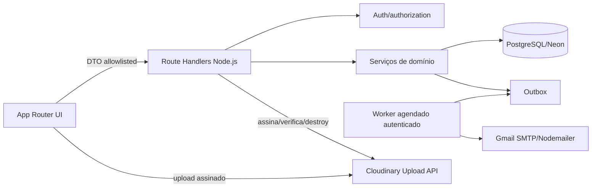
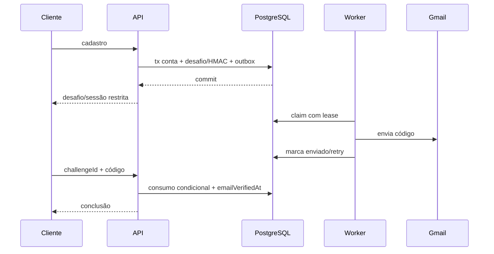
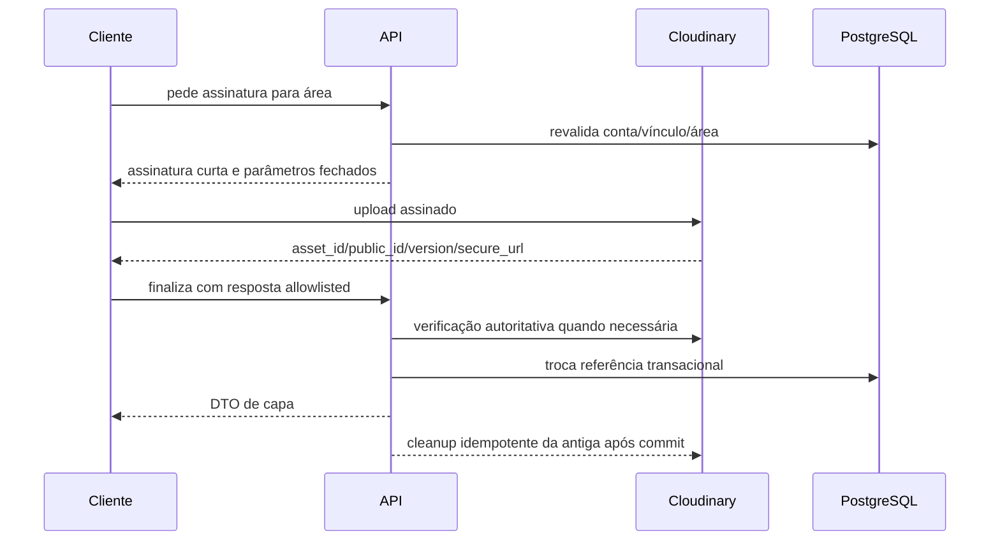

# Arquitetura e contratos propostos

## Fronteiras



- Cliente: coleta entrada, exibe estados e envia arquivos somente com autorização curta; nunca decide ownership/role/status.
- Route Handler: valida request/cookie/CSRF conforme padrão aplicável, chama serviço e traduz erro tipado.
- Serviço: revalida identidade, vínculo e estado dentro da operação; controla idempotência/transação.
- Adaptadores: SMTP e Cloudinary são substituíveis e isolados; testes usam fakes.
- Worker: processa outbox com autenticação de máquina, lease e limite de lote; não aceita autoridade de usuário.

## Endpoints candidatos

| Método/caminho | Autorização | Entrada principal | Saída/semântica |
|---|---|---|---|
| `POST /api/auth/sign-up` | pública | cadastro vigente + idempotency | `202` com desafio/sessão restrita; política final pendente. |
| `POST /api/auth/email-verification/confirm` | desafio restrito | `{challengeId, code}` | `204` ou DTO de conclusão; consumo atômico. |
| `POST /api/auth/email-verification/resend` | desafio restrito | `{challengeId}` | `202`; resposta controlada mesmo em cooldown. |
| `POST /api/auth/password-reset/request` | pública | `{email}` | sempre `202` com mensagem uniforme. |
| `POST /api/auth/password-reset/confirm` | pública com prova | `{token,newPassword,confirmation}` | `204`; exige novo login. |
| `GET /api/.../environmental-draft` | sessão normal/contexto | path | `{draft|null}` com `revision`. |
| `PUT /api/.../environmental-draft` | sessão normal/contexto | `{revision,formVersion,payload}` + idempotency | `200/201`; `409 STALE_REVISION`. |
| `DELETE /api/.../environmental-draft` | sessão normal/contexto | `{revision}` | `204`, repetível. |
| `POST /api/.../environmental-draft/confirm` | sessão normal/contexto | `{revision}` + idempotency | `201/200` do conjunto confirmado. |
| `POST /api/.../areas/{areaId}/image-upload-signatures` | sessão normal/gestor | metadados allowlisted | assinatura curta, timestamp, cloud name, public ID/preset. |
| `POST /api/.../areas/{areaId}/image` | sessão normal/gestor | resposta Cloudinary allowlisted | `201/200` com imagem pública do domínio. |
| `DELETE /api/.../areas/{areaId}/image` | sessão normal/gestor | revisão/idempotency | `204`, cleanup assíncrono. |

`RECOMENDACAO`: para imagens, `OWNER`/`ADMIN` podem alterar capa; `MEMBER` apenas lê. Isso exige confirmação porque a permissão atual de criação de área já nega `MEMBER`, mas não existe regra específica de imagem.

## Envelope e erros

```json
{"error":{"code":"STALE_REVISION","message":"O conteúdo mudou. Atualize antes de continuar.","recovery":"REFRESH_DRAFT"}}
```

| Código | HTTP | Uso |
|---|---:|---|
| `INVALID_INPUT` | 400 | forma/allowlist inválida; nunca segredo. |
| `UNAUTHENTICATED` | 401 | sessão ausente/inválida. |
| `VERIFICATION_REQUIRED` | 403 | sessão normal proibida até verificar. |
| `FORBIDDEN` | 403 | autoridade conhecida insuficiente; usar 404 quando necessário ocultar recurso contextual. |
| `NOT_FOUND` | 404 | recurso inexistente ou fora do contexto. |
| `STALE_REVISION` | 409 | concorrência otimista. |
| `IDEMPOTENCY_CONFLICT` | 409 | mesma chave com payload diferente. |
| `EXPIRED_OR_INVALID_PROOF` | 400 | prova inválida com mensagem uniforme. |
| `RATE_LIMITED` | 429 | `Retry-After`, sem informar existência de conta. |
| `PROVIDER_UNAVAILABLE` | 503 | operação recuperável; não expor resposta crua do provedor. |

## Sequências críticas

### Cadastro/verificação



### Upload Cloudinary



## Concorrência e idempotência

- Reenvio versus confirmação: atualização condicional por desafio vigente; novo desafio invalida anterior na mesma transação.
- Reset duplo: `consumedAt IS NULL AND expiresAt > now`; somente uma atualização afeta uma linha.
- Draft: `WHERE id AND revision = expected`; incremento em cada save; retorno 409 inclui revisão atual, não payload sem autorização.
- Confirmação: reutiliza invariantes da IMP-005 e chave do ator; marca draft `CONFIRMED` após criar/recuperar conjunto.
- Imagem: `revision`/ponteiro atual evita duas substituições silenciosas; objetos perdedores viram cleanup jobs.
