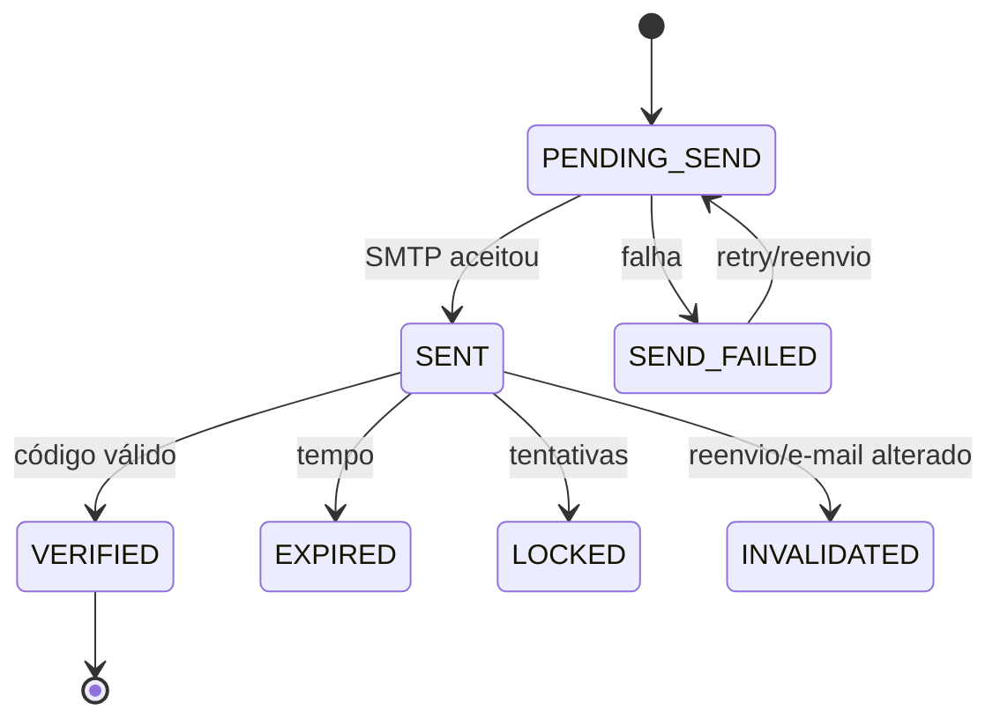

# Verificação de e-mail

## Fluxo recomendado

1. Validar cadastro e normalizar e-mail por regra única conservadora: trim + comparação case-insensitive compatível com índice aprovado. Não remover pontos nem aliases `+`, especialmente Gmail, sem decisão.
2. Na transação, criar/reconciliar conta, gerar desafio e outbox. Conta existente não verificada recebe recuperação por reenvio, não duplicata.
3. Emitir identificador/sessão restrita que autoriza somente consultar estado, reenviar, confirmar e sair. TTL proposto: 30 min; renovável mediante regras do desafio.
4. Gerar seis dígitos com CSPRNG e `padStart(6, "0")`; manter como string.
5. Guardar HMAC-SHA-256 de contexto canônico (`purpose`, challenge ID, user ID, e-mail canônico, código) com segredo separado de JWT e `keyId` para rotação.
6. No POST de confirmação, aplicar rate limit, buscar desafio vigente, calcular HMAC e comparar em tempo constante; tentativa errada incrementa contador atomicamente.
7. Consumo válido define `consumedAt` e `User.emailVerifiedAt` na mesma transação. Estado administrativo não muda.
8. Emitir sessão normal apenas conforme decisão `PD-CRI-001`; recomendação é substituir a sessão restrita depois do sucesso se `status === ACTIVE`.

## Estados

Parâmetros `PROPOSTA`: validade 15 min; 5 tentativas; cooldown de 60 s; 5 envios/hora por conta e origem; novo desafio invalida todos os anteriores antes de ser utilizável. Todos configuráveis com limites mínimos/máximos validados.

## Corridas e respostas

- Verificação versus reenvio: lock/condição sobre desafio vigente. Se verificação consome primeiro, reenvio retorna já verificado; se reenvio invalida primeiro, o código antigo falha.
- Duas verificações: uma consome; a segunda recebe resultado idempotente “já verificado” somente se a mesma conta/desafio e estado final forem confirmáveis.
- Código atrasado: só o desafio mais recente vigente é aceito.
- Falha de envio: tela permite novo envio; não exige recriar conta. Não revelar credencial/configuração.
- Erros de código incorreto, expirado e consumido podem convergir em mensagem segura; UI oferece reenvio quando elegível.

## Conta e acesso

Verificação e administração são eixos independentes:

| Estado administrativo | E-mail | Resultado recomendado |
|---|---|---|
| `ACTIVE` | não verificado | somente sessão restrita. |
| `ACTIVE` | verificado | sessão normal. |
| `PENDING` | qualquer | não conceder workspace; sem redefinir semântica. |
| `INACTIVE`/`BLOCKED` | qualquer | não conceder acesso nem reativar. |

Contas existentes, admins e criações internas exigem rollout aprovado. Opções: grandfathering temporário explicitamente auditado; campanha de verificação; obrigatoriedade no próximo login; verificação administrativa com origem. Proibido preencher `emailVerifiedAt` em massa sem base factual ou bloquear todos de imediato sem comunicação/recuperação.

Alteração futura de e-mail deve invalidar desafios/sessões conforme política, limpar `emailVerifiedAt` e verificar o novo endereço antes de substituir o canônico. Este pacote não adiciona recurso de edição de perfil.
